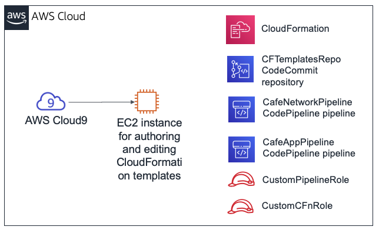
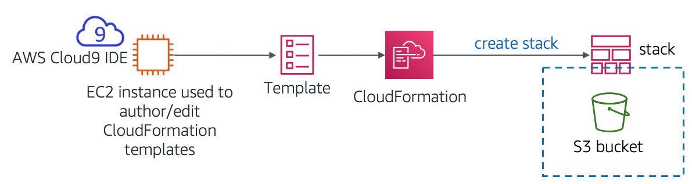
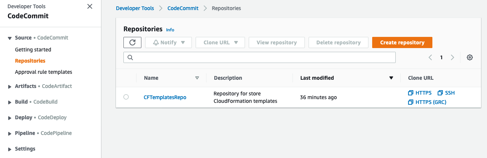
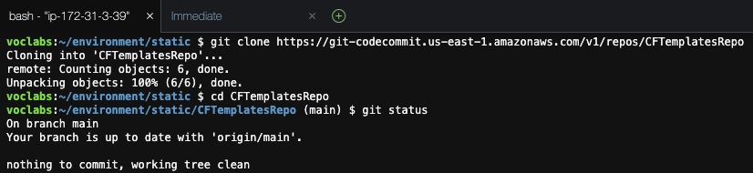
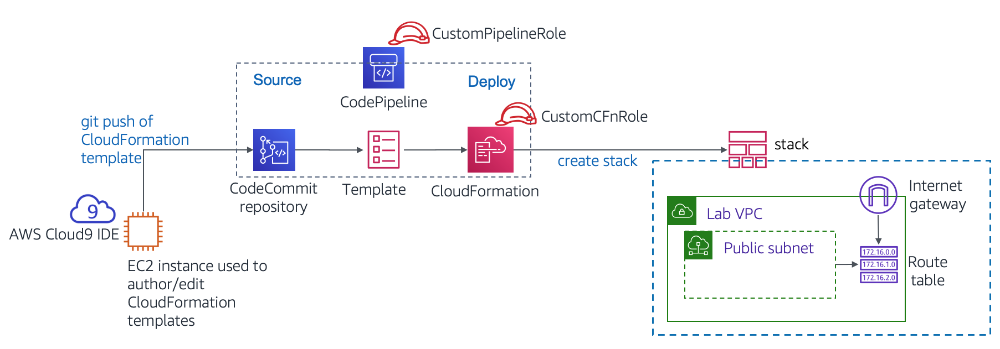
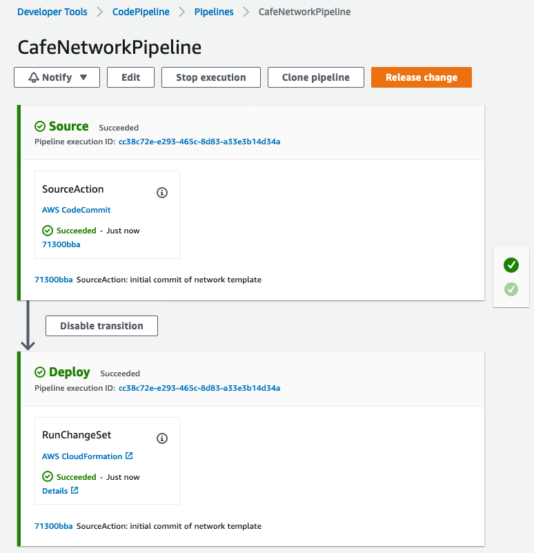
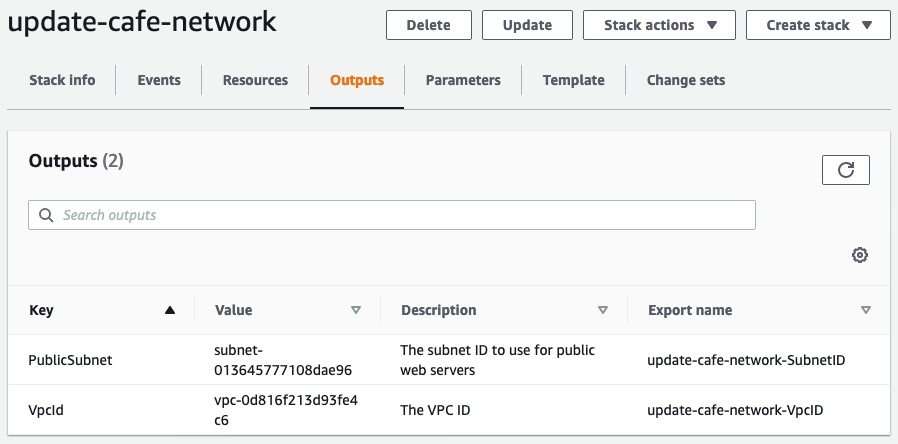

# Module 10 - Challenge Lab: Automating Infrastructure Deployment

## Scenario

Up to this point, the café staff created their AWS resources and configured their applications manually—mostly by using the AWS Management Console. This approach worked well as a way for the café to get started with a web presence quickly. However, they find it challenging to replicate their deployments to new AWS Regions so that they can support new café locations in multiple countries. They would also like to have separate development and production environments that reliably have matching configurations.

In this challenge lab, you will take on the role of Sofía as you work to automate the café's deployments and replicate them to another AWS Region.


## Lab overview and objectives

In this lab, you will gain experience with creating AWS CloudFormation templates. You will use the templates to create and update AWS CloudFormation stacks. The stacks create and manage updates to resources in multiple AWS service areas in your AWS account. You will practice using AWS CodeCommit to control the version of your templates. You will also observe how you can use AWS CodePipeline to automate stack updates.

After completing this lab, you should be able to:

  * Deploy a virtual private cloud (VPC) networking layer by using an AWS CloudFormation template

  * Deploy an application layer by using an AWS CloudFormation template

  * Use Git to invoke AWS CodePipeline, and to create or update stacks from templates that are stored in AWS CodeCommit

  * Duplicate network and application resources to another AWS Region by using AWS CloudFormation

    

When you *start* the lab, the following resources are already created for you in the AWS account:

  

Note that in this challenge lab, you will encounter a few tasks where step-by-step instructions are not provided. You must figure out how to complete the tasks on your own.


## Duration

This lab will require approximately **90 minutes** to complete.


## AWS service restrictions

In this lab environment, access to AWS services and service actions might be restricted to the ones that are needed to complete the lab instructions. You might encounter errors if you attempt to access other services or perform actions beyond the ones that are described in this lab.


## Accessing the AWS Management Console

1. At the top of these instructions, choose <span id="ssb_voc_grey">Start Lab</span> to launch your lab.

    A **Start Lab** panel opens, and it displays the lab status.

    <i class="fas fa-info-circle"></i> **Tip**: If you ever need more time to complete the lab that is displayed on the timer, choose the <span id="ssb_voc_grey">Start Lab</span> button again to restart the timer for the environment. Doing so will not delete resources you have created.

2. Wait until you see the message *Lab status: ready*, then close the **Start Lab** panel by choosing the **X**.

3. At the top of these instructions, choose <span id="ssb_voc_grey">AWS</span>.

    This opens the AWS Management Console in a new browser tab. The system will automatically log you in.

    **Tip**: If a new browser tab does not open, a banner or icon is usually at the top of your browser with the message that your browser is preventing the site from opening pop-up windows. Choose the banner or icon, and then choose **Allow pop-ups**.

4. Arrange the AWS Management Console tab so that it displays alongside these instructions. Ideally, you will have both browser tabs open at the same time so that you can follow the lab steps more easily.

    **Note**: To hide the terminal window, you can also clear the **Terminal** box at the top of the screen.


## A business request: Creating a static website for the café by using AWS CloudFormation (Challenge #1)

The café would like to start using AWS CloudFormation to create and maintain resources in the AWS account. As a simple first attempt at this process, you will take on the role of Sofía and create a simple AWS CloudFormation template that can be used to create an Amazon Simple Storage Service (Amazon S3) bucket. Then, you will add more detail to the template so that when you update the stack, it configures the bucket to host a static website for the café.


###  Task 1: Creating an AWS CloudFormation template from scratch

In this first task, you will create an AWS CloudFormation template that creates an S3 bucket. You will then run an AWS Command Line Interface (AWS CLI) command that created the AWS CloudFormation stack. (The stack is the resource that creates the bucket.)


5. Navigate to the AWS Cloud9 service and open the integrated development environment (IDE) of the existing AWS Cloud9 instance.


6. In the AWS Cloud9 IDE, choose **File > New File**, then choose **File > Save**, and save the new file as: `S3.yaml`


7. At the top of the file, add the following two lines:

   ```yaml
   AWSTemplateFormatVersion: "2010-09-09"
   Description:
   ```


8. Next, add the following three lines to your template:

   ```yaml
   Resources:
     S3Bucket:
       Type: AWS::S3::Bucket
   ```

   **Tip**: Make sure that you keep the correct number of spaces for each indentation level. The `Resources:` line should have no indentation. The `S3Bucket:` line should be indented by 2 spaces. Finally, the `Type: AWS::S3::Bucket` line should be indented by 4 spaces.
   
   <i class="fas fa-info-circle"></i>AWS CloudFormation supports the YAML Version 1.1 specification, with a few exceptions. For more information about YAML, go to <a href="https://http://www.yaml.org/" target="_blank">the YAML website</a>.


9. Add a description (such as `"cafe S3 template"`) on the **Description:** line. Before you start your description, be sure that you have a space *after* the colon (:). After you enter the description, **Save** the changes to file.

   <i class="fas fa-info-circle"></i> In the guided lab earlier in this module, you used the AWS Management Console to create an AWS CloudFormation stack. Here, you use the AWS CLI instead.


10. In the Bash terminal, run these two lines of code:

    ```bash
    aws configure get region
    aws cloudformation create-stack --stack-name CreateBucket --template-body file://S3.yaml
    ```

    The first line of code that you ran returned the default AWS Region of the AWS CLI client that is installed on the AWS Cloud9 instance. You could modify the default AWS Region by running `aws configure`. However, for this lab, you should leave the default Region.

    The second line of code that you ran created a stack that used the template you defined. Because you did not specify the Region in the command, the stack will be created in the default Region.  

    If the `create-stack` command ran successfully, you should see some output that is formatted in JavaScript Object Notation (JSON). This output should indicate a *StackId*.

    This diagram illustrates the actions you just completed.



11. In the AWS Management Console, navigate to the AWS CloudFormation service and observe the details of the *CreateBucket* stack.

    For example, look at the information in the **Events**, **Resources**, **Outputs**, and **Template** tabs.


12. Navigate to the Amazon S3 service page to observe the bucket that your template created.

    **Tip**: The bucket has the bucket name *createbucket-s3bucket-&lt;random-string&gt;*.


#### Answering questions about the AWS CloudFormation stack

The answers will be recorded when you choose the blue **Submit** button at the end of the lab.


13. Access the questions in this lab.
    - Choose the <span id="ssb_voc_grey">Details <i class="fas fa-angle-down"></i></span> menu, and choose <span id="ssb_voc_grey">Show</span>.
    - At the bottom of the page, choose the **Access the multiple choice questions** link.


14. In the page that you loaded, submit answers for each of the following questions:

	- **Question 1:** Was an S3 bucket created, even if you did not specify a name for the bucket? If so, what name was it given?

	- **Question 2:** What Region was the bucket created in, and why was it created in this Region?

	- **Question 3:** To define an S3 bucket, how many lines of code did you need to enter in the `Resources:` section of the template file?

	**Note:** Leave the browser tab with the questions in it open, so that you can return to it later in the lab.


### Task 2: Configuring the bucket as a website and updating the stack

In this next task, you will update the AWS CloudFormation template. The update will configure the S3 bucket to host a static website. This task is similar to the results from the Module 3 challenge lab. In that challenge lab, you created and configured the S3 bucket manually by using the AWS Management Console. However, in this lab, you will instead configure the bucket by using an AWS CloudFormation template.


15. Upload static website assets to the bucket.

    To do this task, run the following commands in the Bash terminal (replace &lt;*bucket-name*&gt; with your actual bucket name):

    ```bash
    wget https://aws-tc-largeobjects.s3-us-west-2.amazonaws.com/ILT-TF-200-ACACAD-20-EN/mod10-challenge/static-website.zip
    unzip static-website.zip -d static
    cd static
    aws s3 cp --recursive . s3://<bucket-name>/ --acl public-read
    ```

    If these operations are successful, you should see numerous *upload:&lt;file_name&gt;* messages in the command output.


16. In a new browser tab, open the AWS CloudFormation template documentation for defining S3 bucket resources.

    - Go to the <a href="https://docs.aws.amazon.com/AWSCloudFormation/latest/UserGuide/aws-template-resource-type-ref.html" target="_blank">AWS resource and property types reference</a> documentation

    - Scroll down, choose **Amazon S3**, and then choose the **AWS::S3::Bucket** resource type.


17. Using the documentation as a reference, modify your S3.yaml template to set the following characteristics on the S3 bucket resource:

    - Attach a *deletion policy* that will retain the bucket

    - Configure the bucket to host a static website with *index.html* set as the index document

      <i class="fas fa-info-circle"></i> **Tip**: You can accomplish this task by adding two additional lines of code to your template. See the code in the *Examples* section of the documentation page that you opened in the last step.
      
      

18. To your AWS CloudFormation template, add an *output* that provides the website URL.

    Again, consult the **Examples** section of the documentation as a reference.


19. Save the changes to your S3.yaml file.


20. Validate your template.

    Back in the Bash terminal, change the directory back to the location of the S3.yaml file and validate your template by running the following commands.

    ```bash
    cd ../
    aws cloudformation validate-template --template-body file://S3.yaml
    ```

    If the output indicates that your template has syntax or other errors, correct them, and then run the command again to verify that they have been resolved.
    
    


21. Update the stack by running this command:

    ```bash
    aws cloudformation update-stack --stack-name CreateBucket --template-body file://S3.yaml
    ```

    **Tip**: Proper YAML syntax is important. If you receive a *ValidationError* when you run `update-stack`, review your use of colons and confirm that you indented each line appropriately. The example templates in the documentation provide a good reference for well-structured YAML templates.
    
    


22. Browse to the AWS CloudFormation service and confirm that your stack update completed successfully.

    - The stack should show status *UPDATE_COMPLETE*.
    - If the stack does not attain a status of *UPDATE_COMPLETE*, try these troubleshooting tips.
      - If you see that the stack has a *ROLLBACK* status of some kind, go the **Events** tab and search for an *UPDATE_FAILED* entry. (Read the *Status* reason for that event to understand why the stack update failed.)
      - After you think that you resolved any errors, run the `update-stack` command again. In the console, return to the AWS CloudFormation stack and go to the **Events** tab to confirm whether you successfully updated the stack.
      - Repeat as necessary.


23. Verify success.

    - Does the stack's **Outputs** tab list an output with a URL value? If so, choose the link.

    - Does the static website open? (You previously copied the website assets into the bucket.)

      If so, congratulations!

      **Note:** If the stack does not have any output—or if the output hyperlink does not display the contents of the café website—you can try these troubleshooting steps.
      
      - Browse to the Amazon S3 console and choose your bucket. The **Overview** tab should list the index.html file and two folders that are named *css* and *images*. If these resources are not listed, you might want to revisit the first step in this challenge section.
      
      - Choose the **index.html** file and then choose **Permissions**. Under **Public access**, the value for **Read object** should be *Yes*.
      
      - Return to the bucket view. In the **Properties** tab, confirm that <i class="fas fa-check-circle" style="color:purple"></i> **Static website hosting** is enabled, with a **Hosting type** of *Bucket hosting*.
      
      - All of the permissions and properties that are described in this list should be set in your S3.yaml template. If necessary, adjust the details in the template and run the `update-stack` AWS CLI command again.
      
        **Note:** In this first challenge, you manually copied the website files into the bucket. You can also perform this action by using a custom resource from AWS CloudFormation, combined with an AWS Lambda function. Both of these resources can be defined in an AWS CloudFormation template. This approach is a more advanced use of AWS CloudFormation beyond the scope of this lab. However, if you are interested in this topic, refer to the <a href="https://docs.aws.amazon.com/AWSCloudFormation/latest/UserGuide/template-custom-resources-lambda.html" target="_blank">AWS Lambda-backed custom resources</a> page in the AWS Documentation.
      


## New business requirement: Storing templates in a version control system (Challenge #2)

The café team was impressed that Sofía configured an entire static website by using an AWS CloudFormation template. Given this success, the team decided that they would like to expand their use of infrastructure as code (IaC) to build out other application resources in the AWS account.

The team understands that it is a best practice to store IaC templates in a version control system, so they asked Sofía to take on this challenge. Sofía spoke with Mateo about this new business requirement when he stopped by the café. He mentioned that AWS CodeCommit would be a good choice for storing templates and managing version control for them. Mateo created a CodeCommit repository with some sample AWS CloudFormation templates in it. Sofía is eager to start using this code repository.


### Task 3: Cloning a CodeCommit repository that contains AWS CloudFormation templates

In this task, you will work as Sofía to clone a CodeCommit repository. The café team will use the repository to store and control the versions of the AWS CloudFormation templates.


24. Browse to the CodeCommit service and in your account, notice the repository that is named *CFTemplatesRepo*.

   

<i class="fas fa-info-circle"></i> CodeCommit is a source control service that can be used to host Git-based repositories. It can be used in a way that's similar to GitHub repositories. For details about AWS CodeCommit, see the <a href="https://aws.amazon.com/codecommit/" target="_blank">AWS Documentation</a>.


25. Choose **CFTemplatesRepo** and then choose the **templates** folder.

    Notice that it has AWS CloudFormation templates in it.

    <i class="fas fa-info-circle"></i> In this part of the lab, you will store your IaC AWS CloudFormation templates in CodeCommit.


26. Open the *CFTemplatesRepo/templates/**start-lab.yaml*** file and analyze the contents.

    - Notice that this template defines a few of the resources that you observed in this AWS account.

    - For example:

      - Starting on line 6, the template defines an *AWS Cloud9 instance*
      - Starting on line 12, the template defines the *CodeCommit repository* that you now have open

      <i class="fas fa-info-circle"></i> The lab platform that hosts this lab created an AWS CloudFormation stack when you chose **Start Lab**. The AWS CloudFormation template that it ran includes the resource definitions that are contained in this template. However, this example template does not contain all the resource definitions that are in the *actual* template that was used to start this lab.


27. In the breadcrumbs at the top of the page, choose **Repositories** and in the **Clone URL** column, choose **HTTPS**.

    <i class="fas fa-info-circle"></i> This action copies the CodeCommit repository's HTTPS clone URL to your clipboard.


28. Return to the AWS Cloud9 IDE and clone the existing CodeCommit repository to your workspace (replace &lt;*url*&gt; with the clone URL that you copied)

    In the Bash terminal in the AWS Cloud9 IDE, enter this command:

    ```bash
    git clone <url>
    ```

    This command clones a copy of the CodeCommit repository that you just observed. The command creates a *CFTemplatesRepo* directory that should now appear in the navigation pane (which is the left pane in the IDE).

    Use the Git client software to analyze your local copy of the repository.

    ```bash
    cd CFTemplatesRepo
    git status
    ```

    

    The `git status` command shows what branch of the repository you are connected to. It also shows that your local copy is up to date with the source branch in CodeCommit.
    
    


## New business requirement: Using a continuous delivery service, create the network and application layers for the café (Challenge #3)

The next challenge is for Sofía to use AWS CloudFormation to create all the network resources that the dynamic website café application can be deployed to. Then, she must deploy the café application itself.

Also, Sofía would like to find an easier way to update stacks when she updates an AWS CloudFormation template. She is now updating templates regularly, and she thinks that she should be able to automate stack updates.

Sofía spoke with Mateo about this issue. He mentioned that AWS CodePipeline provides the continuous integration and continuous delivery (CI/CD) service capabilities that she is looking for. Mateo then created two pipelines for Sofía, and she is eager to start working with them.

In this challenge, you will work as Sofía and make use of these pipelines. You will also define—in AWS CloudFormation templates—all the resources that are needed to deploy the dynamic café website.


### Task 4: Creating a new network layer with AWS CloudFormation, CodeCommit, and CodePipeline

In this task, you will use an AWS CloudFormation template to create a VPC with a public subnet, along with other network resources. You will gain experience with using a CI/CD pipeline. When you use Git to push the template into a CodeCommit repository, it will trigger a pipeline that will create an AWS CloudFormation stack.


29. Create a new AWS CloudFormation template that will create a VPC, public subnet, and other resources.

    - In the navigation pane of the AWS Cloud9 IDE, expand the **CFTemplatesRepo/templates** directory.

    - In the **templates** directory, right-click `template1.yaml` and create a duplicate of it.

    - Rename the duplicate to: `cafe-network.yaml`

    - In the text editor, open cafe-network.yaml and set the description to: `Network layer for the cafe`

    - Observe the details of the seven resources that this template creates.


30. Observe the AWS CodePipeline details that were preconfigured in your account.

    - In the AWS Management Console, from the <span id="ssb_services">Services <i class="fas fa-angle-down"></i></span> menu, choose **CodePipeline**.

    - Choose **Pipelines**.

    - Notice that two pipelines have been predefined for you:

      - CafeAppPipeline
      - CafeNetworkPipeline

      <i class="fas fa-exclamation-triangle"></i> **Important**: The status of the most recent attempt to run each pipeline will show that they failed. However, this status is expected. The AWS CloudFormation template files that the pipelines reference do not exist in their expected location.


31. Analyze the *Source* stage of the CafeNetworkPipeline.      

    - Choose **CafeNetworkPipeline** and observe the pipeline details.

      In the **Source** area, you can see that this pipeline's **SourceAction** is *AWS CodeCommit*.

    - To the right of the **SourceAction** heading, choose <i class="fas fa-info-circle"></i>

      The details in the **Configuration** window show that the source is the *CFTemplatesRepo* CodeCommit repository.

    - To return to the **CafeNetworkPipeline** page, choose **Done**.


32. Analyze the *Deploy* stage of the CafeNetworkPipeline.

    - Notice that the *Deploy* action will be performed by using AWS CloudFormation.

    - To the right of the **RunChangeSet** heading, choose <i class="fas fa-info-circle"></i>

      **Analysis**: The details in the **Configuration** window show that a stack named *update-cafe-network* will be run or be updated. To perform these actions, the stack will use the cafe-network.yaml AWS CloudFormation template. This *Deploy* action receives the template from the *Source* stage, which found the template in the CodeCommit repository.

      The following diagram illustrates how you will trigger this pipeline and what the pipeline will do. It also shows some of the AWS account resources that the resulting AWS CloudFormation stack will create or update.

    

    <i class="fas fa-info-circle"></i> For more details about AWS CodePipeline, refer to the <a href="https://aws.amazon.com/codepipeline/" target="_blank">AWS Documentation</a>.


33. Return to the AWS Cloud9 instance and trigger the creation of the *update-cafe-network* by checking your AWS CloudFormation template into CodeCommit.

    - Observe how the local copy of the repository differs from the origin. In the Bash terminal, run the following command:

      ```bash
      git status
      ```
    
      The output should show that the cafe-network.yaml file that you created is currently untracked in Git.
      
    - Run these two commands to add the new file to the repository and then commit it to the repository with a comment.

      ```bash
      git add templates/cafe-network.yaml
      git commit -m 'initial commit of network template' templates/cafe-network.yaml
      ```
    
    - Check the status of your local copy of the repository:
    
      ```bash
      git status
      ```
      
      
      The information that is returned should report that your branch is ahead of the origin by one commit.
      
    - Finally, push the commit to the remote repository (this command actually copies the file to CodeCommit):
    
      ```bash
      git push
      ```


34. Return to the CodePipeline console and choose the **CafeNetworkPipeline**.

    - Observe that the creation of the stack is automatically triggered.

      **Note:** It might take a minute or two for the *Source* stage to update and for the *Deploy* stage to show that it is *In progress*. Eventually, the *Deploy* stage status should show *Succeeded*.

    - Notice that the details for both *Source* and *Deploy* show the commit number that was returned when you ran `git push`. The details also show the comment that you added to the commit.


   


Troubleshooting tips:

   - If the *Deploy* step has a status of *Failed - Just now*, access the error details by opening the **Details** link. For example, you could have a template-formatting error that must be resolved.
   - After you update the template, you can update the stack by running the appropriate `git commit` and `git push` commands again.
       - The **Release change** button can also trigger the pipeline to run again. It will do so even if you do not make changes to the CodeCommit repository (such as by issuing a `git push` command).
       - Similarly, you can use the **Retry** button in the *Deploy* stage of the pipeline. It will retry the *Deploy* stage without retrying the *Source* stage.
   - If the stack fails to roll back—and prevents you from performing additional updates to the stack—you can delete the stack. To do so, go to the stacks page in the AWS CloudFormation console and delete the stack. If you delete the network stack, push a new update to Git. This action will trigger the re-creation of the stack.


35. In the AWS CloudFormation console, confirm that the *update-cafe-network* stack ran. It should have a status *CREATE_COMPLETE* or *UPDATE_COMPLETE*.

    Also, check the **Outputs** tab for the stack. It currently shows no outputs. Soon, however, you will update the stack so that it creates outputs.


36. In the Amazon VPC console, observe that the resources defined in the cafe-network.yaml template were created in the AWS account.

    For example, the console should list a VPC named *Cafe VPC*, and a subnet named *Cafe Public Subnet*.

    Congratulations! You have successfully created the network resources that are needed to run the café website.


### Task 5: Updating the network stack

In this task, you update the network stack so that it exports essential information about two of the resources that it creates. These two outputs can then be referenced by the application stack that you create later.


37. Add the following lines to the bottom of *cafe-network.yaml*.

```YAML
Outputs:
  PublicSubnet:
    Description: The subnet ID to use for public web servers
    Value:
      Ref: PublicSubnet
    Export:
      Name:
        'Fn::Sub': '${AWS::StackName}-SubnetID'
  VpcId:
    Description: The VPC ID
    Value:
      Ref: VPC
    Export:
      Name:
        'Fn::Sub': '${AWS::StackName}-VpcID'
```


38. Save the change and in the Bash terminal, add and commit the code, and then push it to CodeCommit by using Git.


39. Verify that the AWS CloudFormation stack update occurs. Also verify that the **Outputs** tab now lists two keys with export names.

| Name | Export Name |
| --- | ------ |
| *PublicSubnet* | *update-cafe-network-SubnetID* |
| *VpcId* | *update-cafe-network-VpcID* |


   


### Task 6: Defining an EC2 instance resource and creating the application stack  

In this task, you will create a new AWS CloudFormation template that will be used to create a stack. The new stack deploys a dynamic website for the café. The *CafeAppPipeline* pipeline (which you observed earlier) creates or updates the *update-cafe-app* stack when you push the cafe-app.yaml template to the CodeCommit repository.


40. Back in AWS Cloud9, duplicate the **template2.yaml** file in the templates directory and rename the duplicate as `cafe-app.yaml`.


41. In the cafe-app.yaml template, analyze the existing template contents:

    - In the **Parameters** area, the **LatestAmiId** performs a lookup. It finds the latest Amazon Linux 2 Amazon Machine Image (AMI) ID in the AWS Region where you create the stack. It can be referenced when you define an Amazon Elastic Compute Cloud (Amazon EC2) instance.
    - Also in the **Parameters** area, the **CafeNetworkParameter** defines a string value. The value defaults to the name of the stack that you created when you ran the cafe-network.yaml AWS CloudFormation template. Setting this string as a parameter provides you with the flexibility to point to a different stack name if you must reference resources in another stack.
    - In the **Mappings** area, the **RegionMap** mapping can be referenced when you define an EC2 instance. Using this mapping can help ensure that the correct key pair will be used for the instance. However, use of this feature depends on the AWS Region where you run the template.
    - In the **Resources** area, an **EC2 security group** is defined. It opens TCP ports 80 and 22 for inbound network traffic. It is created in the VPC that the *update-cafe-network* stack created.
    - In the **Outputs** area, an output named **WebServerPublicIP** returns the public IPv4 address of the EC2 instance that you will define next.


42. In the cafe-app.yaml template, define a third *parameter* so that a user can choose between different instance types when they launch an EC2 instance.

    - Browse to the <a href="https://docs.aws.amazon.com/AWSCloudFormation/latest/UserGuide/parameters-section-structure.html" target="_blank">AWS Documentation</a>. Under the *Defining a parameter in a template* section, copy the example YAML parameter.

    - Paste the parameter into your template. Then, modify the parameter so that the permitted instance types are *t2.micro*, *t2.small*, *t3.micro*, and *t3.small*. Also, set the default to `t2.small` and update the description so that it reflects the options that a user can choose.


43. In a new browser tab, open the <a href="https://docs.aws.amazon.com/AWSCloudFormation/latest/UserGuide/aws-properties-ec2-instance.html" target="_blank">AWS Documentation</a> and use the information in that page as a reference.


44. Back in the cafe-app.yaml template, create a new *EC2 instance* resource that has the following characteristics:

    - Set the **Logical ID** to `CafeInstance` (see https://docs.aws.amazon.com/AWSCloudFormation/latest/UserGuide/resources-section-structure.html for reference, if needed)

    - Include an **ImageId** that references the *LatestAmiId* parameter

    - For **instance type**, reference the instance type parameter that you defined in the previous step.

    - For **KeyName**, use the following line of code, which references the RegionMap mapping that is already defined in the template:

      ```yaml
      KeyName: !FindInMap [RegionMap, !Ref "AWS::Region", keypair]
      ```

    - For the **instance profile** (the AWS Identity and Access Management, or IAM, role that is attached to the instance), specify `CafeRole`

      **Note**: The CafeRole IAM role already exists in your account. Attaching it grants your EC2 instance the permissions to retrieve Parameter Store values from AWS Systems Manager.

    - In the **Properties** section, include the following lines of code:

      ```yaml
      NetworkInterfaces:
        - DeviceIndex: '0'
          AssociatePublicIpAddress: 'true'
          SubnetId: !ImportValue
            'Fn::Sub': '${CafeNetworkParameter}-SubnetID'
          GroupSet:
            - !Ref CafeSG
      ```

      - **Analysis**: The previous lines help ensure that your instance deploys to the *Public Subnet* that you created when you ran the café network stack. Recall that at the beginning of this task, you updated the network stack to define outputs with *export* names. In the preceding code, you *import* the value for the **SubnetId**. The preceding code also helps ensure that the instance you create will be in the *CafeSG* security group that is already defined for you in this template.

    - Set a **tag** with a *key* of *Name* and a *value* of *Cafe Web Server*

      - **Tip:** Observe how a *Name* tag was applied to the security group resource that is already defined in the template.

    - In the **Properties** section, include the following additional **UserData** code:

      ```yaml
        UserData:
          Fn::Base64:
            !Sub |
              #!/bin/bash
              yum -y update
              yum install -y httpd mariadb-server wget
              amazon-linux-extras install -y lamp-mariadb10.2-php7.2 php7.2
              systemctl enable httpd
              systemctl start httpd
              systemctl enable mariadb
              systemctl start mariadb
              wget https://aws-tc-largeobjects.s3-us-west-2.amazonaws.com/ILT-TF-200-ACACAD-20-EN/mod10-challenge/cafe-app.sh
              chmod +x cafe-app.sh
              ./cafe-app.sh
      ```

      **Analysis**: The previous code runs on the instance at the end of the boot process. It installs an Apache HTTP web server, a MariaDB database, and PHP on the Amazon Linux instance. Next, it starts the web server and the database. Then, it downloads a script named cafe-app.sh and runs it. The cafe-app script configures the database and installs the PHP code that makes the café website function.


45. After you are satisfied with your template updates, save the changes. To validate the template format in the Bash terminal, run the following command:

    ```bash
    aws cloudformation validate-template --template-body file:///home/ec2-user/environment/CFTemplatesRepo/templates/cafe-app.yaml
    ```

    If you receive a JSON-formatted response that includes the three parameters that were defined at the top of your template, then your template passed the validation. However, if you received a *ValidationError* response (or some other error response), you must correct the issue. Then, save the changes and run the `validate-template` command again.


46. If your template passed the validation check, add the file to CodeCommit. In the Bash terminal, run `git` commands to add the file, commit it, and push it to the repository.

    <i class="fas fa-info-circle"></i> **Tip**: If it helps, refer back to the Git commands in Task 3. However, remember that the name of the template that you want to push to CodeCommit for this task is different.


47. Return to the CodePipeline console and choose the **CafeAppPipeline**.

    **Note**: It might take a minute or two for the *Source* stage to update and for the *Deploy* stage to show that it is *In progress*. Eventually, the *Deploy* stage status should show *Succeeded - Just now*.

    - If the status shows a failure, try these troubleshooting tips.

      - If you see that the *Deploy* stage has a status of *Failed - Just now*, open the error information by choosing the **Details** link. It might provide a link that takes you to the AWS CloudFormation stack details. (Go to the **Events** tab to figure out which error was the first one that caused the stack to roll back).
      - If the stack fails to roll back, or if it has a *ROLLBACK_COMPLETE* status that prevents you from updating the stack with the pipeline, you can delete the stack from the AWS CloudFormation stacks page. Then, push a new update to Git to trigger the stack to be created again.


48. In the AWS CloudFormation console, confirm that the *update-cafe-app* stack ran successfully and has a status of *CREATE_COMPLETE*.


49. Go to the Amazon EC2 console. Observe that the EC2 instance and security group resources (which were defined in the cafe-app.yaml template) were created.


50. After the EC2 instance has started and passed both status checks, test the café website. In a browser tab, load the following URL, where &lt;*public-ip-address*&gt; is the *public IPv4 address* of the EC2 instance that you defined: `http://<public-ip-address>/cafe`


    You should see the café website.
    
    **Tip**: It can take 2 minutes or so for the user data script details that you defined to finish running. Be patient if you do not see the website immediately.
    
    Notice that the website shows server information, such as the Region and Availability Zone where the web server is running.
    
    Congratulations! You deployed a network layer and an application layer by using a CI/CD pipeline and an IaC approach.


#### Answering questions about the results of creating an application layer

51. Return to the browser tab with the multiple-choice questions for this lab, and answer the following questions:

    - **Question 4:**  Go to the **Parameters** tab of the *update-cafe-app* stack. What value do you see for the **LatestAmiId**?

    - **Question 5:** Go to the **Stack info** tab of the *update-cafe-app* stack. What is the Amazon Resource Name (ARN) of the IAM role that grants the permissions to create and update the *update-cafe-app* stack?

    - **Question 6:** In the AWS Management Console, navigate to the CodeCommit repository where your AWS CloudFormation templates are stored. Choose **Commits** and in the **Commits** list, open one of the commits by choosing its commit ID. What you do observe?


## New business requirement: Duplicating the network and application resources in a second AWS Region (Challenge #4)

Sofía is pleased that she was able to create both the network layer and the application layer for the dynamic café website by using AWS CloudFormation. Sofía also just learned that the café staff would like her to duplicate these resources into a second AWS Region, so she is even more pleased.

Sofía will soon experience the benefits of the hard work that she did to define the resources and configurations in AWS CloudFormation templates. She will observe that it is easier to duplicate environments through an IaC approach instead of creating all the resources manually.


### Task 7: Duplicating the café network and website to another AWS Region

In this final lab task, you will experience how quickly you can duplicate a deployment. A quick deployment is possible because you defined all your resources in AWS CloudFormation templates.

In Tasks 4, 5, and 6, the AWS CloudFormation stacks were created or updated automatically. A pipeline was defined to monitor when the CodeCommit repository was updated. It then invoked AWS CloudFormation to create or update the stack. However, in this task, you will use the AWS CLI to duplicate the café network resources in another AWS Region. Then, you will use the AWS CloudFormation console to create the application stack in the second Region.


52. Back in the AWS Cloud9 IDE, run the following command to duplicate the café *network* to another AWS Region:

    ```bash
    aws cloudformation create-stack --stack-name update-cafe-network --template-body file:///home/ec2-user/environment/CFTemplatesRepo/templates/cafe-network.yaml --region us-west-2
    ```

    It should return a *StackId*. Notice that you could override the default Region for the creation of this stack by specifying the Region when you ran the command.


53. Browse to the AWS CloudFormation console and change the Region to **US West (Oregon) us-west-2**.

    - The *update-cafe-network* stack should be listed

    - Verify that the status of the second *update-cafe-region* stack eventually changes to *CREATE_COMPLETE*

      <i class="fas fa-info-circle"></i>**Tip**: Use the <i class="fas fa-sync"></i> refresh icon to see the status change more quickly when it completes.


54. Browse to the Amazon VPC service page, and also confirm that you are using the **Oregon** Region (*us-west-2*).

    You should be able to observe the network resources that were created.


55. In the **Oregon** Region (*us-west-2*), create an EC2 key pair named `cafe-oregon`.

    - Browse to the Amazon EC2 console and confirm that you are in the **Oregon** Region.
    - From the navigation pane, choose **Network & Security > Key Pairs**.
    - Choose **Create key pair**.
    - Name the key pair `cafe-oregon` and choose **Create key pair** again.

      **Tip**: You can optionally save the key pair, or you can choose **Cancel**. You don't need to use the key pair in this lab. However, in a typical use case, you must save the key pair—you will not have another opportunity to do so.


56. Revisit the application template details.

    - Return to the AWS Cloud9 IDE and observe the **cafe-app.yaml** template details in the text editor.
    - Notice the **KeyName** property in the resource definition for the EC2 instance. It references the **RegionMap** mapping that is defined in the template.
    - The mapping indicates that if the instance is launched in the *us-east-1 (N. Virginia) Region*, it should use the *vockey key pair*. However, if the instance is launched in the *us-west-2 (Oregon) Region*, it should use the *cafe-oregon key pair* that you just created.
    - Also notice the **InstanceTypeParameter** that you defined earlier. It provides a few instance type options in the **AllowedValues** area, but it also sets *t2.small* as the default. You will use this configuration in a moment.


57. In the AWS Cloud9 IDE, copy the template file to an S3 bucket. (In the following command, replace &lt;*repobucket-bucketname*&gt; with the actual S3 bucket name in your account. Its name should contain the string *repobucket*.)

    ```bash
    aws s3 cp templates/cafe-app.yaml s3://<repobucket-bucketname>/
    ```


58. In the Amazon S3 console, copy the **Object URL** (which is an *https* address) of the file that you just uploaded.


59. In the AWS CloudFormation console, change the Region to **Oregon** (*us-west-2*).


60. Create a stack (with new resources).

    - In the **Amazon S3 URL** box of the **Create stack** screen, paste the object URL that you just copied.

    - In the next screen (**Specify stack details**) -
      - **Stack name**: Enter an appropriate name
      - **InstanceTypeParameter**: *t3.micro*

      Notice that you can set the instance type at stack creation because you defined it as a parameter in the AWS CloudFormation template.

    - Advance through the remaining screens (accepting all the default settings), and finish creating the stack.

    - Verify that the stack created successfully.


61. Browse to the Amazon EC2 console and observe the created resources.

    - Be sure to give the web server a few minutes to finish booting and to run the user data script.
    - Notice the *key pair* that is used by the instance, and the instance type. These settings are different than the settings on the web server that runs in the *us-east-1* Region. You used the same template, *without modifying it*, to launch this stack.
    - After the server has fully started, you should be able to access the website at `http://<public-ip-address>/cafe` (where &lt;*public-ip-address*&gt; is the public IPv4 IP address of the EC2 instance.
    - Notice that the server information on the website shows that this second instance of the café website is running in the *us-west-2* Region. The first web server that you created shows it is running in the *us-east-1* Region.


## Update from the café


Sofía is full with ideas as a result of what she just learned how to do!

She used AWS CloudFormation to deploy a static version of the café website successfully. She then deployed the dynamic café website as a web application successfully. For the dynamic website, Sofía used a CI/CD pipeline that used AWS CodeCommit, AWS CodePipeline, and AWS CloudFormation. In addition, she quickly duplicated both the network resources and the café application resources to another AWS Region.  

Sofía imagines how she could use the AWS CloudFormation templates as part of a *backup and disaster recovery (DR)* solution. She just experienced how quickly she was able to re-create the essential café infrastructure. If her production deployment ever experiences a failure for any reason, she can now recreate it or duplicate it quickly.

Sofía also thinks about how she can now spin up *test environments* quickly. She can be confident that the configuration details of the test environments will match the production environment. She can also specifically control the ways that the test environment differs from the production environment by using features such as parameters and mappings.

The benefits of DevOps automation are many. Sofía now plans to make automation and CI/CD pipelines central to the way her team develops, tests, and deploys updates to the café's cloud resources.


## Submitting your work

62. At the top of these instructions, choose <span id="ssb_blue">Submit</span> to record your progress and when prompted, choose **<span id="ssb_blue">Yes</span>**.
    
63. If the results don't display after a couple of minutes, return to the top of these instructions and choose <span id="ssb_voc_grey">Grades</span>

     **Tip**: You can submit your work multiple times. After you change your work, choose **Submit** again. Your last submission is what will be recorded for this lab.
    
64. To find detailed feedback on your work, choose <span id="ssb_voc_grey">Details</span> followed by <i class="fas fa-caret-right"></i> **View Submission Report**.


## Lab complete

<i class="icon-flag-checkered"></i> Congratulations! You have completed the lab.


65. To confirm that you want to end the lab, at the top of this page, choose **<span id="ssb_voc_grey">End Lab</span>**, and then choose **<span id="ssb_blue">Yes</span>**.  

    A panel should appear with this message: *DELETE has been initiated... You may close this message box now.*


66. To close the panel, choose the **X** in the top-right corner.


*©2020 Amazon Web Services, Inc. and its affiliates. All rights reserved. This work may not be reproduced or redistributed, in whole or in part, without prior written permission from Amazon Web Services, Inc. Commercial copying, lending, or selling is prohibited.*
