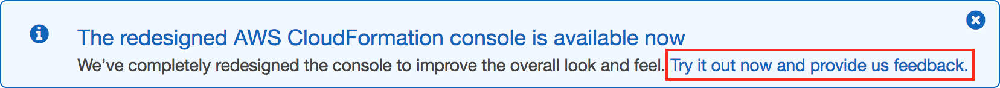
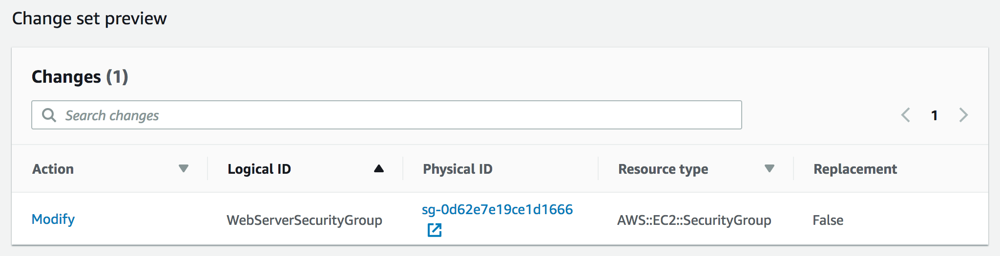
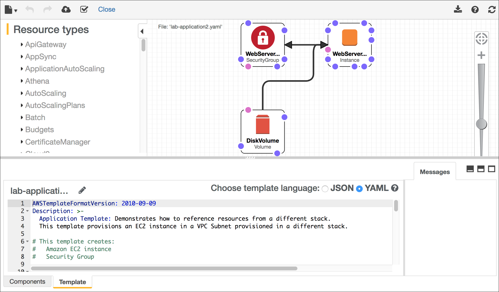

# Module 10 - Guided Lab: Automating Infrastructure Deployment with AWS CloudFormation

[//]: # "SKU: ILT-TF-200-ACACAD-2    Source Course: ILT-TF-100-ARCHIT-6 branch dev_65"

## Lab overview and objectives

Deploying infrastructure in a consistent, reliable manner is difficult. It requires people to follow documented procedures without taking any undocumented shortcuts. It can also be difficult to deploy infrastructure out-of-hours when fewer staff are available. AWS CloudFormation changes this situation by defining infrastructure in a template that can be automatically deployed—even on an automated schedule.

In this lab, you will learn how to deploy multiple layers of infrastructure with AWS CloudFormation, update a CloudFormation stack, and delete a stack (while retaining some resources).

After completing this lab, you should be able to:

- Use AWS CloudFormation to deploy a virtual private cloud (VPC) networking layer
- Use AWS CloudFormation to deploy an application layer that references the networking layer
- Explore templates with AWS CloudFormation Designer
- Delete a stack that has a deletion policy

<br/>

##Duration

This lab will require approximately **20 minutes** to complete.

<br/>

## AWS service restrictions

In this lab environment, access to AWS services and service actions might be restricted to the ones that are needed to complete the lab instructions. You might encounter errors if you attempt to access other services or perform actions beyond the ones that are described in this lab.

<br/>

## Accessing the AWS Management Console

1. At the top of these instructions, choose <span id="ssb_voc_grey">Start Lab</span> to launch your lab.

   A **Start Lab** panel opens, and it displays the lab status.

   <i class="fas fa-info-circle"></i> **Tip**: If you need more time to complete the lab, restart the timer for the environment by choosing the <span id="ssb_voc_grey">Start Lab</span> button again.

2. Wait until the **Start Lab** panel displays the message *Lab status: ready*, then close the panel by choosing the **X**.

3. At the top of these instructions, choose <span id="ssb_voc_grey">AWS</span>.

   This action opens the AWS Management Console in a new browser tab. The system automatically logs you in.

   <i class="fas fa-exclamation-triangle"></i> **Tip**: If a new browser tab does not open, a banner or icon is usually at the top of your browser with the message that your browser is preventing the site from opening pop-up windows. Choose the banner or icon, and then choose **Allow pop-ups**.

4. Arrange the **AWS Management Console** tab so that it displays alongside these instructions. Ideally, you will have both browser tabs open at the same time so that you can follow the lab steps more easily.

   <i class="fas fa-exclamation-triangle"></i> **Do not change the Region unless specifically instructed to do so**.

<br/>

## Task 1: Deploying a networking layer

It is a best practice to deploy infrastructure in _layers_. Common layers are:

- Network (Amazon VPC)
- Database
- Application

This way, templates can be reused between systems. For example, you can deploy a common network topology between development, test, and production environments, or deploy a standard database for multiple applications.

In this task, you will deploy an AWS CloudFormation template that creates a _networking layer_ by using Amazon VPC.

5. Right-click the following link and download the template to your computer: [lab-network.yaml](../../../scripts/lab-network.yaml)

   <i class="fas fa-comment"></i> If you want, you can open the template in a text editor to see how the AWS resources are defined.

   Templates can be written in JavaScript Object Notation (JSON) or YAML Ain't Markup Language (YAML). YAML is a markup language that is similar to JSON, but it is easier to read and edit.

6. In the **AWS Management Console**, from the <span id="ssb_services">Services<i class="fas fa-angle-down"></i></span> menu, choose **CloudFormation**.

7. If you see this message, click <span style="color:blue">Try it out now and provide us feedback</span>:

   

8. Choose <span id="ssb_orange">Create stack</span> and configure these settings.

   **Step 1: Specify template**

    - **Template source:** <span id="ssbox_cloudformation_blue"><i class="far fa-dot-circle" style="color:#007dbc;"></i> Upload a template file</span>
    - **Upload a template file:** Click <span id="ssb_ssm_white">Choose file</span> then select the **lab-network.yaml** file that you downloaded.
    - Choose <span id="ssb_orange">Next</span>

   **Step 2: Create Stack**

    - **Stack name:** `lab-network`
    - Choose <span id="ssb_orange">Next</span>

   **Step 3: Configure stack options**

    - In the **Tags** section, enter these values.
      - **Key:** `application`
      - **Value:** `inventory`
    - Choose <span id="ssb_orange">Next</span>

   **Step 4: Review lab-network**

    - Choose <span id="ssb_orange">Create stack</span>

   The *template* will now be used by AWS CloudFormation to generate a *stack* of resources in the AWS account.

   The specified *tags* are automatically propagated to the resources that are created, which makes it easier to identify resources that are used by particular applications.

9. Choose the **Stack info** tab.

10.  Wait for the **Status** to change to <span style="color: green;"><i class="far fa-check-circle"></i>CREATE_COMPLETE</span>.

   <i class="fas fa-comment"></i> Choose **Refresh** <i class="fas fa-redo"></i> every 15 seconds to update the display, if necessary.

   You can now examine the resources that were created.

11. Choose the **Resources** tab.

   You will see a list of the resources that were created by the template.

   <i class="fas fa-comment"></i> If the list is empty, update the list by choosing **Refresh** <i class="fas fa-redo"></i>.

12. Choose the **Events** tab and scroll through the events log.

   The events log shows (from more recent to less recent) the activities that were performed by AWS CloudFormation. Example events include starting to create a resource and then completing the resource creation. Any errors that were encountered during the creation of the stack will be listed in this tab.

13. Choose the **Outputs** tab.

   A CloudFormation stack can provide _output information_, such as the ID of specific resources and links to resources.
   
   Two outputs are listed.

      - **PublicSubnet:**  The ID of the public subnet that was created (for example: _subnet-08aafd57f745035f1__
      - **VPC:** The ID of the VPC that was created (for example: _vpc-08e2b7d1272ee9fb4_)
   
   Outputs can also be used to provide values to other stacks. This is shown in the **Export name** column. In this case, the VPC and subnet IDs are given export names so that other stacks can retrieve the values. These other stacks can then build resources inside the VPC and subnet that were just created. You will use these values in the next task.
   
14. Choose the **Template** tab.

   This tab shows the template that was used to create the stack—that is, the template that you uploaded while you created the stack. Feel free to examine the template and see the resources that were created. Also feel free to explore the **Outputs** section at the end (this section defined which values to export).

<br/>
## Task 2: Deploying an application layer

Now that you deployed the _network layer_, you will deploy an _application layer_ that contains an Amazon Elastic Compute Cloud (Amazon EC2) instance and a security group.

The AWS CloudFormation template will _import_ the VPC and subnet IDs from the _Outputs_ of the existing CloudFormation stack. It will then use this information to create the security group in the VPC and the EC2 instance in the subnet.

15.  Right-click the following link and download the template to your computer: [lab-application.yaml](../../../scripts/lab-application.yaml)

   <i class="fas fa-comment"></i> If you want, you can open the template in a text editor to see how resources are defined.

16. In the left navigation pane, choose **Stacks**.

17. Select **Create stack > With new resources (standard)**, and then configure these settings.

   **Step 1: Specify template**

    - **Template source:** <span id="ssbox_cloudformation_blue"><i class="far fa-dot-circle" style="color:#007dbc;"></i> Upload a template file</span>
    - **Upload a template file:** Click <span id="ssb_ssm_white">Choose file</span> then select the **lab-application.yaml** file that you downloaded.
    - Choose <span id="ssb_orange">Next</span>

   **Step 2: Create Stack**

    - **Stack name:** `lab-application`
    - **NetworkStackName:** `lab-network`
    - Choose <span id="ssb_orange">Next</span>

   <i class="fas fa-comment"></i> The _Network Stack Name_ parameter tells the template the name of the first stack that you created (_lab-network_), so it can retrieve values from the _Outputs_.

   **Step 3: Configure stack options**

    - In the **Tags** section, enter these values.
      - **Key:** `application`
      - **Value:** `inventory`
    - Choose <span id="ssb_orange">Next</span>

   **Step 4: Review lab-application**

    - Choose <span id="ssb_orange">Create stack</span>

   While the stack is being created, examine the details in the **Events** tab and the **Resources** tab. You can monitor the progress of the resource-creation process and the resource status.

18. In the **Stack info** tab, wait for the **Status** to change to <span style="color: green;"><i class="far fa-check-circle"></i>CREATE_COMPLETE</span>.

   Your application is now ready!

19. Choose the **Outputs** tab.

20. Copy the **URL** that is displayed, open a new web browser tab, paste the URL, and press ENTER.

   The browser tab will open the application, which is running on the web server that this new CloudFormation stack created.

   A CloudFormation stack can use reference values from another CloudFormation stack. For example, this portion of the _lab-application_ template references the _lab-network_ template:

    ```yaml
      WebServerSecurityGroup:
        Type: AWS::EC2::SecurityGroup
        Properties:
          GroupDescription: Enable HTTP ingress
          VpcId:
            Fn::ImportValue:
              !Sub ${NetworkStackName}-VPCID
    ```

   The last line uses the _network stack name_ that you provided (_lab-network_) when the stack was created. It imports the value of _lab-network-VPCID_ from the _Outputs_ of the first stack. It then inserts the value into the VPC ID field of the security group definition. The result is that the security group is created in the VPC that was created by the first stack.

   Here is another example, which is in the CloudFormation template that you just used to create the application stack. This template code places the EC2 instance into the subnet that was created by the network stack:

    ```yaml
      SubnetId:
        Fn::ImportValue:
        !Sub ${NetworkStackName}-SubnetID
    ```

   It takes the _subnet ID_ from the _lab-network_ stack and uses it in the _lab-application_ stack to launch the instance into the public subnet, which was created by the first stack.
   

<br/>
## Task 3: Updating a Stack

AWS CloudFormation can also _update_ a stack that has been deployed. When you update a stack, AWS CloudFormation will only modify or replace the resources that are being changed. Any resources that are not being changed will be left as-is.

In this task, you will update the _lab-application_ stack to modify a setting in the security group.

First, you will examine the current settings for the security group.

21. In the **AWS Management Console**, from the <span id="ssb_services">Services <i class="fas fa-angle-down"></i></span> menu, choose **EC2**.

22. In the left navigation pane, choose **Security Groups**.

23. Select the check box for <i class="far fa-check-square"></i> **lab-application-WebServerSecurityGroup...**.

24. Choose the **Inbound rules** tab.

   Currently, only one rule is in the security group. The rule permits _HTTP_ traffic.

   You will now return to AWS CloudFormation to update the stack.

25. From the <span id="ssb_services">Services <i class="fas fa-angle-down"></i></span> menu, choose **CloudFormation**.

26. Right-click the following link and download the updated template to your computer: [lab-application2.yaml](../../../scripts/lab-application2.yaml)

   This template has an additional configuration to permit inbound Secure Shell (SSH) traffic on port 22:

    ```yaml
      - IpProtocol: tcp
        FromPort: 22
        ToPort: 22
        CidrIp: 0.0.0.0/0
    ```

27. In the **Stacks** list of the **AWS CloudFormation console**, select  **lab-application**.

28. Choose <span id="ssb_ssm_white">Update</span> and configure these settings.

    - Select <span id="ssbox_cloudformation_blue"><i class="far fa-dot-circle" style="color:#007dbc;"></i> Replace current template</span>
    - **Template source:** <span id="ssbox_cloudformation_blue"><i class="far fa-dot-circle" style="color:#007dbc;"></i> Upload a template file</span>
    - **Upload a template file:** Click <span id="ssb_ssm_white">Choose file</span> then select the **lab-application2.yaml** file that you downloaded.

29. Choose <span id="ssb_orange">Next</span> in each of the next *three* screens to advance to the **Review lab-application** page.

    In the **Change set preview** section at the bottom of the page, AWS CloudFormation displays the resources that will be updated:

    

    This change set preview indicates that AWS CloudFormation will *Modify* the *WebServerSecurityGroup* without needing to replace it (_Replacement = False_). This change set means that the security group will have a minor change applied to it, and no references to the security group will need to change.

30. Choose <span id="ssb_orange">Update stack</span>

31. In the **Stack info** tab, wait for the **Status** to change to <span style="color: green;"><i class="far fa-check-circle"></i>UPDATE_COMPLETE</span>.

     <i class="fas fa-comment"></i> Update the status by choosing **Refresh** <i class="fas fa-redo"></i> every 15 seconds, if necessary.

     You can now verify the change.

32. Return to the **Amazon EC2 console** and from the left navigation pane, choose **Security Groups**.

33. In the **Security Groups** list, select **lab-application-WebServerSecurityGroup**.

     The **Inbound rules** tab should display an additional rule that allows _SSH_ traffic over _TCP port 22_.

     This subtask demonstrates how changes can be deployed in a repeatable, documented process. The AWS CloudFormation templates can be stored in a source code repository (such as AWS CodeCommit). This way, you can maintain versions and a history of the templates and the infrastructure that was deployed.
     

<br/>
## Task 4: Exploring templates with AWS CloudFormation Designer

*AWS CloudFormation Designer* is a graphic tool for creating, viewing, and modifying AWS CloudFormation templates. With Designer, you can diagram your template resources by using a drag-and-drop interface, and then edit their details through the integrated JSON and YAML editor.

Whether you are a new to AWS CloudFormation or an experienced AWS CloudFormation user, Designer can help you quickly see the interrelationship between a template's resources. It also enables you to easily modify templates.

In this task, you will gain some hands-on experience with Designer.

34.  From the <span id="ssb_services">Services <i class="fas fa-angle-down"></i></span> menu, choose **CloudFormation**.

35.  In the left navigation pane, choose **Designer**.
  
   **Tip:** You might need to expand the left navigation pane by choosing the menu icon.

   [//]: # "I added the previous tip because I couldn't originally find the navigation pane in the console, until I realized that I needed to open it through the menu. I hope this addition is ok. I think it's likely that there's a standard Font Awesome icon for the menu, but unfortunately, I'm not familiar with it :( "

36.  Choose the **File** <i class="fas fa-file"></i> menu, select **Open > Local file**, and select the **lab-application2.yaml** template that you downloaded previously.

   Designer will display a graphical representation of the template:

   

   Instead of drawing a typical architecture diagram, Designer is a visual editor for AWS CloudFormation templates. It draws the resources that are defined in a template and their relationship to each other.

37. Experiment with the features of the Designer. Some things to try are:

    - Click the displayed resources. The lower pane will then display the portion of the template that defines the resources.

    - Try dragging a new resource—from the **Resource types** pane on the left—into the design area. The definition of the resource will be automatically inserted into the template.

    - Try dragging the resource connector circles to create relationships between resources.

    - Open the **lab-network.yaml** template that you downloaded earlier in the lab and also explore its resources in Designer.
    

<br/>
## Task 5: Deleting the stack

When resources are no longer required, AWS CloudFormation can delete the resources built for the stack.

A _deletion policy_ can also be specified against resources. It can preserve or (in some cases) back up a resource when its stack is deleted. This feature is useful for retaining databases, disk volumes, or any resource that might be needed after the stack is deleted.

The _lab-application_ stack was configured to take a snapshot of an Amazon Elastic Block Store (Amazon EBS) disk volume before it is deleted. The code in the template that accomplishes that configuration is:

```yaml
  DiskVolume:
    Type: AWS::EC2::Volume
    Properties:
      Size: 100
      AvailabilityZone: !GetAtt WebServerInstance.AvailabilityZone
      Tags:
        - Key: Name
          Value: Web Data
    DeletionPolicy: Snapshot
```

The _DeletionPolicy_ in the final line directs AWS CloudFormation to create a snapshot of the disk volume before it is deleted.

You will now delete the _lab-application_ stack and see the results of this deletion policy.

38.  Return to the main **AWS CloudFormation console** by choosing the <span style="color:#1166bb">Close</span> link at the top of the Designer page (choose **Leave page** if prompted).

39.  In the list of stacks, choose the **lab-application** link.

40.  Choose <span id="ssb_ssm_white">Delete</span>

41.  Choose <span id="ssb_orange">Delete stack</span>

   You can monitor the deletion process in the **Events** tab and update the screen by choosing **Refresh** <i class="fas fa-redo"></i> occasionally. You might also see an events log entry that indicates that the EBS snapshot is being created.

42. Wait for the stack to be deleted. It will disappear from the stacks list.

   The application stack __ removed, but the network stack remained untouched. This scenario reinforces the idea that different teams (for example, the network team or the application team) could manage their own stacks.

   You will now verify that a snapshot of the EBS volume was created before the EBS volume was deleted.

43. From the <span id="ssb_services">Services <i class="fas fa-angle-down"></i></span> menu, choose **EC2**.

44. In the left navigation pane, choose **Snapshots**.

   You should see a snapshot with a **Started** time in the last few minutes.
   
   

<br/>

## Submitting your work

45. At the top of these instructions, choose <span id="ssb_blue">Submit</span> to record your progress and when prompted, choose **Yes**.

46. If the results don't display after a couple of minutes, return to the top of these instructions and choose <span id="ssb_voc_grey">Grades</span>

    **Tip**: You can submit your work multiple times. After you change your work, choose **Submit** again. Your last submission is what will be recorded for this lab.

47. To find detailed feedback on your work, choose <span id="ssb_voc_grey">Details</span> followed by <i class="fas fa-caret-right"></i> **View Submission Report**.

<br/>

## Lab complete <i class="fas fa-graduation-cap"></i>

<i class="fas fa-flag-checkered"></i> Congratulations! You have completed the lab.

48. Choose <span id="ssb_voc_grey">End Lab</span> at the top of this page, and then select <span id="ssb_blue">Yes</span> to confirm that you want to end the lab.

    A panel indicates that *DELETE has been initiated... You may close this message box now.*

49. Select the **X** in the top right corner to close the panel.


*©2020 Amazon Web Services, Inc. and its affiliates. All rights reserved. This work may not be reproduced or redistributed, in whole or in part, without prior written permission from Amazon Web Services, Inc. Commercial copying, lending, or selling is prohibited.*

