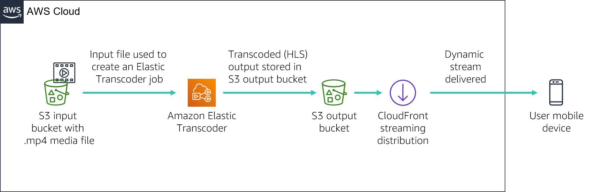

# Module 11 - Guided Lab: Streaming Dynamic Content using Amazon CloudFront


[//]: # "SKU: ILT-TF-200-ACACAD-2    Source Course: spl-52"

## Lab overview and objectives

In this lab, you will use Amazon CloudFront to deliver a dynamic, multiple bit-rate stream to a connected device using Apple’s HTTP Live Streaming (HLS) protocol. The stream can be played on any browser that supports the HLS protocol. In this lab, you will also use Amazon Elastic Transcoder to convert a source video into multiple bit-rates that will be delivered using CloudFront.

After completing this lab, you should be able to:

- Create multiple bit-rate versions of a given source media file using Amazon Elastic Transcoder.

- Use Amazon CloudFront to deliver the dynamic (multi bit-rate) stream created by Amazon Elastic Transcoder.

  

At the **end** of this lab, your architecture will look like the following example:




##Duration

This lab will require approximately **30 minutes** to complete.

<br/>

## AWS service restrictions

In this lab environment, access to AWS services and service actions might be restricted to the ones that are needed to complete the lab instructions. You might encounter errors if you attempt to access other services or perform actions beyond the ones that are described in this lab.

<br/>

## Accessing the AWS Management Console

1. At the top of these instructions, choose <span id="ssb_voc_grey">Start Lab</span> to launch your lab.

   A **Start Lab** panel opens, and it displays the lab status.

   <i class="fas fa-info-circle"></i> **Tip**: If you need more time to complete the lab, restart the timer for the environment by choosing the <span id="ssb_voc_grey">Start Lab</span> button again.

2. Wait until the **Start Lab** panel displays the message *Lab status: ready*, then close the panel by choosing the **X**.

3. At the top of these instructions, choose <span id="ssb_voc_grey">AWS</span>.

   This action opens the AWS Management Console in a new browser tab. The system automatically logs you in.

   <i class="fas fa-exclamation-triangle"></i> **Tip**: If a new browser tab does not open, a banner or icon is usually at the top of your browser with the message that your browser is preventing the site from opening pop-up windows. Choose the banner or icon, and then choose **Allow pop-ups**.

4. Arrange the **AWS Management Console** tab so that it displays alongside these instructions. Ideally, you will have both browser tabs open at the same time so that you can follow the lab steps more easily.

   <i class="fas fa-exclamation-triangle"></i> **Do not change the Region unless specifically instructed to do so**.

<br/>
## Task 1: Lab Preparation

In this lab, you will be using a sample video file to configure a dynamic stream. For your convenience, an Amazon Simple Storage Service (Amazon S3) bucket has already been created.

5. In the AWS Management Console, on the **Services** menu, choose **S3**.

   An S3 bucket containing the string ***awstrainingreinvent*** should be present. Note the Region that the bucket is in, and open the bucket.

6. Open the **input** folder. It contains a video file named **AmazonS3Sample.mp4**.

   **Note:** From the time you log in to the Amazon S3 console, it can take up to ten minutes for the file to appear in the S3 bucket. If you do not see it, select the circular arrow icon on the upper right of the screen to refresh the contents of the bucket.

<br/>
## Task 2: Create an Amazon CloudFront Distribution

In this task, you will create an Amazon CloudFront distribution that will be used to deliver the multiple bit-rate files generated by Amazon Elastic Transcoder to end-user devices.

7. On the **Services** menu, choose **CloudFront**.

8. Choose **Create Distribution**.

9. Under the **Web** section of the page, choose **Get Started**.

10. Under **Origin Settings** section of the page, enter the follow information:

    * Select the **Origin Domain Name** field. A list of S3 buckets will appear. Choose the one that was created earlier that has **awstrainingreinvent** as part of the file name.
    * Under **Restrict Bucket Access** select **No**.

11. Scroll to the bottom of the page, then choose **Create Distribution**.

<br/>
## Task 3: Create an Amazon Elastic Transcoder Pipeline

### Create a Pipeline

In this section, you will create a pipeline that will manage the jobs to transcode the input file.

12. In the AWS Management Console, on the **Services** menu, choose  **Elastic Transcoder**.

13. In the navigation bar of the Amazon Elastic Transcoder console, select the same Region that the S3 bucket was created in.

14. On the Pipelines page, choose **Create a new Pipeline**.

15. For **Pipeline Name**, enter `InputPipeline`

16. For **Input Bucket**, select the **awstrainingreinvent** S3 bucket.

17. For **IAM Role**, under **Other roles**, select **AmazonElasticTranscoderRole**. This is a role that was pre-created in this lab's CloudFormation template that uses the managed policy AmazonElasticTranscoderRole. The Elastic Transcoder service will assume this role to access Amazon S3 and Amazon Simple Notification Service (Amazon SNS) resources in your lab account.

18. In the **Configuration for Amazon S3 Bucket for Transcoded Files and Playlists** section, enter the follow information:

    * Under **Bucket**, select the **awstrainingreinvent** S3 bucket.
    * Under **Storage Class**, select **Standard**.

19. In the **Configuration for Amazon S3 Bucket for Thumbnails** section, enter the following information:

    * Under **Bucket**, select the **awstrainingreinvent** S3 bucket.
    * Under **Storage Class**, select **ReducedRedundancy**.

20. Choose **Create Pipeline**.

<br/>
### Create a Job

In this section, you will create a job under the Amazon Elastic Transcoder pipeline that was just created. The job does the work of transcoding the input file into multiple bit-rates as selected.

21. On the Pipelines page, choose **Create New Job** to create a transcoding job. You create the job in the pipeline (queue) that you want to use to transcode the video file.

22. For **Pipeline**, select **InputPipeline**.

23. For **Output Key Prefix**, enter `output/`.

    Amazon Elastic Transcoder will prepend this value to the names of all files that the job will create (including output files, thumbnails, and playlists).

24. For **Input Key**, select the input file labeled **input/AmazonS3Sample.mp4.**

<br/>
### Configure Output Details

The settings in this section will determine how many output files (bit-rates) are created. You will configure three output files for this demo having three separate bit-rates (2Mbps, 1.5Mbps and 1Mbps). Each output bit-rate will require you to create a separate output details section. This will also output a playlist file for each bit-rate, which lists all the segments that make up the stream.

25. For **Preset:**, select **System preset: HLS 2M**

26. For **Segment Duration**, enter `10` (which is the HLS default).

27. For **Output Key**, enter the unique prefix `HLS20M` to name the segments created using this preset.

28. Click **+ Add Another Output** and repeat the steps above to generate segments for presets **HLS 1.5M** and **HLS 1M** and then provide the respective prefix names:

    * `HLS15M`
    * `HLS10M`

<i class="fas fa-circle"></i> Caution: Do not create the job yet! Instead, complete the next few steps in this lab which will have you add a playlist to the job.

<br/>

### Configure a Playlist

The playlist will combine all the individual bit-rate playlists and provide a single URL for the devices to playback the stream. To configure a playlist, do the following:

29. Under **Playlists (Adaptive Streaming)**, choose **Add Playlist**, then configure:

    * **Playlist Name** `primary`
    * **Playlist Format:** *HLSv3*

30. Select all the three outputs, which were entered in the previous section, to include them in this  playlist by selecting the **+** option.

31. Choose **Create New Job**.

    The transcoding process should complete within a minute.

<br/>

## Task 4: Test Playback of the Dynamic (Multi Bit-Rate) Stream

In this module, you will test the playback of the dynamic stream generated in the previous section using an iOS or Android device. You can also use an Android 4.x device to test the below exercise.

**Note** Certain browsers may not support this feature. Use the default web browser in the device to test.

<br/>
### Construct the Playback URL

The playback URL that plays through Amazon CloudFront is comprised of two components:

- Amazon CloudFront domain name

-  Path of the playlist file in the S3 bucket (output generated by Elastic Transcoder):

    ```plain
    http://<CloudFront domain name>/<playlist file path in Amazon S3 bucket>
    ```

<br/>

### Obtain an Amazon CloudFront Domain Name

To obtain an Amazon CloudFront domain name:

32. In the AWS Management Console, on the **Services** menu, choose **CloudFront**.

33. Select the **Amazon CloudFront** distribution that was previously created, and verify that the **Distribution Status** has changed from *InProgress* to *Deployed*.

34. Proceed to the next step only after the **Status** changes to *Deployed*.

35. Select the Distribution by selecting the square box to the left of the Distribution.

36. Choose **Distribution Settings**.

37. Copy the **Domain Name** and paste it into a text editor.

<br/>

### Obtain the Playlist File Path

To obtain the playlist file path:

38. On the **Services** menu, choose **S3**.

39. Select the **awstrainingreinvent** S3 bucket.

40. Open the **output** folder (which contains the output of the transcoding job) and select the **primary.m3u8** playlist file.

    This is the file that you will play on your mobile device.

    Next, you must create the URL to the file from CloudFront.

41. In a text editor, construct the URL by appending `/output/primary.m3u8` to the end of your CloudFront domain name.

    The new URL should look similar to: *d1ckwesahkbyvu.cloudfront.net/output/primary.m3u8*

42. Type the URL into the default browser of an iOS or Android device. If you do not have a mobile device available, type the URL into a browser on your computer.

     <i class="fas fa-exclamation-triangle"></i> **Be aware that standard data rates may apply when playing the video on a mobile device**.

43. The stream should start playing on your device and dynamically request the relevant segments based on your bandwidth and CPU conditions.

You have learned how to use AWS services such as Amazon S3, Amazon Elastic Transcoder, and Amazon CloudFront together to deliver HLS media files to iOS or Android devices.

You have successfully:

- Learned the basic concepts and terminology of the Amazon Elastic Transcoder and Amazon CloudFront services.

- Created your own Amazon Elastic Transcoder pipeline and Amazon CloudFront distribution.

- Used Amazon Elastic Transcoder to transcode a video file into different HLS formats and distributed it to remote devices using Amazon CloudFront.

<br/>

## Submitting your work

44. At the top of these instructions, choose <span id="ssb_blue">Submit</span> to record your progress and when prompted, choose **Yes**.

45. If the results don't display after a couple of minutes, return to the top of these instructions and choose <span id="ssb_voc_grey">Grades</span>

    **Tip**: You can submit your work multiple times. After you change your work, choose **Submit** again. Your last submission is what will be recorded for this lab.

46. To find detailed feedback on your work, choose <span id="ssb_voc_grey">Details</span> followed by <i class="fas fa-caret-right"></i> **View Submission Report**.

<br/>

## Lab complete <i class="fas fa-graduation-cap"></i>

<i class="fas fa-flag-checkered"></i> Congratulations! You have completed the lab.

47. Choose <span id="ssb_voc_grey">End Lab</span> at the top of this page, and then select <span id="ssb_blue">Yes</span> to confirm that you want to end the lab.

    A panel indicates that *DELETE has been initiated... You may close this message box now.*

48. Select the **X** in the top right corner to close the panel.

<br/>
## Additional Resources

- [Amazon Elastic Transcoder and Amazon CloudFront](http://aws.amazon.com/elastictranscoder/)

- [Amazon CloudFront](http://aws.amazon.com/cloudfront/)

- [AWS Training and Certification](http://aws.amazon.com/training/)


*©2020 Amazon Web Services, Inc. and its affiliates. All rights reserved. This work may not be reproduced or redistributed, in whole or in part, without prior written permission from Amazon Web Services, Inc. Commercial copying, lending, or selling is prohibited.*
