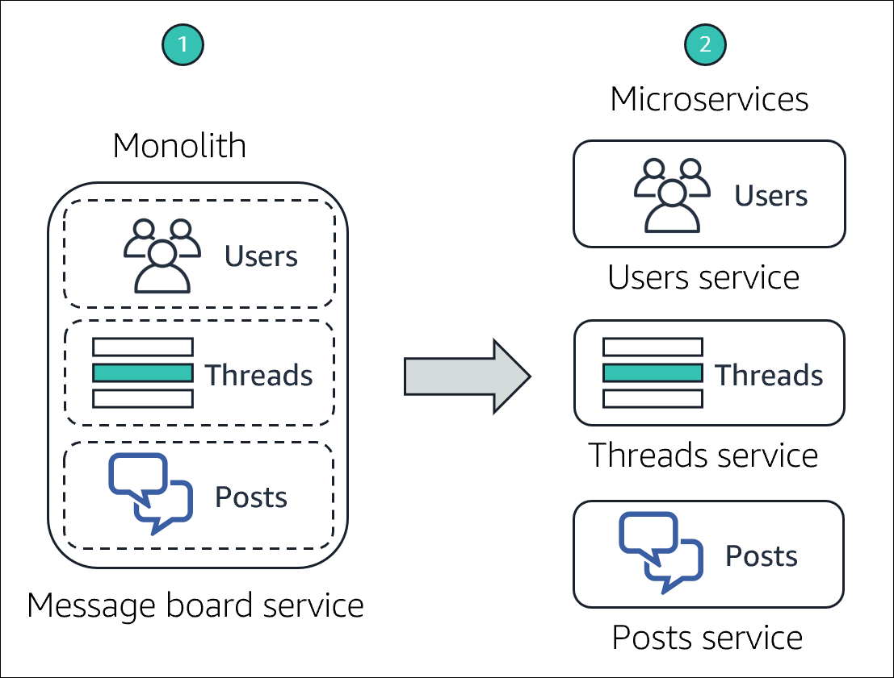
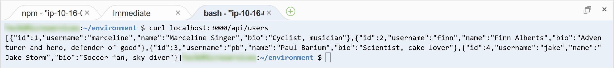
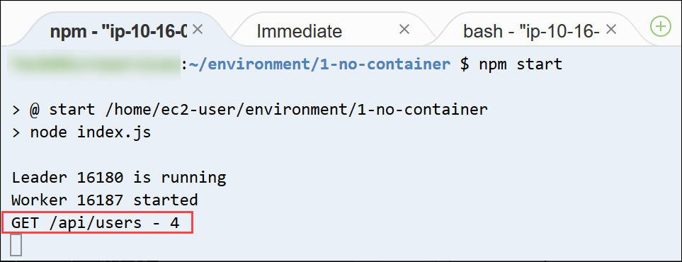
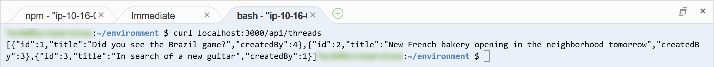
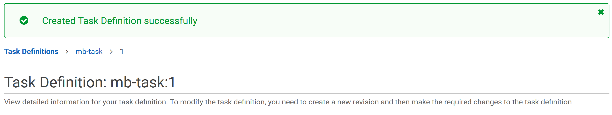
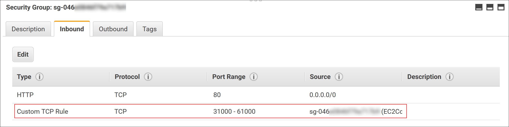
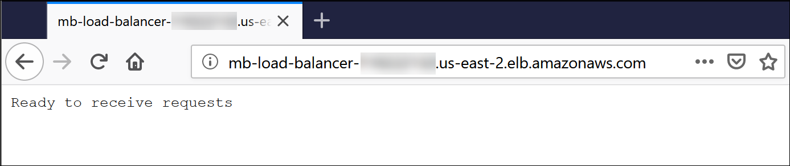
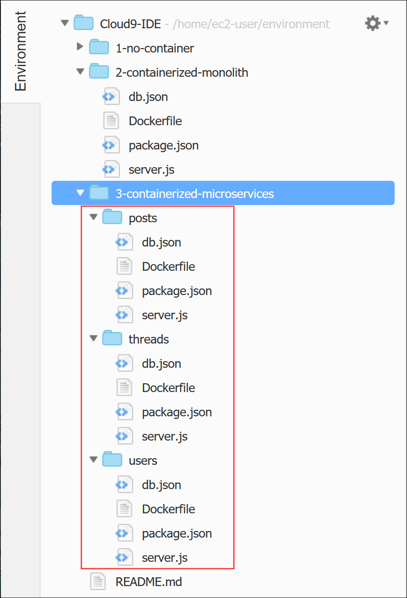
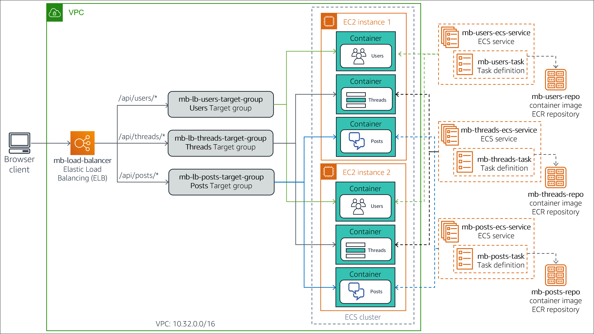

# (Optional) Module 13 - Guided Lab 1: Breaking a Monolithic Node.js Application into Microservices

[//]: # "SKU: ILT-TF-200-ACACAD-2    Source Course: ILT-TF-100-TUMCSR-1"

## Lab overview and objectives

Traditional monolithic architectures can be difficult to scale. As an application's code base grows, it becomes complex to update and maintain. It can be difficult and complicated to introduce new features, languages, frameworks, and technologies, which can then limit innovation and new ideas.

In a microservices architecture, each application component runs as its own service. They are built around business capabilities, and each service performs a single function. Microservices can be written by using different frameworks and programming languages, and they communicate with other services via a well-defined application programming interface (API). Finally, you can deploy them independently—as a single service, or as a group of services.

In this optional lab, you will migrate a monolithic application that runs in a standard Node.js server to a containerized Docker environment. You will then refactor the application into microservices and deploy it to a containerized environment that is orchestrated by Amazon Elastic Container Service (Amazon ECS). The Node.js application implements the functions of a simple message board where *users* can create topic *threads*, and post *messages* on each thread.


After completing this lab, you should be able to:

- Migrate a monolithic Node.js application to run in a Docker container

- Refactor a Node.js application from a monolithic design to a microservices architecture

- Deploy a containerized Node.js microservices application to Amazon ECS


The following diagram illustrates the evolution of the application's design as it moves from monolithic to microservices-based.




&nbsp;

The diagram highlights the following differences between the monolithic approach and the microservices design:

*	In a monolithic design, all the functions of the Node.js application are packaged and run as a single service. If one function fails, the entire application fails. Likewise, if one application function experiences a spike in demand, all functions in the service must be scaled together.

* In a microservices architecture, each function of the Node.js application runs as a separate service. The services can scale and be updated independently of each other.

<br/>

##Duration

This lab requires approximately **3 hours** to complete. 

<br/>

## AWS service restrictions

In this lab environment, access to AWS services and service actions might be restricted to the ones that are needed to complete the lab instructions. You might encounter errors if you attempt to access other services or perform actions beyond the ones that are described in this lab.

<br/>

## Accessing the AWS Management Console

1. At the top of these instructions, choose <span id="ssb_voc_grey">Start Lab</span> to launch your lab.

   A **Start Lab** panel opens, and it displays the lab status.

   <i class="fas fa-info-circle"></i> **Tip**: If you need more time to complete the lab, restart the timer for the environment by choosing the <span id="ssb_voc_grey">Start Lab</span> button again.

2. Wait until the **Start Lab** panel displays the message *Lab status: ready*, then close the panel by choosing the **X**.

3. At the top of these instructions, choose <span id="ssb_voc_grey">AWS</span>.

   This action opens the AWS Management Console in a new browser tab. The system automatically logs you in.

   <i class="fas fa-exclamation-triangle"></i> **Tip**: If a new browser tab does not open, a banner or icon is usually at the top of your browser with the message that your browser is preventing the site from opening pop-up windows. Choose the banner or icon, and then choose **Allow pop-ups**.

4. Arrange the **AWS Management Console** tab so that it displays alongside these instructions. Ideally, you will have both browser tabs open at the same time so that you can follow the lab steps more easily.

   <i class="fas fa-exclamation-triangle"></i> **Do not change the Region unless specifically instructed to do so**.

<br/>

## Task 1: Preparing the development environment

An AWS Cloud9 environment was created for you during the process of creating the lab environment. AWS Cloud9 is a cloud-based integrated development environment (IDE) that you can use to write, run, and debug code on a browser. It comes pre-packaged with essential tools for popular programming languages, and provides access to the AWS Command Line Interface (AWS CLI) in a terminal session tab. Your AWS Cloud9 environment has access to the all the AWS resources that are authorized for the user ID that you used to log in to the AWS Management Console.


To set up your development environment, you will open the AWS Cloud9 IDE, and download and extract the required *lab files*.

5. In the **AWS Management Console** browser tab, expand **All services**, and then select **Developer Tools > Cloud9**.

6. In the **Cloud9-IDE** card, choose **Open IDE**

    The IDE opens in a new browser tab and displays several tabs, including a **Welcome** tab.

    Next, you will download and extract the required lab files.

7. In the bottom pane of the IDE, enter the following command in the terminal tab labeled **bash - "ip-nnn-nnn-nnn-nnn"**:

    ```bash
    curl -s https://aws-tc-largeobjects.s3.amazonaws.com/ILT-TF-100-TUHAWA-1/lab-four/lab-files-ms-node-js.tar.gz | tar -zxv
    ```

    This command retrieves a compressed archive file that contains the lab files. It also extracts the file contents in the AWS Cloud9 **~/environment** folder. The command output should like the following example:

    

    &nbsp;

    The downloaded and extracted files are visible in the **Environment** window (in the left pane).

    

    &nbsp;

    You can see the following folders:

      - **1-no-container** – Contains the files that are related to the *monolithic* implementation of the application. This implementation is intended to run directly on a Node.js server.

      - **2-containerized-monolith** – Contains the files that are related to the *monolithic* implementation of the application. This implementation is intended to run in a containerized Docker environment orchestrated by Amazon ECS.

      - **3-containerized-microservices** – Contains the files that are related to the *microservices* implementation of the application. This implementation is intended to run in a containerized Docker environment orchestrated by Amazon ECS.

    Keep the AWS Cloud9 IDE tab opened throughout this lab, because you will use it frequently.

<br/>
## Task 2: Running the application on a basic Node.js server

The base Node.js application is a monolithic service that was designed to run directly on a server, without a container. In this task, you deploy the application to the Node.js server that is installed on the instance running your AWS Cloud9 environment. You then test the application by using the AWS CLI terminal to invoke its RESTful API methods.

The deployment architecture and request flow are illustrated in the following diagram.


&nbsp;

  **Note**: The monolithic implementation of the application uses the Node.js *cluster* functionality to spawn one worker process per CPU core. The processes share a single port, and are invoked in a round-robin way by the load balancer that is built into Node.js. This feature increases scalability on servers that have multiple CPU cores.

In this task, you will:

  - Install the Node.js modules required by the application

  - Review the application design and code

  - Run the application

<br/>

### Task 2.1: Installing the required Node.js modules

The message board application uses two modules from the Node.js *koa* framework in its implementation: *koa* and *koa-router*. *Koa.js* is a widely used Node.js web application framework that facilitates building asynchronous server-side JavaScript applications.

8. In the terminal tab, enter the following commands to install the *koa* and *koa-router* modules:

    ```bash
    cd ~/environment/1-no-container
    npm install koa
    npm install koa-router
    ```

    

    &nbsp;

    The modules are downloaded and installed in the **1-no-container/node_modules** folder of the AWS Cloud9 **~/environment** folder. You can ignore the notice, warnings, and update messages in the output.

<br/>

### Task 2.2: Reviewing the application design and code

The components that implement the monolithic message board application are in the **1-no-container** folder. Review them to gain an understanding of the application design and code.

9. In the **Environment** window on the left, expand the **1-no-container** folder. The components of the application include:

     - **node_modules** folder – This folder was created when you installed the required JavaScript modules in the previous subtask. It contains their source code.

     - **db.json** – A JavaScript Object Notation (JSON) object that simulates the message board database. It contains attributes that represent *users*, *threads*, and *posts*, with corresponding sample values.

     - **index.js** – JavaScript program that is the application's entry point.

     - **package.json** – A JSON object that describes the application, its entry point, and its dependencies.

     - **package-lock.json** – A JSON object that was automatically generated when you installed the required JavaScript modules in the **node_modules** folder. It is used by the installation utility, *npm*, to track the modifications that are made to the folder.

     - **server.js** – JavaScript program that defines the application's RESTful API methods, and implements their respective handlers.

10. Examine the *package.json* object. In the **Environment** window, open **package.json** an editor tab by double-clicking it. Notice the following attributes of the JSON object:

      - **Lines 2 through 5** – The *dependencies* attribute defines the JavaScript module dependencies for the application. Note that the *koa* and *koa-router* modules that you installed in the previous subtask are listed here.

      - **Lines 6 through 8** – The *scripts* attribute declares the *index.js* program as the entry point to the application.

11. Examine the **db.json** object. In the **Environment** window, open **db.json** in an editor tab by double-clicking it. Notice the following attributes of the JSON object:

    - **Lines 2 through 27** – These lines define a *users* attribute that represents the registered users of the message board. The attribute value is a list of *four* sample users with the following names: *Marcerline Singer*, *Finn Alberts*, *Paul Barium*, and *Jake Storm*.

    - **Lines 29 through 45** – These lines define a *threads* attribute that represents the current active threads on the message board. The attribute value is a list of *three* sample threads with the following titles:

        - *Did you see the Brazil game?*

        - *New French bakery opening in the neighborhood tomorrow*

        - *In search of a new guitar*

      - **Lines 47 through 78** – These lines define a *posts* attribute that represents the posted messages on the active threads. The attribute value is a list of *six* sample message posts.

12. Review the code for *index.js*. In the **Environment** window, open **index.js** in an editor tab by double-clicking it. Notice the following information:

      - **Lines 1 through 3** – These lines import the JavaScript modules that the program requires, specifically: *cluster*, *http*, and *os*.

      - **Line 3** – This line uses the *os* module to ask about the number of CPU cores that are available on the server.

      - **Lines 5 through 15** – These lines are run the first time the program is invoked (when the application is started). They create a *Leader* thread for the cluster and one *worker* thread for each CPU core that is  available on the server.

      - **Lines 16 through 19** – These lines handle each request to the application by invoking the *server.js* program in the current *worker* thread.

13. Lastly, review the code for *server.js*. In the **Environment** window, open **server.js** in an editor tab by double-clicking it. Use the comments that are provided in the code to facilitate your understanding of the logic. In particular, notice the following information:

      - **Line 3** – This line imports *db.json*, the JSON object that simulates the database.

      - **Lines 6 through 11** – These lines define a generator function that runs for every request. Its purpose is to print a line that contains the *HTTP method*, *resource path URL*, and *elapsed time* for each request that is processed.

      - **Lines 13 through 47** – These lines define the application's RESTful API methods and their implementation. Specifically, the application can respond to the following RESTful calls.

        - `GET /api/users`: Returns the collection of *users* in the database

        - `GET /api/users/:userId`: Returns the information for the *user* that is identified by *:userId*

        - `GET /api/threads`: Returns the collection of *threads* in the database

        - `GET /api/threads/:threadId`: Returns the information for the *thread* that is identified by *:threadId*

        - `GET /api/posts/in-thread/:threadId`: Returns the collection of *post messages* for the *thread* that is identified by *:threadId*

        - `GET /api/posts/by-user/:userId`: Returns the collection of *post messages* for the *user* that is identified by *:userId*

        - `GET /api/`: Returns the message *API ready to receive requests*

        - `GET /`: Returns the message *Ready to receive requests*

      - **Line 52** – This line defines the *port number* where the application listens for requests

<br/>

### Task 2.3: Running the application

In this subtask, you will start the Node.js server and run the message board application. Then, you will test some of its RESTful API methods.

14. In the terminal tab, start Node.js and the application by entering the following command:

    ```bash
    npm start
    ```

    

    &nbsp;

    The server is started, and the application's entry point, *index.js*, is run. The first time that *index.js* is invoked, it creates two cluster threads—*Leader* and *Worker*—to process requests.

    Next, you will leave the current terminal session active and open a second terminal tab to test the application's RESTful API.

15. In the bottom pane, open a new terminal tab by choosing **(+)** and selecting **New Terminal**. You now have two terminals where you can enter commands.

16. In the **right terminal tab**, retrieve the `/api/users` resource by entering the following command:

    ```bash
    curl localhost:3000/api/users
    ```

    The RESTful invocation returns a JSON object that contains the list of *users* in the message board database.

    

&nbsp;

17. Select the **left terminal tab**. You see an output message from server.js that it processed a GET method request on the resource, which is identified by the path `/api/users`. The request took *4* milliseconds to process.

    

    &nbsp;

18. Retrieve the information for only the *fourth* user in database. In the **right terminal tab**, enter the following command:

    ```bash
    curl localhost:3000/api/users/4
    ```

    The information for *Jake Storm*, the fourth user in the database, is returned:

    


19. Next, retrieve all the *threads* that are currently in the database. In the **right terminal tab**, enter the following command:

    ```bash
    curl localhost:3000/api/threads
    ```

    A JSON object that contains all the threads in the database is returned:

    

    &nbsp;

20. Lastly, retrieve all the *posts* for the *first* thread in the database. In the **right terminal tab**, enter the following command:

    ```bash
    curl localhost:3000/api/posts/in-thread/1
    ```

    A JSON object that contains two message posts is returned:

    

    &nbsp;

21. Stop the Node.js server. In the **left terminal tab**, press CTRL+C to terminate the server process.

  You have validated that the application responds properly to GET requests. In the next task, you will containerize the application.

<br/>

## Task 3: Containerizing the monolith for Amazon ECS

Containers wrap application code in a unit of deployment, which captures a snapshot of the code and its dependencies. They can help ensure that applications deploy quickly, reliably, and consistently, regardless of the deployment environment.

In this task, you will build a container image for the monolithic message board application and push it to Amazon Elastic Container Registry (Amazon ECR). This step prepares the application for deployment to Amazon ECS.

Specifically, you will perform the following steps:

  - Prepare the application for Docker containerization

  - Provision a repository

  - Build and push the Docker image to the repository

<br/>
### Task 3.1: Preparing the application for Docker containerization

To put the message board application into a Docker container, the following changes must be made to the application:

  - Remove the use of the Node.js *cluster* feature and convert the application to a single-process design. With Docker containers, the goal is to run a single process per container, instead of a cluster of processes.

  - Create a *Dockerfile* for the application. This file is basically a build script that contains instructions about how to build a *container image* for the application.

A container-ready version of the application is provided to you in the **2-containerized-monolith** folder of your AWS Cloud9 environment. Take a few minutes to review the files and understand the changes that were made to prepare the application for containerization.

22. In the **Environment** window on the left, expand the **2-containerized-monolith** folder, and open the **package.json** in an editor tab by double-clicking it.

    In **Line 7**, notice that the entry point into the application was changed from *index.js* to *server.js*. The *index.js* file is no longer in the application folder. The *index.js* file contained the initialization logic for the Node.js *cluster* feature, and you will no longer use that feature.

23. In the **Environment** window, expand the **2-containerized-monolith** folder, and open the **server.js** file in an editor tab by double-clicking it.

    The only difference from the non-containerized version is the addition of **Line 54**, which prints the message *Worker started* when the application is first started.

24. In the **Environment** window, expand the **2-containerized-monolith** folder, and open the **Dockerfile** in an editor tab by double-clicking it.

    This file contains the instructions about how to build the container image for the application.

  

  &nbsp;

  Notice the following information:

   - **Line 1** – The base image where the container image will be built. Here, it is *alpine-node*, which is a Node.js image.
    
   - **Line 3** – This line sets the working directory of the file system on the image to */srv*.
    
   - **Line 4** – This line adds the contents of the **2-containerized-monolith** folder (the application folder) to the current working directory of the image's file system (which is set in the previous line).
    
   - **Line 5** – This line invokes the *npm install* command to install all the application's library dependencies that were declared in the *package.json* file.
    
   - **Line 7** – This line informs Docker that the container listens on port 3000 when it runs.
    
   - **Line 8** – This line asks Docker to run the command *node server.js*, which starts the application when the image is started.

Now that you understand how the container image for the application will be built, you will next examine where to put the image after it is built.

<br/>
### Task 3.2: Provisioning a repository

Docker container images are intended to be stored in a repository for sharing, version control, and easier management purposes. *Amazon ECR* makes it easy for developers to store, manage, and deploy Docker container images. In addition, Amazon ECR is integrated with Amazon ECS, which enables Amazon ECS to pull container images directly for production deployments.

In this subtask, you will create a repository in Amazon ECR to house the Docker container image for the message board application.

25. In the **Your environments** browser tab, choose **Services**, and then select **Container > Elastic Container Registry**.

    The Amazon ECR console opens.

26. In **Create a repository**, choose **Get Started**.

27. In the **Repository name** box, enter `mb-repo`.

28. Choose **Create repository**.

    A message at the top of the page indicates that the repository was successfully created.

    **Note:** *Do not close the window that shows the message.* You will use it in the next subtask.

<br/>

### Task 3.3: Building and pushing the Docker image

You are now ready to build the container image for the application and push it to the Amazon ECR repository that you created.

One useful feature of the Amazon ECR console is that it provides ready-to-use command templates for building and pushing an image to the new repository. You use these provided AWS CLI commands in the next steps.

29. Before you can successfully run the next steps, you must upgrade the AWS CLI. To do this, go to the **AWS Cloud9 IDE** browser tab, and in the **left terminal tab**, enter the following commands:

      ```bash
      pip3 install awscli --upgrade --user
      export PATH=$HOME/.local/bin:$PATH
      ```

30. Go back to the **Amazon ECR** console browser tab, and in the message window at the top of the page, choose **View push commands**.  

    The **Push commands for mb-repo** pop-up window opens. This window lists four AWS CLI commands that are customized for the *mb-repo*, and they are purposely built to:

      - Authenticate your Docker client to your Amazon ECR registry
      - Build your Docker image
      - Tag your Docker image
      - Push your Docker image to the repository

   The pop-up window offers two versions of the commands: one for *macOS/linux*, and one for *Microsoft Windows*.

31. Make sure that the **macOS/Linux** tab is selected, because you will run these commands in your AWS Cloud9 environment.

    First, you will copy and run the command to log in your Docker client to your registry.

32. In the pop-up window, locate the *first* command and then copy the command to the clipboard by choosing the **Copy** icon.

    The command looks like the following example:

    ```bash
    $ aws ecr get-login-password --region us-east-1 | docker login --username AWS --password-stdin 01234567890.dkr.ecr.us-east-1.amazonaws.com/mb-repo
    ```

33. Switch to the **AWS Cloud9 IDE** browser tab.

34. In the **left terminal tab**, paste the copied command and run it by pressing ENTER:

    

    &nbsp;

    If the command runs successfully, it returns the message *Login Succeeded*. You can ignore the displayed warnings.

    Next, you will build the Docker image for your application.

    **Note**: When a specific terminal tab is not mentioned in an instruction step, use the *left* terminal tab.

35. In the terminal tab, change the directory to the **2-containerized-monolith** folder by entering the following command:

    ```bash
    cd ~/environment/2-containerized-monolith
    ```

36. Switch to the **Amazon ECR** console browser tab.

37. In the **Push commands for mb-repo** window, locate the *second* command and copy the command by choosing the **Copy** icon.

    The command looks like the following example:

    ```bash
    docker build -t mb-repo .
    ```

    Make sure to include the period (.) at the end of the command.

38. Switch to the **AWS Cloud9 IDE** browser tab.

39. In the terminal tab, paste the copied command and run it by pressing ENTER:

    

    &nbsp;

    The *build* command produces multiples lines of output as it runs the instructions that are in the application's *Dockerfile*. When it is finished, you see the messages *Successfully built nnnnnnnnnn* and *Successfully tagged mb-repo:latest*.

    Next, you will tag the image with the repository URI so that it can be pushed the repository.

40. Switch to the **Amazon ECR** console browser tab.

41. In the **Push commands for mb-repo** window, locate the *third* command and choose the **Copy** icon.

    The command looks like the following example:

    ```bash
    docker tag mb-repo:latest 1234567890.dkr.ecr.us-east-2.amazonaws.com/mb-repo:latest
    ```

42. Switch to the **AWS Cloud9 IDE** browser tab.

43. In the terminal tab, paste and run the copied command:

    

    &nbsp;

    The command does not return anything if it completed successfully.

    Finally, you will push the container image to the application's repository.

44. Switch to the **Amazon ECR** console browser tab.

45. In the **Push commands for mb-repo** window, locate the *fourth* command and copy it.

    The command looks like the following example:

    ```bash
    docker push 1234567890.dkr.ecr.us-east-2.amazonaws.com/mb-repo:latest
    ```

46. Switch to the **AWS Cloud9 IDE** browser tab.

47. In the terminal tab, paste and run the copied command:

    

    &nbsp;

    The command outputs several messages as each layer of the image is pushed to the repository.

    Next, you will verify that the image was successfully uploaded.

48. Switch to the **Amazon ECR** console browser tab.

49. Close the **Push commands for mb-repo** window.

50. In the **Repositories** list, choose **mb-repo**.

    In the **Images** list, you should see the container image that you pushed, which you can identify by the *latest* tag.

    

    &nbsp;

51. Record the *Image URI*. In the **Images** list, locate the **Image URI** of the *latest* version of the image, and choose the **Copy** icon. Paste the value in a text editor. You will use it in a subsequent step.

    You have successfully created a container image for the message board application, and you have also pushed it to an Amazon ECR repository.

<br/>

## Task 4: Deploying the monolith to Amazon ECS

In this task, you deploy the containerized monolithic application to an Amazon ECS runtime environment. Specifically, you use Amazon ECS to create a managed cluster of Amazon Elastic Compute Cloud (Amazon EC2) instances. You will deploy your application container image to this cluster. The cluster is configured as the target group of an Application Load Balancer, which will provide failover and scalability.

The following diagram shows the deployment architecture of the containerized monolithic application. It also displays the resources that you will create in this task.


&nbsp;

The steps that you perform in this task are:

  - Create an Amazon ECS cluster.

  - Create a task definition for the application container image.

  - Create the Application Load Balancer.

  - Deploy the monolithic application as an ECS Service.

  - Test the containerized monolithic application.

<br/>
### Task 4.1: Creating an Amazon ECS cluster

An Amazon ECS cluster is a logical grouping of EC2 instances where you can run tasks or services that represent your containerized application.

In this subtask, you will create an ECS cluster by using the Amazon ECS console. The console's cluster creation wizard enables you to create all the infrastructure components that are needed to create the ECS cluster environment. These components include the virtual private cloud (VPC), subnets, security groups, internet gateway, and AWS Identity and Access Management (IAM) roles.

52. Go back to the **AWS Management Console** browser tab, choose **Services**, and then select **Containers > Elastic Container Service**.

53. In the navigation pane, choose **Amazon ECS > Clusters**.

54. In the **Clusters** page, choose **Create Cluster**.

55. In the **Select cluster template** page, select the **EC2 Linux + Networking** card.

56. Choose **Next step**.

57. In the **Configure cluster** wizard, configure the following settings.
    -  **Cluster name**: `mb-ecs-cluster`
    - **Provisioning Model**: *On-Demand Instance*
    - **EC2 instance type**: *t2.micro*
    - **Number of instances**: `2`
    - **VPC**: *Create a new VPC*
    - **CIDR block**: `10.32.0.0/16`
    - **Subnet 1**: `10.32.0.0/24`
    - **Subnet 2**: `10.32.1.0/24`
    - **Security group**: *Create a new security group*
    - **Security group inbound rules**: Leave it at the default setting, which allows inbound traffic from all IP addresses on port 80.

    **Note**: The message in the **Container instance IAM role** section states that you are granting permissions to Amazon ECS to create and use the **ecsInstanceRole**. This role authorizes the EC2 instances in the cluster to invoke Amazon ECS actions.

58. Choose **Create**.

     The **Launch Status** page opens, and shows the tasks that the wizard performs.

59. Wait until all tasks have a check mark, which indicates that they are complete.

    

    &nbsp;

    The resources that the wizard creates are listed in the **Cluster Resources** section.

60. Choose **View Cluster**.

    The details page for the *mb-ecs-cluster* opens. The **Status** field shows a value of *ACTIVE*.

61. Choose the **ECS Instances** tab.

    The two EC2 instances for the cluster (which the wizard created) are listed.

    **Note**: It might take a few minutes for the two EC2 instances to show in the list. If you do not see both instances, choose **Refresh**.

  

  &nbsp;

62. Choose the **Tasks** tab.

    No tasks are deployed to the cluster yet. You will create one next.

<br/>
### Task 4.2: Creating a task definition for the application container image

A task definition is a list of configuration settings for how to run a Docker container on Amazon ECS. It tells Amazon ECS various kinds of information, such as:

  - What container image to run
  - How much CPU and memory the container needs
  - What ports the container listens to traffic on

In this subtask, you will create a task definition for the container image of the message board application.

63. In the navigation pane of the **Amazon ECS** console browser tab, choose **Task Definitions**.

64. Choose **Create new Task Definition**.

65. In the **Select launch type compatibility** page, choose the **EC2** card.

66. Choose **Next step**.

    The **Configure task and container definitions** page opens.

67. In the **Task Definition Name** box, enter `mb-task`.

68. Scroll down to **Container Definitions** and choose **Add container**.

    The **Add container** window opens.

69. Configure the following settings.
    - **Container name**: `mb-container`
    - **Image**: Paste the **Image URI** of the application container image, which you copied to a text editor in a previous step.
    - **Memory Limits**: Select *Hard limit* and enter `256`. (This setting defines the maximum amount of memory that the container is allowed to use.)
    - **Port mappings > Container port**: `3000` (This setting specifies the port where the container receives requests. You do not need to enter a value in **Host port**.)

    The **Add container** window should look similar to the following example:

    

    &nbsp;

70. Choose **Add**.

71. Scroll down and choose **Create**. You can ignore any warnings.

    A message displays, indicating that the task definition was successfully created. Notice that the definition is automatically assigned the version number of *1*.

    

    &nbsp;

    You now have a task definition that tells Amazon ECS how to deploy your application container across the cluster.

<br/>

### Task 4.3: Creating the Application Load Balancer

Next, you will create the Application Load Balancer that distributes incoming requests to the EC2 instances that run in the ECS cluster. This load balancer resides in the same VPC and uses the same security group as the ECS cluster.

72. In the **Amazon ECS** console browser tab, choose **Services**, and then select **Compute > EC2**.

73. In the navigation pane, scroll down and select **Load Balancers**.

74. Choose **Create Load Balancer**.

    The **Select load balancer type** page opens.

75. In the **Application Load Balancer** card, choose **Create**.

    The Application Load Balancer creation wizard opens.

76. In **Step 1: Configure Load Balancer**, configure the following settings.
    - **Name**: `mb-load-balancer`
    - Scroll to the **Availability Zones** section and enter these settings.
      - **VPC**: Select the *Amazon ECS cluster VPC ID*. This ID be similar to *vpc-nnnnnnnnnn (10.32.0.0/16)*
      - **Availability Zones**: Select both Availability Zones.

77. Choose **Next: Configure Security Settings**.

78. In **Step 2: Configure Security Settings**, you can ignore the warning that your load balancer is not using a secure listener. Choose **Next: Configure Security Groups**.

79. In **Step 3: Configure Security Groups**, configure these settings.
      - **Assign a security group**: *Select an existing security group*
      - **Security Group ID**:
        - Clear *default*.
        - Select *EC2ContainerService-mb-ecs-cluster-EcsSecurityGroup*. (This is the security group of your ECS cluster.)

80. Choose **Next: Configure Routing**.

81. In **Step 4: Configure Routing**, configure the following settings.
      - **Target group**: *New target group* (You want the wizard to create a new target group for the load balancer.)
      - **Name**: `mb-load-balancer-target-group`
      - **Protocol** and **Port**: Leave these setting at their default values of *HTTP* and *80*. The application expects to be accessed through RESTful HTTP requests.
      - Expand **Advanced health check settings** and enter the following settings.
        - **Healthy threshold**: `2` (This setting tells the load balancer that the target is considered healthy if it receives two consecutive successful health checks from it.)
        - **Interval**: `6` (This setting increases the frequency of health checks to once every 6 seconds.)

82. Choose **Next: Register Targets**.

83. You can skip **Step 5: Register Targets** because you will register an *ECS service* as a target in a later step. Choose **Next: Review**.

84. In the **Review** page, make sure that the settings are correct, and then choose **Create**.

    A message should indicate that the load balancer was successfully created.

85. Choose **Close**.

    The *mb-load-balancer* is now in the load balancer list.

86. Wait a few moments, then choose the **Refresh** icon. The **State** of the load balancer should change to *active*.

    

    &nbsp;

    To complete the load balancer configuration, you will modify its security group to open the ports that allow internal communication between the load balancer and the instances in the ECS cluster.

87. In the **Description** tab at the bottom, scroll down to the **Security** section.

88. Next to **Security Groups**, choose the security group ID link, which should be similar to *sg-nnnnnnnnnn*.

    The details page of the load balancer's security group opens.

89. To copy the security group ID to the clipboard, go to the **Details** tab (in the bottom pane), hover your pointer over the **security group ID**, and choose the **Copy** icon.

    You will use this ID in a subsequent step.

90. In the bottom pane, select the **Inbound rules** tab.

    The inbound rules for the security group are displayed.

91. Choose **Edit inbound rules**.

    The **Edit inbound rules** dialog window opens.

92. Choose **Add rule**.

    A new line appears in the rules list so that you can add a new rule. It is already preconfigured for a *Custom TCP Rule*, which is the type that you want to add.

93. In the new line, add the following configuration.
     - **Port Range**: `31000-61000`
     - **Source > Custom**: Paste the security group ID from the clipboard.

94. Choose **Save rules**.

    The security group's inbound rules list shows the new rule that you added.

  

  &nbsp;

<br/>

### Task 4.4: Deploying the monolith as an ECS service

You have created all the required Amazon ECS infrastructure components. In this subtask, you will deploy the containerized monolithic application to the cluster as an Amazon ECS service.

An ECS service enables you to simultaneously run and maintain a specified number of task definition instances in an ECS cluster. If one of the tasks fails or stops for any reason, the ECS service scheduler launches another task definition instance to replace it. Thus, it will maintain the desired count of tasks that were specified in the service.

You will now create an ECS service for the message board application's task definition by using the Amazon ECS console.

95. In the **AWS Management Console** browser tab, choose **Services**, and select **Containers > Elastic Container Service**.

96. In the navigation pane, choose **Task Definitions**.

97. In the **Task Definition** list, choose the **mb-task** link.

    A page opens with the available revisions of the task definition.

98. Select **mb-task:1** and choose **Actions > Create Service**.

99. In **Step 1: Configure service**, configure these settings.
      - **Launch type**: *EC2* (You are running the containerized application directly on a cluster of EC2 instances.)
      - **Service name**: `mb-ecs-service`
      - **Service type**: *REPLICA* (This setting establishes a scheduling strategy that places and maintains the desired number of tasks across the ECS cluster.)
      - **Number of tasks**: `1` (Normally, to take full advantage of the cluster, you would enter a higher number, depending on the request load that you expect. However, to keep things simple in this exercise, you specify that you want to launch and maintain one task on the cluster at all times.)

100. Choose **Next step**.

101. In **Step 2: Configure network**, configure the following settings.
     - **Load balancer type**: *Application Load Balancer* (You want the tasks in your service to be load balanced by the *mb-load-balancer* that you set up earlier)
     - **Service IAM role**: *Create new role*
     - **Load balancer name**: *mb-load-balancer*
     - **Container name:port**: This field is already populated with the correct container information that is associated with the task definition. Choose **Add to load balancer**. (This setting will associate the container with one of the load balancer's listeners.)
     - **Production listener port**: *80:HTTP* (This setting associates the container with the load balancer listener for HTTP traffic on port 80)
     - **Target group name**: *mb-load-balancer-target-group*

102. Choose **Next step**.

103. In **Step 3: Set Auto Scaling (optional)**, choose **Next step**. You do not want to configure any additional automatic scaling.

104. In the **Review** page, make sure that the settings are correct and choose **Create Service**.

     The **Launch Status** page opens, and shows the tasks that the wizard performs.

105. Wait until all tasks display check marks, which indicate that they are complete.

  

  &nbsp;

106. To open the details page for *mb-ecs-service*, choose **View Service**.

     The **Tasks** tab shows that there is now one task that is running the container, with a status of *ACTIVATING*.

107. After a few moments, choose **Refresh**. The task's **Last status** should show: *RUNNING*.

  

  &nbsp;

 You have successfully deployed the containerized monolith as an ECS service into the cluster.

<br/>

### Task 4.5: Testing the containerized monolith

You will now validate your deployment by testing the RESTful API methods of the message board application from a web browser.

First, you will find and record the URL of the load balancer.

108. In the **Amazon ECS** console browser tab, choose **Services**, and select **Compute > EC2**.

109. In the navigation pane, scroll down and choose **Load Balancers**.

     The load balancer list shows the **mb-load-balancer**.

110. In the **Description** tab at the bottom, go to **DNS name** and choose the **Copy** icon.

111. Paste the DNS name value into a text editor, and label it `Load Balancer DNS Name`. You will use this value multiple times in later steps.

112. Open a new browser tab, paste the DNS name into the address bar, and press ENTER.

  

  &nbsp;

The page opens with the message *Ready to receive requests*. This message is returned by the message board application when no resource path is included in the GET request.

**Troubleshooting tip**: If you get a server-related HTTP error code, wait a few moments and then try again. It might take a few minutes for the container to register as healthy and begin receiving traffic.

113. In the browser address bar, add `/api` to the end of the URL and press ENTER.

  

  &nbsp;

  The application should return the message *API ready to receive requests*.

114. Test the retrieval of all *users* in the database. In the browser address bar, add `/users` to the end of the URL and press ENTER.

  

  &nbsp;


  The application returns a JSON object that lists the four users in the database.

115. Retrieve the information for the *first user* in the database. In the browser address bar, add `/1` to the end of the URL and press **Enter**.

  

  &nbsp;

The application returns a JSON object that contains the information for *Marcerline Singer*, who is the first user in the database.

116. Next, you will retrieve all the *threads* in the database. In the browser address bar, change the URI after the load balancer DNS name to `/api/threads` and press ENTER.

  

  &nbsp;

  The application returns a JSON object that contains the three threads in the database.

117. Finally, retrieve the *posts* for the *second thread* in the database. In the browser address bar, change the URI after the load balancer DNS name to `/api/posts/in-thread/2` and press ENTER.

  

  &nbsp;

The application returns a JSON object that contains the posted messages for the second thread in the database. The messages are bakery-related.

118. Optionally, invoke other resource paths that the application can serve. When you are finished testing, close the application browser tab.

     You have now successfully containerized the monolithic message board application and deployed it to an Amazon ECS environment.

<br/>

## Task 5: Refactoring the monolith

In this task, you will break the containerized monolithic message board application into several interconnected microservices. You will then push each microservice image to an Amazon ECR repository. Each microservice performs a single business capability of the application, and can be scaled independently of the other microservices. The application is divided into the following microservices, which represent the top-level classes of objects that the application's API serves:

  - *Users* microservice – A service for all *user*-related REST paths (`/api/users/*`)

  - *Threads* microservice – A service for all *thread*-related REST paths (`/api/threads/*`)

  - *Posts* microservice – A service for all *post*-related REST paths (`/api/posts/*`)

To expedite the refactoring, a microservices version of the application is provided to you in the **3-containerized-microservices** folder of your AWS Cloud9 environment.

The steps that you perform in this task are:

  - Review the refactored microservices application

  - Provision an Amazon ECR repository for each microservice

  - Build and push the images for each microservice

<br/>

### Task 5.1: Reviewing the refactored microservices application

In this subtask, you will Take a few minutes to review the files to help you understand the changes that were made to refactor the application into microservices.

119. Switch to the **AWS Cloud9 IDE** browser tab.

120. In the **Environment** pane on the left, expand the **3-containerized-microservices** folder.

     This folder now has three separate subfolders named **posts**, **threads**, and **users**, which represent the three application microservices. Each subfolder contains the implementation files for the corresponding microservice.

121. Expand the **posts**, **threads**, and **users** subfolders.

  

  &nbsp;

Notice that each subfolder contains a copy of the same application files as those of the containerized monolith application. The *db.json*, *Dockerfile*, and *package.json* files in each subfolder are identical to their containerized monolith counterparts. The *server.js* file is the only file that changed from the refactoring.

122. In the **users** subfolder, open **server.js** in an editor tab by double-clicking it.

     **Lines 13 through 20** differ from the containerized monolith version in that the program defines only the API methods and implementations that are related to the *users* resource paths.

123. In the *Threads* subfolder, open **server.js** in an editor tab by double-clicking it.

     **Lines 13 through 20** differ from the containerized monolith version in that the program defines only the API methods and implementations that are related to the *threads* resource paths.

124. In the *posts* subfolder, open **server.js** in an editor tab by double-clicking it.

     **Lines 13 through 21** differ from the containerized monolith version in that the program defines only the API methods and implementations that are related to the *posts* resource paths.

     In summary, the only change that is required to refactor the application is to split the RESTful API method handlers in the monolithic version of *server.js* into three separate *server.js* files. Each individual *server.js* file contains a relevant subset of the API method handlers.

<br/>
### Task 5.2: Provisioning an Amazon ECR repository for each microservice

Similar to what you did for the containerized monolith version, you will now create an Amazon ECR repository for each application microservice.

You will now create a repository for the *Users*, *Threads*, and *Posts* microservice container images.

125. To open the Amazon ECR console, go to the **AWS Management Console** browser tab, choose **Services**, and then select **Containers > Elastic Container Registry**.

126. Choose **Create repository**.

127. In **Repository name**, enter `mb-users-repo`.

128. Choose **Create repository**. A message is displayed at the top of the page indicating that the repository was successfully created.

129. Repeat the previous steps to create two repositories for the other two microservices, with the following repository information.
     - *Threads* repository name: `mb-threads-repo`
     - *Posts* repository name: `mb-posts-repo`
     
     When you have created the repositories for all three microservices, the *Repositories* list should look like the following example:

  


<br/>
### Task 5.3: Building and pushing the images for each microservice


Next, you will build each microservice container image and push it to its corresponding repository. In the following steps, you will use the ready-to-use commands that are provided by the Amazon ECR console to complete the task.

<br/>
#### **Building and pushing the *Users* microservice**

You will start with the container image for the *Users* microservice.

130. Switch to the **AWS Cloud9 IDE** browser tab.

131. In the terminal tab, change the directory to the **3-containerized-microservices/users** folder by entering the following command:

  ```bash
  cd ~/environment/3-containerized-microservices/users
  ```

132. Switch to the **Amazon ECR** console browser tab.

133. In the **Repositories** list, select **mb-users-repo**.

134. At the top of the page, choose **View push commands**.

     The **Push commands for mb-users-repo** pop-up window opens.

     First, you will build the Docker image for the microservice.

135. In the **Push commands for mb-users-repo** window, copy the *second* command to the clipboard by selecting the **Copy** icon next to it. The command should look like:

  ```bash
  docker build -t mb-users-repo .
  ```

  **Note**: Make sure to include the period (.) at the end of the command.

136. Switch to the **AWS Cloud9 IDE** browser tab.

137. In the terminal tab, paste the copied command and run it by pressing ENTER.

     When the command is finished, you should see the messages *Successfully built nnnnnnnnnn* and *Successfully tagged mb-users-repo:latest*.

     Next, you will tag the image with the repository URI so that it can be pushed the repository.

138. Switch to the **Amazon ECR** console browser tab.

139. In the **Push commands for mb-users-repo** window, copy the *third* command to the clipboard by selecting the **Copy** icon next to it. The command should look like:

  ```bash
  docker tag mb-users-repo:latest 1234567890.dkr.ecr.us-east-2.amazonaws.com/mb-users-	repo:latest
  ```

140. Switch to the **AWS Cloud9 IDE** browser tab.

141. In the terminal tab, paste the copied command and run it by pressing ENTER.

     The command does not return anything if it completed successfully.

     Finally, push the container image to the microservice repository.

142. Switch to the **Amazon ECR** console browser tab.

143. In the **Push commands for mb-users-repo** window, copy the *fourth* command to the clipboard by selecting the **Copy** icon next to it. The command should look like:

  ```bash
  docker push 1234567890.dkr.ecr.us-east-2.amazonaws.com/mb-users-repo:latest
  ```

144. Switch to the **AWS Cloud9 IDE** browser tab.

145. In the terminal tab, paste the copied command and run it by pressing ENTER.

     The command outputs several messages as each layer of the image is pushed to the repository.

     You will now verify that the image was successfully uploaded.

146. Switch to the **Amazon ECR** console browser tab and close the **Push commands for mb-users-repo** pop-up window.

147. Choose the **Refresh** icon.

      In the **Images** list, you see the container image that you pushed identified by the *latest* tag.

148. Record the *Image URI*. In the **Images** list, locate the *Image URI* of the *latest* version of the image and choose the **Copy** icon next to it.

149. Paste the value in a text editor and label it as `Users Image URI`. You will use it in a later step.

<br/>

#### **Building and pushing the *Threads* microservice**

Next, you will build and push the container image for the *Threads* microservice.

150. Switch to the **AWS Cloud9 IDE** browser tab.

151. In the terminal tab, change the directory to the **3-containerized-microservices/threads** folder by entering the following command:

  ```bash
  cd ~/environment/3-containerized-microservices/threads
  ```

152. Switch to the **Amazon ECR** console browser tab.

153. In the navigation pane, choose **Repositories** and in the **Repositories** list, select **mb-threads-repo**.

154. Choose **View push commands**.

     The **Push commands for mb-threads-repo** pop-up window opens.

     First, you will build the Docker image for the microservice.

155. In the pop-up window, copy the *second* command by selecting the **Copy** icon. The command should look like:

  ```bash
  docker build -t mb-threads-repo .
  ```

  **Note**: Make sure to include the period (.) at the end of the command.

156. Switch to the **AWS Cloud9 IDE** browser tab.

157. In the terminal tab, paste the copied command and run it.

     When the command is finished, you see the messages *Successfully built nnnnnnnnnn* and *Successfully tagged mb-threads-repo:latest*.

     Next, you will tag the image with the repository URI so that it can be pushed the repository.

158. Switch to the **Amazon ECR** console browser tab.

159. In the pop-up window, copy the *third* command by selecting the **Copy** icon. The command should look like:

  ```bash
docker tag mb-threads-repo:latest 1234567890.dkr.ecr.us-east-2.amazonaws.com/mb-threads-repo:latest
  ```

160. Switch to the **AWS Cloud9 IDE** browser tab.

161. In the terminal tab, paste the copied command and run it.

     The command does not return anything if it completed successfully.

     Finally, you will push the container image to the microservice repository.

162. Switch to the **Amazon ECR** console browser tab.

163. In the pop-up window, copy the *fourth* command by selecting the **Copy** icon. The command should look like:

  ```bash
docker push 1234567890.dkr.ecr.us-east-2.amazonaws.com/mb-threads-repo:latest
  ```

164. Switch to the **AWS Cloud9 IDE** browser tab.

165. In the **Terminal** tab, paste the copied command and run it.

     The command outputs several messages as each layer of the image is pushed to the repository.

     You will now verify that the image was successfully uploaded.

166. Switch to the **Amazon ECR** console browser tab and close the **Push commands for mb-threads-repo** pop-up window.

167. Choose the **Refresh** icon.

     In the **Images** list, you should see the container image that you pushed, which can be identified by the *latest* tag.

168. Record the *Image URI*. In the **Images** list, go to the *Image URI* for *latest* version and choose the **Copy** icon.

169. Paste the value in a text editor and label it as `Threads Image URI`. You will use it in a later step.

<br/>

#### **Building and pushing the *Posts* microservice**

Lastly, you will build and push the container image for the *Posts* microservice.

170. Switch to the **AWS Cloud9 IDE** browser tab.

171. In the terminal tab, change the directory to the **3-containerized-microservices/posts** folder by entering the following command:

  ```bash
  cd ~/environment/3-containerized-microservices/posts
  ```

172. Switch to the **Amazon ECR** console browser tab.

173. In the navigation pane, choose **Repositories**.

174. In the **Repositories** list, select **mb-posts-repo**.

175. Choose **View push commands**.

     The **Push commands for mb-posts-repo** pop-up window opens.

     First, you will build the Docker image for the microservice.

176. In the pop-up window, copy the *second* command. The command should look like:

  ```bash
  docker build -t mb-posts-repo .
  ```
 **Note**: Make sure that you include the period (.) at the end of the command.

177. Switch to the **AWS Cloud9 IDE** browser tab.

178. In the terminal tab, paste and run the copied command.

     When the command is finished, you see the messages *Successfully built nnnnnnnnnn* and *Successfully tagged mb-posts-repo:latest*.

     Next, you will tag the image with the repository URI so that it can be pushed the repository.

179. Switch to the **Amazon ECR** console browser tab.

180. In the pop-up window, copy the *third* command. The command should look like:

  ```bash
  docker tag mb-posts-repo:latest 1234567890.dkr.ecr.us-east-2.amazonaws.com/mb-posts-repo:latest
  ```

181. Switch to the **AWS Cloud9 IDE** browser tab.

182. In the **Terminal** tab, paste and run the copied command.

     The command does not return anything if it completed successfully.

     Finally, you will push the container image to the microservice repository.

183. Switch to the **Amazon ECR** console browser tab.

184. In the pop-up window, copy the *fourth* command. The command should look like:

  ```bash
  docker push 1234567890.dkr.ecr.us-east-2.amazonaws.com/mb-posts-repo:latest
  ```

185. Switch to the **AWS Cloud9 IDE** browser tab.

186. In the **Terminal** tab, paste and run the copied command.

     The command outputs several messages as each layer of the image is pushed to the repository.

     You will now verify that the image was successfully uploaded.

187. Switch to the **Amazon ECR** console browser tab.

188. Close the **Push commands for mb-posts-repo** pop-up window.

189. Choose the **Refresh** icon.

     In the **Images** list, you should see the container image that you pushed, which should have the *latest* tag.

190. Record the Image URI. In the **Images** list, copy the *Image URI* of the *latest* version of the image.

191. Paste the value in a text editor and label it as `Posts Image URI`. You will use it in a later step.

     You have successfully built container images for the microservices in your application and pushed them to Amazon ECR.

<br/>
## Task 6: Deploying the containerized microservices

In this task, you will deploy the containerized microservices message board application to the same ECS cluster that you used for the containerized monolith. You will also use the same Application Load Balancer from before. However, in this task, you will configure it to route requests to different target groups (one for each microservice container) based on the request URI path.

The following diagram shows the deployment architecture of the containerized microservices application. It also displays the resources that you will create.



&nbsp;

The steps that you perform in this task are:

  - Create a task definition for each microservice.

  - Configure the Application Load Balancer

  - Deploy the microservices as ECS services.

  - Validate the deployment.

<br/>
### Task 6.1: Creating a task definition for each microservice

Because the microservices in the application are intended to run independently of each other, they each require their own task definition. In this subtask, you will create three task definitions that run the container image of each individual microservice.

<br/>
#### **Creating a task definition for the *Users* container**

You will start by creating the task definition for the *Users* microservice container.

192. In the navigation pane of the **Amazon ECR** console, choose **Task definitions**, and then choose **Create new Task Definition**.

     **Note:** You may need to expand the menu <i class="fas fa-bars"></i> in the navigation pane to find **Task Definitions**.

193. In **Step 2: Select launch type compatibility** page, select the **EC2** card.

194. Choose **Next step**.

195. In **Step 2: Configure task and container definitions**, configure the following settings:
     - **Task Definition Name**: `mb-users-task`
     - Scroll to the **Container Definitions** section and choose **Add container**. In the **Add container** page, enter these settings.
       - **Container name**: `mb-users-container`
       - **Image**: Paste the *Users Image URI* that you copied to a text editor in a previous step.
       - **Memory Limits**: Make sure that *Hard limit* is selected, and enter `256`. (This defines the maximum amount of memory that the container is allowed to use.)
       - **Port mappings > Container port**: `3000` (This specifies the port on which the container receives requests.)
     - Choose **Add**.

196. Scroll-down and choose **Create**.

     A message indicates that the task definition was successfully created. Notice that the definition is automatically assigned the version number of *1*.


<br/>
#### **Creating a task definition for the *Threads* container**

Next, you will create the task definition for the *Threads* microservice container.

197. In the navigation pane, select **Task Definitions** and choose **Create new Task Definition**.

198. In **Step 1: Select launch type compatibility**, select the **EC2** card.

199. Choose **Next step**.

200. In **Step 2: Configure task and container definitions**, configure the following settings.
      - **Task Definition Name**: `mb-threads-task`.
      - Scroll to the **Container Definitions** section and choose **Add container**. In the **Add container** page that opens, enter these settings.
        - **Container name**: `mb-threads-container`
        - **Image**: Paste the **Threads Image URI** that you copied to a text editor.
        - **Memory Limits**: Make sure that *Hard limit* is selected, and enter `256`.
        - **Port mappings > Container port**: `3000`
      - Choose **Add**.

201. Scroll-down and choose **Create**.

     A message indicates that the task definition was successfully created. The definition is automatically assigned the version number of *1*.


<br/>
#### **Creating a task definition for the *Posts* container**

Lastly, you will now create the task definition for the *Posts* microservice container.

202. In the navigation pane, select **Task Definitions** and then choose **Create new Task Definition**.

203. In **Step 1: Select launch type compatibility**, select the **EC2** card.

204. Choose **Next step**.

205. In **Step 2: Configure task and container definitions**, configure these settings.
     - **Task Definition Name**: `mb-posts-task`
     - Scroll down to the **Container Definitions** section and choose **Add container**. In the **Add container** page, enter these settings.
       - **Container name**: `mb-posts-container`
       - **Image**: Paste the *Posts Image URI* that you copied.
       - **Memory Limits**: Make sure that *Hard limit* is selected, and enter `256`
       - **Port mappings > Container port**: `3000`
       - Choose **Add**.

206. Scroll down and choose **Create**.

     A message indicates that the task definition was successfully created. The definition is automatically assigned the version number of *1*.

<br/>
### Task 6.2: Configuring the Application Load Balancer

In this subtask, you will create a new load balancer target group for each microservice so that requests can be routed to their container. You also configure the load balancer listener rule to forward requests to the correct target group, based on the request URI path.

<br/>
#### **Creating a target group for the *Users* microservice**

207. In the **Amazon ECS** console browser tab, choose **Services**, and then select **Compute > EC2**.

208. In the navigation pane, scroll down and choose **Target Groups**.

209. Choose **Create target group**.

210. In **Step 1: Specify group details**, configure the following settings.
     - **Target group name**: `mb-lb-users-target-group`
     -  **VPC**: Select the *load balancer VPC ID*. It should be similar to *vpc-nnnnnnnnnn (10.32.0.0/16)*.
     -  Scroll down, expand **Advanced health check settings**, and enter these settings.
        -  **Healthy threshold**: `2` (This setting tells the load balancer that if it receives two consecutive successful health checks from a target, the target is considered healthy)
        -  **Interval**: `6` (This increases the frequency of health checks to once every 6 seconds)

211. Choose **Next**.

212. In **Step 2: Register targets,** choose **Create target group**.

     A window opens with a message that the target group was successfully created.

213. Close the message window.

     The *mb-lb-users-target-group* appears in the target group list.

<br/>
#### **Creating a target group for the *Threads* microservice**

Next, you will create a target group for the *Threads* microservice.

214. Choose **Create target group** and in **Step 1: Specify group details**, configure these settings.
     - **Target group name**: `mb-lb-threads-target-group`
     - **VPC**: Select the *load balancer VPC ID*. It should be similar to *vpc-nnnnnnnnnn (10.32.0.0/16)*
     - In the **Advanced health check settings** section, enter these settings.
       - **Healthy threshold**: `2`
       - **Interval**: `6`

215. Choose **Next**.

216. In **Step 2: Register targets**, choose **Create target group**.

     A window opens with a message that the target group was successfully created.

217. Close the message window.

     The *mb-lb-threads-target-group* appears in the target group list.

     

<br/>
#### **Creating a target group for the *Posts* microservice**

Lastly, you will create a target group for the *Posts* microservice.

218. Choose **Create target group** and configure these settings.
     - **Target group name**: `mb-lb-posts-target-group`
     - **VPC**: Select the *load balancer VPC* ID. It should be similar to *vpc-nnnnnnnnnn (10.32.0.0/16)*.
     - In the **Advanced health check settings** section, enter these settings.
       - **Healthy threshold**: `2`
       - **Interval**: `6`

219. Choose **Next**, and then choose **Create target group**.

      A window opens with a message that the target group was successfully created.

220. Close the message window.

     The *mb-lb-posts-target-group* appears in the target group list.

<br/>
#### **Creating listener rules for the load balancers**

You have created the target groups for each microservice. You will modify the listener rules for the load balancer. These rules will route traffic to each load balancer, based on the request URI path.

221. Open the details page for *mb-load-balancer* by going to the navigation pane and selecting **Load Balancers**.

222. In the bottom pane, choose the **Listeners** tab.

223. In the line for the **HTTP:80** listener, choose **View/edit rules**.

  The rules editor opens.

  You will now create a new rule to forward a request to the *Users* target group if the request URI matches the pattern `/api/users*`.

224. In the tool bar at the top of the editor, add a new rule by choosing the **Add rules** (**+**) icon.

   An *Insert Rule* line appears in the rules list.

225. Choose **Insert Rule**.

  A rules box appears allowing you to add an *IF* condition and a *THEN* action.

226. Configure the following settings for this rule.
     - **Add condition**: *Path*
     - **is > Value**:  `/api/users*`
     - **Add action**: *Forward to*
     - **Forward to > Target group**: *mb-lb-users-target-group*

  The rules box should look like the following example:

  

  &nbsp;

227. Choose **Save**.

     The rule is added to the list as rule *1*.

     You will now create a rule to forward a request to the **Threads** target group if the request URI matches the pattern `/api/threads*`.

228. In the line below *rule 1*, choose **Insert Rule**.

     The rules editor opens.

229. Configure the following settings for this rule.

     - Add condition**: *Path***
     - **is > Value**: `/api/threads*`
     - **Add action**: *Forward to***
     - **Forward to > Target group**: *mb-lb-threads-target-group*

230. Choose **Save**.

     The rule is added to the list as rule *2*.

     You will now create a new rule to forward a request to the **Posts** target group if the request URI matches the pattern `/api/posts*`.

231. In the line below *rule 2*, choose **Insert Rule**.

232. In the rules editor, configure these settings:
     - **Add condition**: *Path*
     - **is > Value**: `/api/posts*`
     - **Add action**: *Forward to*
     - **Forward to > Target group**: *mb-lb-posts-target-group*

233. Choose **Save**. 

     The rule is added to the list as rule *3*.

     Now, you will create a new rule to forward a request to the **Users** target group if the request URI matches the patterns of `/` or `/api`. You could select any of the application's target groups because their corresponding microservice can handle both types of requests.

234. In the line below *rule 3*, choose **Insert Rule**.

235. In the rules editor, configure these settings.
     - **Add condition**: *Path*
     - **is > Value**: `/`
     - **or > Value**: `/api`
     - **Add action**: *Forward to*
     - **Forward to > Target group**: *mb-lb-users-target-group*

236. Choose **Save**.

     The rule is added to the list as rule *4*.

     Lastly, you will change the action for the *last* (default) rule so that any other request URI returns an error page with the message *Invalid request*.

237. In the tool bar at the top, choose the **Edit rules** (pencil) icon.

     The rules editor switches to edit mode.

238. Scroll to the *last* rule and choose the **Edit Rule** (pencil) icon.

239. In the rules editor, configure these settings.
     - **Then**: Delete the existing *Forward to* action by choosing the **Delete** (trashcan) icon.
     - **Add action**: *Return fixed response*
     - **Response code**: `200`
     - **Response body**: `Invalid request`

  The rules editor should look like this example:

  

  &nbsp;

240. Choose **Update**.

  A message indicates that the rule was successfully updated.

  The final listener rules for the load balancer should look like this example:

  

  &nbsp;

241. To return to the load balancer details page, choose the **Back arrow** icon (in the top-left area of the window).

     You have completed the required changes to the load balancer configuration.

<br/>
### Task 6.3: Deploying the microservices as ECS services

In this subtask, you will deploy the three microservices to the cluster as ECS services.

**Creating an ECS service for *Users***

You will now create an ECS service for the *Users* microservice task definition.

242. In the **Amazon EC2 console** browser tab, choose **Services**, and then select **Containers > Elastic Container Service**.

243. In the clusters list, choose **mb-ecs-cluster**.

244. In the **Services** tab, open the Create Service wizard by choosing **Create**.

245. In **Step 1: Configure service**, configure the following settings.
     - **Launch type**: *EC2* (You are running the containerized microservice directly on a cluster of EC2 instances.)
     - **Task Definition > Family**: *mb-users-task*
     - **Service name**: `mb-users-ecs-service`
     - **Service type**: *REPLICA* (This setting establishes a scheduling strategy that places and maintains the desired number of tasks across the ECS cluster)
     -  **Number of tasks**: `1` (For this exercise, you want to launch and maintain one task on the cluster at all times)

246. Choose **Next step**.

247. In **Step 2: Configure network**, configure the following settings.
     - **Load balancer type**: *Application Load Balancer* (You want the tasks in your service to be load balanced by the *mb-load-balancer* that you set up)
     - **Service IAM role**: *ecsServiceRole*
     - **Load balancer name**: *mb-load-balancer*
     - **Container to load balance**: *Add to load balancer*
     - **Production listener port**: *80:HTTP* (You are associating the container with the load balancer listener that listens for HTTP traffic on port 80)
     - **Target group name**: *mb-lb-users-target-group*

248. Choose **Next step**.

249. In **Step 3: Set Auto Scaling (optional)**, choose **Next step**. You do not want to configure any additional automatic scaling.

250. In the **Review** page, make sure that the settings are correct and choose **Create Service**.

     The **Launch Status** page opens, and shows the tasks that the wizard performs.

251. Wait until all tasks display a check mark to indicate that they are complete.

252. Choose **View Service**.

     The details page for *mb-users-ecs-service* opens. The **Tasks** tab shows that there is now one task running the container.

253. After a few moments, choose the **Refresh** button.

     The task's **Last status** should show a value of *RUNNING*.

<br/>
#### **Creating an ECS service for *Threads***

Next, you will create an ECS service for the *Threads* microservice task definition.

254. To return to the cluster details page, in the breadcrumb trail at the top of the page, choose **mb-ecs-cluster**.

255. In the **Services** tab, choose **Create**.

256. In **Step 1: Configure service**, configure the following settings.
     - **Launch type**: *EC2*
     - **Task Definition > Family**: *mb-threads-task*
     - **Service name**: `mb-threads-ecs-service`
     - **Service type**: *REPLICA*
     - **Number of tasks**: `1`

257. Choose **Next step**.

258. In **Step 2: Configure network**, configure the following settings.
     - **Load balancing > Load balancer type**: *Application Load Balancer*
     - **Load balancer name**: *mb-load-balancer*
     - **Container to load balance**: *Add to load balancer*
     - **Production listener port**: *80:HTTP*
     - **Target group name**: *mb-lb-threads-target-group*

259. Choose **Next step**.

260. In **Step 3: Set Auto Scaling (optional)** page, click **Next step**.

261. In the **Review** page, make sure that the settings are correct and choose **Create Service**.

     The **Launch Status** page opens and shows the tasks that the wizard performs.

262. Wait until all tasks display a check mark to indicate that they are complete.

263. Choose **View Service**.

     The details page for *mb-threads-ecs-service* opens. The **Tasks** tab shows that one task is running the container.

264. After a few moments, choose **Refresh**. The task's **Last status** shows a value of *RUNNING*.

<br/>
#### **Creating an ECS service for *Posts***

Lastly, create an ECS service for the *Posts* microservice task definition.

265. Return to the cluster details page for *mb-ecs-cluster*.

266. In the **Services** tab, choose **Create**.

267. In **Step 1: Configure service**, configure the following settings.
     - **Launch type**: *EC2*
     - **Task Definition > Family**: *mb-posts-task*
     - **Service name**: `mb-posts-ecs-service`
     - **Service type**: *REPLICA*
     - **Number of tasks**: `1`

268. Choose **Next step**.

269. In **Step 2: Configure network**, configure the following settings.
     - **Load balancing > Load balancer type**: *Application Load Balancer*
     - **Load balancer name**: *mb-load-balancer*
     - **Container to load balance**: *Add to load balancer*
     - **Production listener port**: *80:HTTP*
     - **Target group name**: *mb-lb-posts-target-group*

270. Choose **Next step**.

271. In **Step 3L Set Auto Scaling (optional)**, choose **Next step**.

272. In the **Review** page, make sure that settings are correct and choose **Create Service**.

     The **Launch Status** page opens and shows the tasks that the wizard performs.

273. Wait until all tasks display a check mark to indicate that they are complete.

274. Choose **View Service**.

     The details page for *mb-posts-ecs-service* opens. The **Tasks** tab shows that one task is running the container.

275. After a few moments, choose **Refresh**.

     The task's **Last status** should show a value of *RUNNING*.

276. Return to the cluster details page for *mb-ecs-cluster*.

     The three new services that you created are now in the **Services** list.

  

  &nbsp;

It should only take a few seconds for all your services to start. Double-check that all services and tasks are running and healthy before you proceed.

<br/>

### Task 6.4: Validating the deployment

You will now test the RESTful API methods of the message board application from a web browser. You will also validate that the microservices-based implementation works correctly.

First, you will shut down the ECS service for the containerized monolith version of the application. You do not want it to serve any requests.

277. In the **Services** list, select **mb-ecs-service**, and choose **Update**.

     The **Update Service** wizard opens.

278. For **Number of tasks**, change the value to `0`. (This setting instructs Amazon ECS to not run any tasks for the service.)

279. Choose **Skip to review**.

280. In the **Review** page, choose **Update Service**.

     The *Launch Status* page opens with a message that the service has been updated.

281. Choose **View Service**.

     The details page for *mb-ecs-service* opens. The **Deployments** tab shows that the **Running count** for the service is *0*.

      **Note**: If you do not see the change immediately, wait a few seconds and choose **Refresh**.

  

  &nbsp;

282. Open a new browser tab, paste the *Load Balancer DNS Name* that you recorded earlier, and press ENTER.

     This action returns the message *Ready to receive requests*. The application returns this message when no resource path is included in the GET request. Recall from the listener rules configuration that this type of request is sent to the *Users* microservice.

283. Add `/api` to the end of the URL and press ENTER.

     The application—specifically, the *Users* microservice—returns the message *API ready to receive requests*.

284. Test the retrieval of all *users* in the database. Add `/users` to the end of the URL and press ENTER.

     The *Users* microservice returns a JSON object that lists the four users in the database.

285. Retrieve the information for the *first user* in the database. Add `/1` to the end of the URL and press ENTER.

     The *Users* microservice returns a JSON object that contains the information for *Marcerline Singer*, who is the first user in the database.

286. Next, retrieve all the *threads* in the database. Change the URI after the load balancer DNS name to `/api/threads` and press ENTER.

      The *Threads* microservice returns a JSON object that contains all three threads in the database.

287. Retrieve the *posts* for the *second thread* in the database. Change the URI after the load balancer DNS name to `/api/posts/in-thread/2` and press ENTER.

     The *Posts* microservice returns a JSON object that contains the posted messages for the second thread (which are bakery-related) in the database.

288. Finally, test the submission of a request with an invalid URI. Change the URI after the load balancer DNS name to `/xyz` and press ENTER.

     The request is forwarded to default handler in the load balancer's listener rules, which returns the message *Invalid request*.

     You have successfully converted a monolithic Node.js application to a microservices architecture. The original application ran, without containerization, directly on an instance. In contrast, microservices-based application is deployed in a containerized environment that is orchestrated by Amazon ECS.

<br/>

## Submitting your work

289. At the top of these instructions, choose <span id="ssb_blue">Submit</span> to record your progress and when prompted, choose **Yes**.

290. If the results don't display after a couple of minutes, return to the top of these instructions and choose <span id="ssb_voc_grey">Grades</span>

    **Tip**: You can submit your work multiple times. After you change your work, choose **Submit** again. Your last submission is what will be recorded for this lab.

291. To find detailed feedback on your work, choose <span id="ssb_voc_grey">Details</span> followed by <i class="fas fa-caret-right"></i> **View Submission Report**.

<br/>

## Lab complete <i class="fas fa-graduation-cap"></i>

<i class="fas fa-flag-checkered"></i> Congratulations! You have completed the lab.

292. Choose <span id="ssb_voc_grey">End Lab</span> at the top of this page, and then select <span id="ssb_blue">Yes</span> to confirm that you want to end the lab.

    A panel indicates that *DELETE has been initiated... You may close this message box now.*

293. Select the **X** in the top right corner to close the panel.


*©2020 Amazon Web Services, Inc. and its affiliates. All rights reserved. This work may not be reproduced or redistributed, in whole or in part, without prior written permission from Amazon Web Services, Inc. Commercial copying, lending, or selling is prohibited.*
