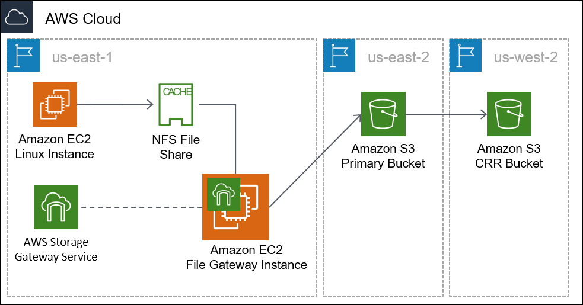
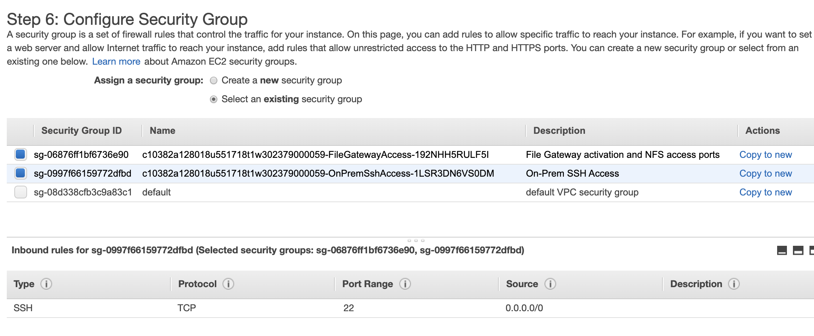
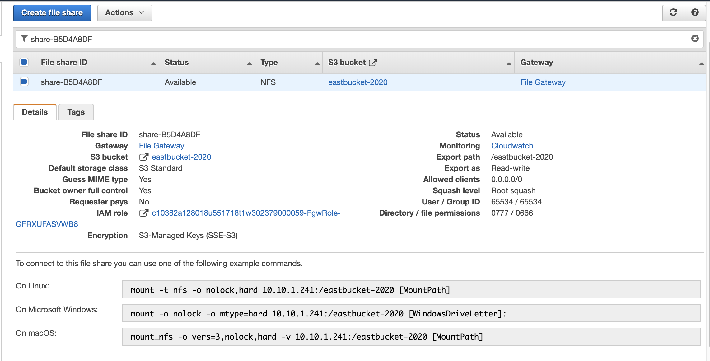

# Module 14 – Guided Lab: Hybrid Storage and Data Migration with AWS Storage Gateway File Gateway
[//]: # "SKU: ILT-TF-200-ACACAD-2    Source Course: SPL-223"

## Lab overview and objectives

In this lab, you will use the AWS Storage Gateway File Gateway service to attach a Network File System (NFS) mount to an on-premises data store. You will then replicate that data to an S3 bucket in AWS. Additionally, you will configure advanced Amazon S3 features, like Amazon S3 lifecycle policies and cross-Region replication.

After completing this lab, you should be able to:

- Configure a File Gateway with an NFS file share and attach it to a Linux instance
- Migrate a set of data from the Linux instance to an S3 bucket
- Create and configure a primary S3 bucket to migrate on-premises server data to AWS
- Create and configure a secondary S3 bucket to use for cross-Region replication
- Create an S3 lifecycle policy to automatically manage data in a bucket

<br/>

## Duration

This lab will require approximately **90 minutes** to complete.

<br/>

## AWS service restrictions

In this lab environment, access to AWS services and service actions might be restricted to the ones that are needed to complete the lab instructions. You might encounter errors if you attempt to access other services or perform actions beyond the ones that are described in this lab.

<br/>

## Accessing the AWS Management Console

1. At the top of these instructions, choose <span id="ssb_voc_grey">Start Lab</span> to launch your lab.

   A **Start Lab** panel opens, and it displays the lab status.

   <i class="fas fa-info-circle"></i> **Tip**: If you need more time to complete the lab, restart the timer for the environment by choosing the <span id="ssb_voc_grey">Start Lab</span> button again.

2. Wait until the **Start Lab** panel displays the message *Lab status: ready*, then close the panel by choosing the **X**.

3. At the top of these instructions, choose <span id="ssb_voc_grey">AWS</span>.

   This action opens the AWS Management Console in a new browser tab. The system automatically logs you in.

   <i class="fas fa-exclamation-triangle"></i> **Tip**: If a new browser tab does not open, a banner or icon is usually at the top of your browser with the message that your browser is preventing the site from opening pop-up windows. Choose the banner or icon, and then choose **Allow pop-ups**.

4. Arrange the **AWS Management Console** tab so that it displays alongside these instructions. Ideally, you will have both browser tabs open at the same time so that you can follow the lab steps more easily.

   <i class="fas fa-exclamation-triangle"></i> **Do not change the Region unless specifically instructed to do so**.

<br/>

## Task 1: Reviewing the lab architecture

This lab environment uses a total of three AWS Regions. A Linux EC2 instance that emulates an on-premises server is deployed to the us-east-1 (N. Virginia) Region. The Storage Gateway virtual appliance is deployed to the same Region as the Linux server. In a real-world scenario, the appliance would be deployed in a VMware vSphere or Microsoft Hyper-V environment, or as a physical Storage Gateway appliance.

The primary S3 bucket is created in the us-east-2 (Ohio) Region. Data from the Linux host is copied to the primary S3 bucket. This bucket can also be called the *source*.

The secondary S3 bucket is created in the us-west-2 (Oregon) Region. This secondary bucket is the *target* for the cross-Region replication policy. It can also be called the *destination*.




<br/>

## Task 2: Creating the primary and secondary S3 buckets

Before you configure the File Gateway, you must create the primary S3 bucket (or the source) where you will replicate the data. You will also create the secondary bucket (or the destination) that will be used for cross-Region replication.

5. In the **AWS Management Console**, on the <span id="ssb_services">Services</span> menu, select **S3**.

6. Choose <span id="ssb_orange">Create bucket</span> then configure these settings:

  - **Bucket name:** Create a name that you can remember easily. It must be globally unique.
  - **Region:** *US East (Ohio) us-east-2*
  - **Bucket Versioning:** *Enable*

   <i class="fas fa-info-circle"></i> For cross-Region replication, you must enable versioning for both the source and destination buckets.  

7. Choose <span id="ssb_orange">Create bucket</span>

8. Repeat the previous steps in this task to create a second bucket with the following configuration:

  - **Bucket name:** Create a name you can easily remember. It must be globally unique.
  - **Region:** *US West (Oregon) us-west-2*
  - **Versioning:** *Enable*

<br/>

## Task 3: Enabling cross-Region replication

Now that you created your two S3 buckets and enabled versioning on them, you can create a replication policy.

9. Select the name of the *source* bucket that you created in the US East (Ohio) Region.

10. Select the **Management** tab, under Replication rules select <span id="ssb_white"></i> Create replication rule</span>

11. Configure the following for **Replication rule configuration**:

  - **Replication rule name:** `crr-full-bucket`
  - **Status** *Enabled*
  - **Choose a rule scope:** *This rule applies to all objects in the bucket*
  - **Destination:**
    - <i class="far fa-dot-circle"></i> *Choose a bucket in this account*
    - Click <span id="ssb_white"></i> Browse S3</span> and select the bucket you created in US West (Oregon) Region.
    - Select <span id="ssb_orange"></i> Choose path</span>
  - **IAM role:** *S3-CRR-Role* 
    - **Note:**  To find the AWS Identity and Access Management (IAM) role, in the search box, enter: `S3-CRR` (This role was pre-created with the required permissions for this lab)

12. Choose <span id="ssb_orange"></i> Save</span>

13. Return to the bucket you created in the US East (Ohio) Region.

14. Click <span id="ssb_orange"></i> Upload</span> to upload a file from your local computer to the bucket.

   *For this lab, use a small file that does not contain sensitive information, such as a blank text file.*

15. Select  <span id="ssb_white"></i> Add files</span> then click <span id="ssb_orange"></i>Upload</span> 

16. Wait for the file to upload, then return to the bucket you created in the US West (Oregon) Region. The file that you uploaded should also be copied to this bucket.

   **Note:** You may need to choose refresh <i class="fas fa-redo"></i> the console for the object to appear.

<br/>

## Task 4: Configuring the File Gateway and creating an NFS file share

In this task, you will deploy the File Gateway appliance as an Amazon Elastic Compute Cloud (Amazon EC2) instance. You will then configure a cache disk, select an S3 bucket to synchronize your on-premises files to, and select an IAM policy to use. Finally, you will create an NFS file share on the File Gateway.

17. At the top-left, choose the <span id="ssb_services">Services</span> menu, then select **Storage Gateway**.

   You can also search for *Storage Gateway* from the top of the **Services** menu to make locating it easier.

18. At the top-right of the console, verify that the current Region is *N. Virginia*.

19. Choose <span id="ssb_orange"></i> Create gateway</span>

20. Select **Amazon S3 File gateway**, then choose <span id="ssb_orange"></i> Next</span>

21. Select **Amazon EC2**, then choose the <span id="ssb_white"></i> <i class="fas fa-external-link-alt"></i> Launch instance</span> button.

   A new tab opens to the EC2 instance launch wizard. This link automatically selects the correct Amazon Machine Image (AMI) that must be used for the File Gateway appliance.

22. Select the **t2.xlarge** instance type, then choose <span id="ssb_grey"></i> Next: Configure Instance Details</span>

   **Note:** t2.xlarge is the only instance type that you can select in this lab environment. If you select any other instance type, it will result in an error message at the end of the wizard.

   <i class="fas fa-info-circle"></i> The t2.xlarge instance type is used only as an example in this lab. For correct appliance sizing when you deploy a Storage Gateway appliance, refer to the <a href="https://docs.aws.amazon.com/storagegateway/latest/userguide/Requirements.html#requirements-hardware-storage" target="_blank">Storage Gateway documentation</a>.

23. On the **Configure instance details** screen, configure these settings:

   - **Number of instances:** `1`
   - **Network:** *On-Prem-VPC*
   - **Subnet:** *On-Prem-Subnet*
   - **Auto-assign Public IP:** *Use subnet setting* (Enable)
   - Accept the default values for the remaining options

     **Note**: You can ignore warning messages, such as: *You do not have permissions to list instance profiles. Contact your administrator, or check your IAM permissions.*

24. Choose <span id="ssb_grey"></i> Next: Add Storage</span>

25. Choose <span id="ssb_grey"></i> Add New Volume</span> and configure these settings:

   - **Volume Type:** *EBS*
   - **Device:** */dev/sdb*
   - **Size (GiB):** `150`
   - **Volume Type:** *General Purpose SSD (gp2)*
   - **Delete on Termination:** <i class="far fa-check-square"></i>

26. Choose <span id="ssb_grey"></i> Next: Add Tags</span>

27. Choose <span id="ssb_grey"></i> Add Tag</span> and configure these settings:

   - **Key:** `Name`
   - **Value:** `File Gateway Appliance`
   - **Instances:** <i class="far fa-check-square"></i>
   - **Volumes:** <i class="far fa-check-square"></i>

   **Note:** Tags are case-sensitive.

28. Choose <span id="ssb_grey"></i> Next: Configure Security Group</span>

29. Choose **Select an existing security group**, and then select:

   - *File Gateway activation and NFS access ports*

     - This security group is configured to allow traffic through ports 80 (HTTP), 443 (HTTPS), 53 (DNS), 123 (NTP), and 2049 (NFS). These ports enable the activation of the File Gateway appliance. They also enable connectivity from the Linux server to the NFS share that you will create on the File Gateway.

       For additional information about the ports used by Storage Gateway, refer to the <a href="https://docs.aws.amazon.com/storagegateway/latest/userguide/Requirements.html#networks" target="_blank">Storage Gateway documentation</a>.

   - *On-Prem SSH Access*

     - This security group is configured to allow Secure Shell (SSH) connections on port 22.

   

30. Choose <span id="ssb_blue"></i> Review and Launch</span>

    **Note:** You will see warning messages at the top of the next screen. You can safely disregard these warnings for this lab. To prevent unwanted or malicious connections to your instances in a production environment, you should always create security groups that are as restrictive as possible.

31. Choose <span id="ssb_blue"></i> Launch</span>

32. On the **Select an existing key pair or create a new key pair** screen, configure these settings:

   - **Choose an existing key pair**
   - **Select a key pair:** Choose the available key
   - <i class="far fa-check-square"></i> *I acknowledge that I have access to the selected private key file...*

   **Note:** This key pair is provided on the **Details > Show > Credentials** page for this lab.

33. Choose <span id="ssb_blue"></i> Launch Instances</span>

34. Choose <span id="ssb_blue"></i> View Instances</span>

    Your File Gateway appliance instance should take a few minutes to deploy.

35. Monitor the status of the deployment and wait for **Status Checks** to complete.

    **Note:** You might need to choose the refresh <i class="fas fa-redo"></i> button within the AWS console.

36. Select your File Gateway instance from the list, then at the bottom of the screen, locate the **IPv4 Public IP** address and copy it. You will use this IP address when you complete the File Gateway deployment.

37. Return to the **AWS Storage Gateway** tab in your browser. It should still be at the **Select host platform** screen.

38. Verify that **Amazon EC2** is selected, then choose <span id="ssb_orange"></i> Next</span>

39. For the **Service endpoint**, select **Public**, and then choose <span id="ssb_orange"></i> Next</span>

40. Paste the **IPv4 Public IP** address that you copied from your File Gateway Appliance instance, and then choose <span id="ssb_orange"></i> Next</span>

41. On the **Activate gateway** screen, configure these settings:

   - **Gateway time zone:** *GMT -5:00 Eastern Time (US & Canada)*
   - **Gateway name:** `File Gateway`

42. Choose <span id="ssb_orange"></i> Activate gateway</span>

43. On the **Configure local disks** screen, wait for the *Preparing local disks* status to show that it finished processing (approximately 1 minute).

44. After the processing is complete, go to **Allocated to** and select **Cache**. 

45. Select <span id="ssb_orange"></i> Save and continue</span>

46. On the **Gateway health log group** screen, select **Disable logging**.

47. Select <span id="ssb_orange"></i> Save and continue</span>

48. Review then select <span id="ssb_orange"></i> Finish</span>

49. Wait for the File Gateway status to change to *Running* (approximately 1–2 minutes), then select the **File Gateway** entry and choose <span id="ssb_white"></i> Create file share</span>

50. On the **File share settings configuration** screen, configure these settings:
   - **Gateway:** Select the name of the File Gateway that you just created (which should be *File Gateway*)
   - **Amazon S3 bucket name**: Enter the name of the source bucket that you created in the US East (Ohio) us-east-2 Region in Task 1.
   - **AWS Region:** *US East (Ohio) us-east-2*
   - **Access objects using**: *Network File System (NFS)*

51. Choose <span id="ssb_orange"></i> Next</span>

52. On the **Amazon S3 storage configuration** screen, configure these settings:

   - **Storage class for new objects:** *S3 Standard*
   - **Object metadata**:
     - <i class="far fa-check-square"></i> *Guess MIME type*
     - <i class="far fa-check-square"></i> *Give bucket owner full control*
     - <i class="far fa-square"></i> Enable *Requester Pays*
   - **Access your S3 bucket**: *Use an existing IAM role*
   - **IAM role:** Paste the *FgwIamPolicyARN*, which you can retrieve by following these instructions –
     - Choose the <span id="ssb_voc_grey">Details</span> dropdown menu above these instructions
     - Select <span id="ssb_voc_grey">Show</span>
     - Copy the *FgwIamPolicyARN* value

53. Choose <span id="ssb_orange"></i> Next</span>

    **Note:** You might get a warning message that the file share is accessible from anywhere. For this lab, you can safely disregard this warning. In a production environment, you should always create policies that are as restrictive as possible to prevent unwanted or malicious connections to your instances.

54. Choose <span id="ssb_orange"></i> Next</span>

55. Review then select <span id="ssb_orange"></i> Create</span> 

56. Monitor the status of the deployment and wait for **Status** to change to *Available*, which takes less than a minute.

    **Note:** If you receive a *user not authorized* message at the top of the screen you can ignore this. This will not affect the lab.


57. Select the file share that you just created. At the bottom of the screen, note the command to mount the file share on Linux. You will need it for the next task.

    

<br/>

## Task 5: Mounting the file share to the Linux instance and migrating the data

Before you can migrate data to the NFS share that you created, you must first mount the share. In this task, you will mount the NFS share on a Linux server, then copy data to the share.

58. Connect to the **On-Prem Linux Server** instance.

### <i class="fab fa-windows"></i> Microsoft Windows users

<i class="fas fa-comment"></i> These instructions are specifically for Microsoft Windows users. If you are using macOS or Linux, <a href="#ssh-MACLinux">skip to the next section</a>.


59. Above these instructions that you are currently reading, choose the <span id="ssb_voc_grey">Details</span> dropdown menu, and then select <span id="ssb_voc_grey">Show</span>

    A **Credentials** window opens.

60. Choose the **Download PPK** button and save the **labsuser.ppk** file.

  **Note:** Typically, your browser saves the file to the **Downloads** directory.

61. Note the **OnPremLinuxInstance** address, if it is displayed.

62. Exit the **Details** panel by choosing the **X**.

63. To use SSH to access the EC2 instance, you must use **PuTTY**. If you do not have PuTTY installed on your computer, <a href="https://the.earth.li/~sgtatham/putty/latest/w64/putty.exe">download PuTTY</a>.

64. Open **putty.exe**.

65. To keep the PuTTY session open for a longer period of time, configure the PuTTY timeout:
  * Choose **Connection**
  * **Seconds between keepalives**: `30`

66. Configure your PuTTY session by using the following settings.
  * Choose **Session**
  * **Host Name (or IP address):** Paste the **OnPremLinuxInstance** for the instance you noted earlier
    * Alternatively, return to the Amazon EC2 console and choose **Instances**
    * Select the instance you want to connect to
    * In the *Description* tab, copy the **IPv4 Public IP** value
  * Back in PuTTY, in the **Connection** list, expand <i class="far fa-plus-square"></i> **SSH**
  * Choose **Auth** (but don't expand it)
  * Choose **Browse**
  * Browse to and select the **labsuser.ppk** file that you downloaded
  * To select the file, choose **Open**
  * Choose **Open** again


67. To trust and connect to the host, choose **Yes**.

68. When you are prompted with **login as**, enter: `ec2-user`

    This action connects you to the EC2 instance.

69. Microsoft Windows users: <a href="#ssh-after">Click here to skip ahead to the next task.</a>


<a id='ssh-MACLinux'></a>

### macOS <span style="font-size: 30px; color: #808080;"><i class="fab fa-apple"></i></span> and Linux <span style="font-size: 30px; "><i class="fab fa-linux"></i></span> Users

These instructions are specifically for macOS or Linux users. If you are a Windows user, <a href="#ssh-after">skip ahead to the next task.</a>

70. Above these instructions that you are currently reading, choose the <span id="ssb_voc_grey">Details</span> dropdown menu, and then select <span id="ssb_voc_grey">Show</span>

    A **Credentials** window opens.

71. Choose the **Download PEM** button and save the **labsuser.pem** file.

72. Note the **OnPremLinuxInstance** address, if it is displayed.

73. Exit the **Details** panel by choosing the **X**.

74. Open a terminal window, and change directory to the directory where the *labsuser.pem* file was downloaded by using the `cd` command.

    For example, if the *labsuser.pem* file was saved to your **Downloads** directory, run this command:

    ```bash
    cd ~/Downloads
    ```

75. Change the permissions on the key to be read-only, by running this command:

    ```bash
    chmod 400 labsuser.pem
    ```

76. Run the following command (replace **<public-ip\>** with the **OnPremLinuxInstance** address that you copied earlier).

   * Alternatively, to find the IP address of the on-premises instance, return to the Amazon EC2 console and select **Instances**
   * Select the instance that you want to connect to
   * In the **Description** tab, copy the **IPv4 Public IP** value


   ```bash
    ssh -i labsuser.pem ec2-user@<public-ip>
   ```

77. When you are prompted to allow the first connection to this remote SSH server, enter `yes`.

    Because you are using a key pair for authentication, you are not prompted for a password.

<a id='ssh-after'></a>

<br/>

#### You should now be connected to the instance.

78. On the Linux instance, to view the data that exists on this server, enter the following command:

   `ls /media/data`

   You should see 20 image files in the .png format.

79. Create the directory that will be used to synchronize data with your S3 bucket by using the following command:

   `sudo mkdir -p /mnt/nfs/s3`

80. Mount the file share on the Linux instance by using the command that you copied at the end of the last task.

  ```bash
  sudo mount -t nfs -o nolock,hard <File-Gateway-appliance-private-IP-address>:/<S3-bucket-name> /mnt/nfs/s3
  ```

	For example:

  ```bash
  sudo mount -t nfs -o nolock,hard 10.10.1.33:/lab-nfs-bucket /mnt/nfs/s3
  ```

81. Verify that the share was mounted correctly by entering the following command:

	`df -h`

	The output of the command should be similar to the following example:

  ```pseudocode
  [ec2-user@ip-10-10-1-210 ~]$ df -h
  Filesystem                  Size  Used Avail Use% Mounted on
  devtmpfs                    483M   64K  483M   1% /dev
  tmpfs                       493M     0  493M   0% /dev/shm
  /dev/xvda1                  7.8G  1.1G  6.6G  14% /
  10.10.1.33:/lab-nfs-bucket  8.0E     0  8.0E   0% /mnt/nfs/s3
  ```

82. Now that you created the mount point, you can copy the data that you want to migrate to Amazon S3 into the share by using this command:

   `cp -v /media/data/*.png /mnt/nfs/s3`


<br/>

## Task 6: Verifying that the data is migrated

You have finished configuring the gateway and copying data into the NFS share. Now, you will verify that the configuration works as intended.

83. Choose the <span id="ssb_services">Services</span> menu and select **S3**.

84. Select the bucket that you created in the US East (Ohio) Region, and verify that the 20 image files are listed.

   **Note:** You might need to choose the refresh <i class="fas fa-redo"></i> in the AWS console.

85. Return to the S3 buckets page and select the bucket that you created in the US West (Oregon) Region. Verify that the images files replicated to this bucket, based on the policy that you created earlier.

   **Note:** S3 Object replication can take up to 15 minutes to complete. Keep refreshing until you see the replicated objects. 

<br/>

You successfully migrated data to Amazon S3 by using AWS Storage Gateway in File Gateway mode! After your data is stored in Amazon S3, you can act on it like native Amazon S3 data. In this lab, you created a replication policy to copy the data to a secondary Region. You could also perform other operations, such as configuring a lifecycle policy. For example, you could migrate infrequently used data automatically from S3 Standard to Amazon Simple Storage Service Glacier for long-term storage, which can reduce costs. 

<br/>

## Submitting your work

86. At the top of these instructions, choose <span id="ssb_blue">Submit</span> to record your progress and when prompted, choose <span id="ssb_blue">Yes</span>.

87. If the results don't display after a couple of minutes, return to the top of these instructions and choose <span id="ssb_voc_grey">Grades</span>

    **Tip**: You can submit your work multiple times. After you change your work, choose **Submit** again. Your last submission is what will be recorded for this lab.

88. To find detailed feedback on your work, choose <span id="ssb_voc_grey">Details</span> followed by <i class="fas fa-caret-right"></i> **View Submission Report**.


<br/>

## Lab complete <i class="fas fa-graduation-cap"></i>
<i class="fas fa-flag-checkered"></i> Congratulations! You have completed the lab.


89. Choose <span id="ssb_voc_grey">End Lab</span> at the top of this page, and then select <span id="ssb_blue">Yes</span> to confirm that you want to end the lab.

    A panel should appear with this message: *DELETE has been initiated... You may close this message box now.*​

90. Select the **X** in the top right corner to close the panel.

<br/>


*©2021 Amazon Web Services, Inc. and its affiliates. All rights reserved. This work may not be reproduced or redistributed, in whole or in part, without prior written permission from Amazon Web Services, Inc. Commercial copying, lending, or selling is prohibited.*

