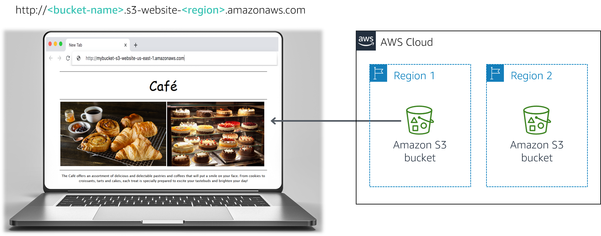

<!-- Font Awesome -->
<link rel="stylesheet" href="https://use.fontawesome.com/releases/v5.11.2/css/all.css">
<style type="text/css">
    #ssb_alexa_blue {
        background-color: #3366ff;
        font-weight: bold;
        font-size: 90%;
        color: white;
        position: relative;
        top: -1px;
        padding-top: 3px;
        padding-bottom: 3px;
        padding-left: 10px;
        padding-right: 10px;
        border-color: #3366ff;
        border-radius: 2px;
        white-space: nowrap
    }
    #ssb_alexa_ocean {
        background-color: #00a0d2;
        font-weight: bold;
        font-size: 90%;
        color: white;
        position: relative;
        top: -1px;
        padding-top: 3px;
        padding-bottom: 3px;
        padding-left: 10px;
        padding-right: 10px;
        border-color: #00a0d2;
        white-space: nowrap
    }
    #ssb_alexa_sand {
        background-color: #f2f2f2;
        font-weight: bold;
        font-size: 90%;
        color: #00a0d2;
        position: relative;
        top: -1px;
        border-color: #dcdcdc;
        border-style: solid;
        border-width: 2px;
        padding-top: 3px;
        padding-bottom: 3px;
        padding-left: 10px;
        padding-right: 10px;
        white-space: nowrap
    }
    #ssb_alexa_white {
        background-color: white;
        font-weight: bold;
        font-size: 90%;
        color: #00a0d2;
        position: relative;
        top: -1px;
        border-color: #00a0d2;
        border-style: solid;
        border-width: 2px;
        padding-top: 3px;
        padding-bottom: 3px;
        padding-left: 10px;
        padding-right: 10px;
        white-space: nowrap
    }
    #ssb_blue {
        background-color: #257ACF;
        font-weight: bold;
        font-size: 90%;
        color: white;
        position: relative;
        top: -1px;
        border-radius: 5px;
        padding-top: 3px;
        padding-bottom: 3px;
        padding-left: 10px;
        padding-right: 10px;
        white-space: nowrap
    }
    #ssb_catalog_orange {
        background-color: #E36000;
        font-weight: bold;
        font-size: 90%;
        color: white;
        position: relative;
        top: -1px;
        border-radius: 1px;
        padding-top: 3px;
        padding-bottom: 3px;
        padding-left: 10px;
        padding-right: 10px;
        white-space: nowrap
    }
    #ssb_catalog_red {
        background-color: #D90000;
        font-weight: bold;
        font-size: 90%;
        color: white;
        position: relative;
        top: -1px;
        border-radius: 5px;
        padding-top: 3px;
        padding-bottom: 3px;
        padding-left: 10px;
        padding-right: 10px;
        white-space: nowrap
    }
    #ssb_dark_blue {
        color: white;
        background-color: darkblue;
        border-radius: 3px;
        padding: 0px 6px;
        white-space: nowrap
    }
    #ssb_grafana_blue {
        background-color: #00678b;
        font-weight: bold;
        font-size: 90%;
        color: white;
        position: relative;
        top: -1px;
        padding-top: 3px;
        padding-bottom: 3px;
        padding-left: 10px;
        padding-right: 10px;
        border-color: #00678b;
        border-radius: 2px;
        white-space: nowrap
    }
    #ssb_grafana_green {
        background-color: #629300;
        font-weight: bold;
        font-size: 90%;
        color: white;
        position: relative;
        top: -1px;
        padding-top: 3px;
        padding-bottom: 3px;
        padding-left: 10px;
        padding-right: 10px;
        border-color: #629300;
        border-radius: 2px;
        white-space: nowrap
    }
    #ssb_grafana_orange {
        background-color: #ec8427;
        font-weight: bold;
        font-size: 90%;
        color: white;
        position: relative;
        top: -1px;
        padding-top: 3px;
        padding-bottom: 3px;
        padding-left: 10px;
        padding-right: 10px;
        border-color: #ec8427;
        border-radius: 2px;
        white-space: nowrap
    }
    #ssb_grey {
        background-color: #DEDEDE;
        font-weight: bold;
        font-size: 90%;
        color: #444;
        position: relative;
        top: -1px;
        border-radius: 5px;
        border-width: 1px;
        border-style: solid;
        border-color: #444;
        padding-top: 3px;
        padding-bottom: 3px;
        padding-left: 10px;
        padding-right: 10px;
        white-space: nowrap
    }
    #ssb_grey_square {
        background-color: #DEDEDE;
        font-weight: bold;
        font-size: 90%;
        color: #444;
        position: relative;
        top: -1px;
        border-radius: 1px;
        border-width: 1px;
        border-style: solid;
        border-color: #444;
        padding-top: 2px;
        padding-bottom: 2px;
        padding-left: 10px;
        padding-right: 10px;
        white-space: nowrap
    }
    #ssb_iot_blue {
        background-color: #00A1C9;
        font-weight: bold;
        font-size: 90%;
        color: white;
        position: relative;
        top: -1px;
        padding-top: 3px;
        padding-bottom: 3px;
        padding-left: 10px;
        padding-right: 10px;
        border-color: #00A1C9;
        border-radius: 2px;
        white-space: nowrap
    }
    #ssb_iot_grey {
        background-color: white;
        font-weight: bold;
        font-size: 90%;
        color: gray;
        position: relative;
        top: -1px;
        border-color: gray;
        border-radius: 2px;
        border-style: solid;
        border-width: 1px;
        padding-top: 3px;
        padding-bottom: 3px;
        padding-left: 10px;
        padding-right: 10px;
        white-space: nowrap
    }
    #ssb_iot_white {
        background-color: white;
        font-weight: bold;
        font-size: 90%;
        color: #00A1C9;
        position: relative;
        top: -1px;
        border-color: #00A1C9;
        border-radius: 2px;
        border-style: solid;
        border-width: 1px;
        padding-top: 3px;
        padding-bottom: 3px;
        padding-left: 10px;
        padding-right: 10px;
        white-space: nowrap
    }
    #ssb_kibana_blue {
        background-color: #0079a5;
        font-weight: bold;
        font-size: 90%;
        color: white;
        position: relative;
        top: -1px;
        padding-top: 3px;
        padding-bottom: 3px;
        padding-left: 10px;
        padding-right: 10px;
        border-color: #0079a5;
        border-radius: 2px;
        white-space: nowrap
    }
    #ssb_kibana_white {
        background-color: white;
        font-weight: bold;
        font-size: 90%;
        color: #0079a5;
        position: relative;
        top: -1px;
        border-color: #0079a5;
        border-radius: 2px;
        border-width: 1px;
        border-style: solid;
        padding-top: 3px;
        padding-bottom: 3px;
        padding-left: 10px;
        padding-right: 10px;
        white-space: nowrap
    }
    #ssb_lambda_orange {
        background-color: #ec7211;
        font-weight: bold;
        font-size: 90%;
        color: white;
        position: relative;
        top: -1px;
        padding-top: 3px;
        padding-bottom: 3px;
        padding-left: 10px;
        padding-right: 10px;
        white-space: nowrap
    }
    #ssb_lambda_white {
        background-color: white;
        font-weight: bold;
        font-size: 90%;
        color: #545b64;
        position: relative;
        top: -1px;
        border-color: #545b64;
        border-radius: 2px;
        border-width: 1px;
        border-style: solid;
        padding-top: 3px;
        padding-bottom: 3px;
        padding-left: 10px;
        padding-right: 10px;
        white-space: nowrap
    }
    #ssb_maroon {
        color: white;
        background-color: darkred;
        border-radius: 3px;
        padding: 0px 6px;
        white-space: nowrap
    }
    #ssb_orange {
        background-color: #ec7211;
        font-weight: bold;
        font-size: 90%;
        color: white;
        position: relative;
        top: -1px;
        padding-top: 3px;
        padding-bottom: 3px;
        padding-left: 10px;
        padding-right: 10px;
        white-space: nowrap
    }
    #ssl_orange {
        color: #ec7211;
        font-weight: bold
    }
    #ssb_orange_oval {
        background-color: #ec7211;
        font-weight: bold;
        font-size: 90%;
        color: white;
        position: relative;
        top: -1px;
        padding-top: 3px;
        padding-bottom: 3px;
        padding-left: 10px;
        padding-right: 10px;
        border-radius: 20px;
        white-space: nowrap
    }
    #ssb_oval {
        background-color: #DEDEDE;
        font-weight: bold;
        font-size: 90%;
        color: #444;
        position: relative;
        top: -1px;
        border-radius: 20px;
        border-width: 1px;
        border-style: solid;
        border-color: #444;
        padding-top: 3px;
        padding-bottom: 3px;
        padding-left: 10px;
        padding-right: 10px;
    }
    #ssb_start_lab {
        background-color: #34A853;
        font-weight: bold;
        font-size: 90%;
        color: white;
        border-radius: 2px;
        padding-left: 10px;
        padding-right: 10px;
        padding-top: 3px;
        padding-bottom: 3px
    }
    #ssb_open_console {
        background-color: white;
        font-family: Google Sans;
        font-weight: bold;
        font-size: 90%;
        color: #1a73e8;
        border-color: #dadce0;
        border-radius: 4px;
        border-width: 2px;
        border-style: solid;
        outline-color: #ffffff;
        padding-top: 5px;
        padding-bottom: 5px;
        padding-left: 10px;
        padding-right: 10px
    }
    #ssb_rds_white {
        background-color: white;
        font-weight: bold;
        font-size: 90%;
        color: #545b64;
        position: relative;
        top: -1px;
        border-color: #545b64;
        border-radius: 2px;
        border-width: 1px;
        border-style: solid;
        padding-top: 3px;
        padding-bottom: 3px;
        padding-left: 10px;
        padding-right: 10px;
    }
    #ssb_red {
        background-color: #D93025;
        font-weight: bold;
        font-size: 90%;
        color: white;
        border-radius: 2px;
        padding-left: 10px;
        padding-right: 10px;
        padding-top: 3px;
        padding-bottom: 3px
    }
    #ssb_red_oval {
        background-color: #D93025;
        font-weight: bold;
        font-size: 90%;
        color: white;
        position: relative;
        top: -1px;
        padding-top: 3px;
        padding-bottom: 3px;
        padding-left: 10px;
        padding-right: 10px;
        border-radius: 20px;
        white-space: nowrap
    }
    #ssb_s3_blue {
        background-color: #329AD6;
        font-weight: bold;
        font-size: 90%;
        color: white;
        position: relative;
        top: -1px;
        padding-top: 3px;
        padding-bottom: 3px;
        padding-left: 10px;
        padding-right: 10px;
    }
    #ssb_s3_white {
        background-color: white;
        font-weight: bold;
        font-size: 90%;
        color: #329AD6;
        position: relative;
        top: -1px;
        border-color: #329AD6;
        border-width: 1px;
        border-style: solid;
        padding-top: 3px;
        padding-bottom: 3px;
        padding-left: 10px;
        padding-right: 10px;
    }
    #ssb_services {
        background-color: #232f3e;
        font-weight: bold;
        font-size: 90%;
        color: white;
        position: relative;
        top: -1px;
        padding-top: 3px;
        padding-bottom: 3px;
        padding-left: 10px;
        padding-right: 10px;
    }
    #ssb_square_lex {
        background-color: white;
        font-weight: bold;
        font-size: 90%;
        color: #1166bb;
        position: relative;
        top: -1px;
        border-color: #c4cbcd;
        border-style: solid;
        border-width: 2px;
        padding-top: 3px;
        padding-bottom: 3px;
        padding-left: 10px;
        padding-right: 10px
    }
    #ssb_ssm_white {
        background-color: white;
        font-weight: bold;
        font-size: 90%;
        color: #545b64;
        position: relative;
        top: -1px;
        border-color: #545b64;
        border-radius: 2px;
        border-width: 1px;
        border-style: solid;
        padding-top: 3px;
        padding-bottom: 3px;
        padding-left: 10px;
        padding-right: 10px;
    }
    #ssb_white {
        background-color: white;
        font-weight: bold;
        font-size: 90%;
        color: #545b64;
        position: relative;
        top: -1px;
        border-color: #545b64;
        border-radius: 2px;
        border-width: 1px;
        border-style: solid;
        padding-top: 3px;
        padding-bottom: 3px;
        padding-left: 10px;
        padding-right: 10px;
    }
    #ssbox_cloudformation_blue {
        font-weight: bold;
        background-color: #f1faff;
        font-size: 90%;
        border-color: #00A1C9;
        border-width: 1px;
        border-style: solid;
        padding-top: 3px;
        padding-bottom: 3px;
        padding-left: 10px;
        padding-right: 10px;
    }
    #ssl_alexa_ocean {
        color: #00a0d2;
        font-weight: bold
    }
    #ssl_blue {
        color: #1166bb;
        font-weight: bold
    }
    #ssl_catalog_orange {
        color: #E16706;
        font-weight: bold
    }
    #ssb_codestar_blue {
        background-color: #329AD6;
        font-weight: bold;
        font-size: 80%;
        color: white;
        position: relative;
        top: -1px;
        border-radius: 1px;
        padding-top: 3px;
        padding-bottom: 3px;
        padding-left: 10px;
        padding-right: 10px;
        white-space: nowrap
    }
    #ssb_cognito_blue {
        background-color: #2a7fd4;
        font-weight: bold;
        font-size: 90%;
        color: white;
        position: relative;
        top: -1px;
        padding-top: 3px;
        padding-bottom: 3px;
        padding-left: 10px;
        padding-right: 10px;
        border-color: #0055aa;
        border-radius: 2px;
        white-space: nowrap
    }
    #ssb_eb_blue {
        background-color: #0f6dca;
        font-weight: bold;
        font-size: 90%;
        color: white;
        position: relative;
        top: -1px;
        padding-top: 3px;
        padding-bottom: 3px;
        padding-left: 10px;
        padding-right: 10px;
        border-color: #0055aa;
        border-width: 1px;
        border-style: solid;
        border-radius: 4px;
        white-space: nowrap;
    }
    #ssb_eb_grey {
        background-color: #e5e5e5;
        font-weight: bold;
        font-size: 90%;
        color: 444444;
        position: relative;
        top: -1px;
        padding-top: 3px;
        padding-bottom: 3px;
        padding-left: 10px;
        padding-right: 10px;
        border-color: #bbbbbb;
        border-width: 1px;
        border-style: solid;
        border-radius: 4px;
        white-space: nowrap
    }
    #ssb_voc_grey {
        background-color: #F2F3F4;
        font-size: 90%;
        color: black;
        position: relative;
        top: -1px;
        padding-top: 3px;
        padding-bottom: 3px;
        padding-left: 10px;
        padding-right: 10px;
        border-color: grey;
        border-width: 1px;
        border-style: solid;
        white-space: nowrap
    }
</style>

# Module 3 Challenge Lab: Creating a Static Website for the Café

## Scenario

Frank and Martha are a husband-and-wife team who own and operate a small café business that sells desserts and coffee. Their daughter, Sofía, and their other employee, Nikhil—who is a secondary school student—also work at the café. The café has a single location in a large city.

The café currently doesn’t have a marketing strategy. They mostly gain new customers when someone walks by, notices the café, and decides to try it. The café has a reputation for high-quality desserts and coffees, but their reputation is limited to people who have visited, or who have heard about them from their customers.

Sofía suggests to Frank and Martha that they should expand community awareness of what the café has to offer. The café doesn’t have a web presence yet, and it doesn’t currently use any cloud computing services. However, that situation is about to change.

<br/>
## Lab overview and objectives

In this lab, you use Amazon Simple Storage Service (Amazon S3) to build a static website and implement architectural best practices to protect and manage your data.

After completing this lab, you should be able to:

- Host a static website by using Amazon S3
- Implement one way to protect your data with Amazon S3
- Implement a data lifecycle strategy in Amazon S3
- Implement a disaster recovery (DR) strategy in Amazon S3
<br/>
At the end of this lab, your architecture should look like the following example:



<br/>
**Note:** In this challenge lab, you will encounter a few tasks where step-by-step instructions are not provided. You must figure out how to complete the tasks on your own.

<br/>
## Duration

This lab will require approximately **60 minutes** to complete.

<br/>
## AWS service restrictions

In this lab environment, access to AWS services and service actions might be restricted to the ones that are needed to complete the lab instructions. You might encounter errors if you attempt to access other services or perform actions beyond the ones that are described in this lab.

<br/>
## Accessing the AWS Management Console

1. At the top of these instructions, choose <span id="ssb_voc_grey">Start Lab</span> to launch your lab.

   A **Start Lab** panel opens, and it displays the lab status.

   **Tip**: If you need more time to complete the lab, choose the Start Lab button again to restart the timer for the environment.

2. Wait until you see the message *Lab status: ready*, then close the **Start Lab** panel by choosing the **X**.

3. At the top of these instructions, choose <span id="ssb_voc_grey">AWS</span>.

   This opens the AWS Management Console in a new browser tab. The system will automatically log you in.

   **Tip**: If a new browser tab does not open, a banner or icon is usually at the top of your browser with a message that your browser is preventing the site from opening pop-up windows. Choose the banner or icon and then choose **Allow pop ups**.

4. Arrange the AWS Management Console tab so that it displays along side these instructions. Ideally, you will be able to see both browser tabs at the same time so that you can follow the lab steps more easily.

<br/>
## A business request for the café: Launching a static website (Challenge #1)

Sofía mentions to Nikhil that she would like the café to have a website that will visually showcase the café's offerings. It would also provide customers with business details, such as the location of the store, business hours, and telephone number.

Nikhil is happy that he was asked to create the first website for the café.

For this first challenge, you will take on the role of Nikhil and use Amazon S3 to create a basic website for the café.

<br/>
### Task 1: Extracting the files that you need for this lab

In this task, you will extract the files that you need to create the static website.

5. Download the *.zip* file you need for this lab by opening [this Amazon S3 link](https://aws-tc-largeobjects.s3-us-west-2.amazonaws.com/ILT-TF-200-ACACAD-20-EN/Module-3-Challenge-Lab/static-website.zip).

6. On your computer, extract the files. Notice that you have an *index.html* file, and two folders that contain Cascading Style Sheets (CSS) and image files.

<br/>
### Task 2: Creating an S3 bucket to host your static website

In this task, you will create an S3 bucket and configure it to host your static website.

7. Open the **Amazon S3 console**.

8. Create a bucket to host your static website.

   - Create the bucket in the **N. Virginia** (us-east-1) AWS Region.
   - **Tip**: You must disable **Block *all* public access**.

9. Enable static website hosting on your bucket.
   - **Tip**: You will use the *index.html* file for your index document.

<br/>
### Task 3: Uploading content to your S3 bucket

In this task, you will upload the static files to your S3 bucket.

10. Upload the *index.html* file and the *css* and *images* folders to your S3 bucket.

11. In a separate web browser tab, open the endpoint link for your static website.

<br/>
#### Answering questions about the lab

Answers will be recorded when you choose the blue **Submit** button above at the end of the lab.

12. Access the questions in this lab.
	- Choose the <span id="ssb_voc_grey">Details <i class="fas fa-angle-down"></i></span>
	 menu, and choose <span id="ssb_voc_grey">Show</span>.
	- Choose the **Access the multiple choice questions** link that appears at the bottom of the page.

13. In the page you loaded, answer the first question:

	- **Question 1**: When viewing the website after Task 3, do you see the page in the browser?

  **Note**: Leave the questions webpage open in your browser tab. You will return to it later in this lab.

<br/>
### Task 4: Creating a bucket policy to grant public read access

Frank shares his plan to create *many* new types of pastries for the café. You realize that you will need to upload an image for each new dessert that he creates, and enable public access on that object. You don't want to do this process manually. Instead, you decide to create a bucket policy that automatically makes each object public when it's uploaded to the folder.

14. Create a bucket policy that grants read-only permission to public anonymous users by using the Bucket Policy editor.

  **Hint**: If you get stuck, refer to the examples in the [AWS Documentation](https://docs.aws.amazon.com/AmazonS3/latest/dev/example-bucket-policies.html).

15. Confirm that the website for the café is now publicly accessible.

<br/>
*Congratulations!* You now have a static website for the café.
<br/>

## New business requirement: Protecting website data (Challenge #2)

You show Sofía the new website, and she's very impressed. Good job!

You and Sofía discuss that you will likely need to make many updates to the website as the number of café offerings expands.

Olivia, an AWS Solutions Architect and café regular, advises you to implement a strategy to prevent the accidental overwrite and deletion of website objects.

You already need to make some changes to the website, so you decide that this would be a good time to explore object versioning.

<br/>
### Task 5: Enabling versioning on the S3 bucket

In this task, you will enable versioning on your S3 bucket and confirm that it works.

16. In the S3 console, enable versioning on your S3 bucket.

  **Note**: Notice that after you enable versioning, you can't disable it.

17. In your favorite text editor, open the *index.html* file. For example, you could use Notepad++ or TextWrangler.

18. Modify the file according to the following instructions:
    - Locate the first line that has the embedded CSS code **bgcolor="aquamarine"** in the HTML, and change it to `bgcolor="gainsboro"`.
    - Locate the line that has the embedded CSS code **bgcolor="orange"** in the HTML, and change it to `bgcolor="cornsilk"`.
    - Locate the second line that has the embedded CSS code **bgcolor="aquamarine"** in the HTML, and change it to `bgcolor="gainsboro"`.
    - Save the changes.

19. Upload the updated file to your S3 bucket.

20. Reload the web browser tab with your website and notice the changes.

21. To see the latest version of the *index.html* file, go to your bucket and choose **List versions**. You should see both versions of this file in the dropdown menu.

22. Return to the browser tab with the multiple-choice questions for this lab, and answer the following question:

	- **Question 2**: What is another way to ensure maximum protection and prevent the accidental deletion of a preserved version? (**Hint**: Review the [Amazon S3 FAQs](https://aws.amazon.com/s3/faqs/).)

<br/>
<br/>
**Architecture best practice**

In this task, you used one technique to implement the architecture best practice of *protecting your data*.

<details>
	<summary>Expand <b>here</b> to learn more about it.</summary>
	According to the <a href = https://d1.awsstatic.com/whitepapers/architecture/AWS_Well-Architected_Framework.pdf>Well-Architected Framework</a>, versioning can be part of a larger data lifecycle management process. Before you architect any system, foundational practices that influence security should be in place. For example, <i>data classification</i> provides a way to categorize organizational data based on levels of sensitivity. <i>Encryption</i> protects data by rendering it unintelligible to unauthorized access. These tools and techniques are important because they support objectives such as preventing financial loss or complying with regulatory obligations.
</details>

<br/>
## New business requirement: Optimizing costs of S3 object storage (Challenge #3)

Now that you enabled versioning, you realize that the size of the S3 bucket will continue to grow as you upload new objects and versions. To save costs, you decide to implement a strategy to retire some of those older versions.

<br/>
### Task 6: Setting lifecycle policies

In this task, you will set a lifecycle policy to automatically move older versions of the objects in your source bucket to S3 Standard-Infrequent Access (S3 Standard-IA). The policy should also eventually expire the objects.

23.   Configure two rules in the website bucket's lifecycle configuration. To receive full credit, create two separate rules. Do not configure two transitions in a single rule:
     - In one rule, move previous versions of all source bucket objects to S3 Standard-IA after 30 days
     - In the other rule, delete previous versions of the objects after 365 days
     <br/>**Hint**: If you get stuck, refer to the [AWS Documentation](https://docs.aws.amazon.com/AmazonS3/latest/user-guide/create-lifecycle.html) for guidance.
     <br/>
     **Note**: To *limit the scope* of the replication to a particular bucket object (for example, the *index.html* file), create a tag for the object before you create the lifecycle rule.
     <br/>

Good! You should now have a lifecycle configuration that will move previous versions of your source bucket objects to S3 Standard-IA after 30 days. The policy will also permanently delete the objects that are in S3 Standard-IA after 365 days.

<br/>
**Architecture best practice**

In this task, you implemented the architecture best practice of *defining data lifecycle management.*

<details>
	<summary>Expand <b>here</b> to learn more about it.</summary>
	According to the <a href = https://d1.awsstatic.com/whitepapers/architecture/AWS_Well-Architected_Framework.pdf>Well-Architected Framework</a>, in practice, your lifecycle strategy should be based on the <i>criticality and sensitivity</i> of your data, and <i>legal and organizational requirements</i>. You should consider factors such as data retention duration, data destruction, data access management, data transformation, and data sharing.
</details>

<br/>
## New business requirement: Enhancing durability and planning for DR (Challenge #4)

The next time Olivia comes to the café, you tell her about the updates to the website. You describe the measures that you took to protect the website's static files from being accidentally overwritten or deleted. Olivia tells you that cross-Region replication is another feature of Amazon S3 that you can also use to back up and archive critical data.

<br/>
### Task 7: Enabling cross-Region replication

In this task, you will enable cross-Region replication on your source S3 bucket.

24.   In a different Region than your source bucket, create a second bucket and enable versioning on it. The second bucket is your *destination bucket*.

25.   On your source S3 bucket, enable cross-Region replication. When you create the replication rule, make sure that you:
     - Replicate the entire source bucket.
     - Use the **CafeRole** for the AWS Identity and Access Management (IAM) role. This IAM role gives Amazon S3 the permissions to read objects from the source bucket and replicate them to the destination bucket.
     - If you encounter the warning *The replication rule is saved, but it might not work*, you can ignore it and proceed to the next step.
     <br/>
     **Hint**: If you get stuck, refer to the [AWS Documentation](https://docs.aws.amazon.com/AmazonS3/latest/user-guide/enable-replication.html#enable-replication-add-rule) for guidance.
     <br/>
     **Note:** *CafeRole* has the following permissions:

```yaml
Version: 2012-10-17
Statement:
  - Action:
	- s3:ListBucket
	- s3:ReplicateObject
	- s3:ReplicateDelete
	- s3:ReplicateTags
	- s3:Get*
    Resource:
	- '*'
    Effect: Allow
```

This access policy allows the role to perform the replication tasks on *all* S3 buckets. In a real production environment, you should restrict the policy to apply only to your source and destination S3 buckets. For more information about creating an IAM role, refer to [Setting Up Permissions for Replication](https://docs.aws.amazon.com/AmazonS3/latest/dev/setting-repl-config-perm-overview.html).
<br/>
26. Return to the browser tab with the multiple-choice questions for this lab, and answer the following question:

	- **Question 3**: Do you see the objects from your source bucket in the destination bucket?

27. Make a minor change to the *index.html* file and upload the new version to your source bucket.

28. Verify that the source bucket now has three versions of the *index.html* file.

29. Confirm that the new object was replicated to your destination bucket. You might need to reload the browser tab.

30. Go to your source bucket and delete the latest version.

31. Return to the browser tab with the multiple-choice questions for this lab, and answer the following question:

	- **Question 4**: Was the version that you just deleted from your source bucket also deleted from your destination bucket?

<br/>
**Architecture best practice**

In this task, you implemented the architecture best practice of *automating disaster recovery*.

<details>
	<summary>Expand <b>here</b> to learn more about it.</summary>
	According to the <a href = https://d1.awsstatic.com/whitepapers/architecture/AWS_Well-Architected_Framework.pdf>Well-Architected Framework</a>, the start of your DR strategy is <i>having backups and redundant workload components in place</i>. You should use AWS or third-party tools to automate system recovery and route traffic to the DR site or Region.
</details>

<br/>
## Submitting your work

32. At the top of these instructions, choose <span id="ssb_blue">Submit</span> to record your progress and when prompted, choose **Yes**.

33. If the results don't display after a couple of minutes, return to the top of these instructions and choose <span id="ssb_voc_grey">Grades</span>

     **Tip**: You can submit your work multiple times. After you change your work, choose **Submit** again. Your last submission is what will be recorded for this lab.

34. To find detailed feedback on your work, choose <span id="ssb_voc_grey">Details</span> followed by <i class="fas fa-caret-right"></i> **View Submission Report**.

<br/>

## Lab complete

<i class="fas fa-flag-checkered"></i> Congratulations! You have completed the lab.

35. To confirm that you want to end the lab, at the top of this page, choose **<span id="ssb_voc_grey">End Lab</span>**, and then choose **<span id="ssb_blue">Yes</span>**.  

    A panel should appear with this message: _DELETE has been initiated... You may close this message box now._

36. To close the panel, choose the **X** in the top-right corner.


<br/>
*©2020 Amazon Web Services, Inc. and its affiliates. All rights reserved. This work may not be reproduced or redistributed, in whole or in part, without prior written permission from Amazon Web Services, Inc. Commercial copying, lending, or selling is prohibited.*
