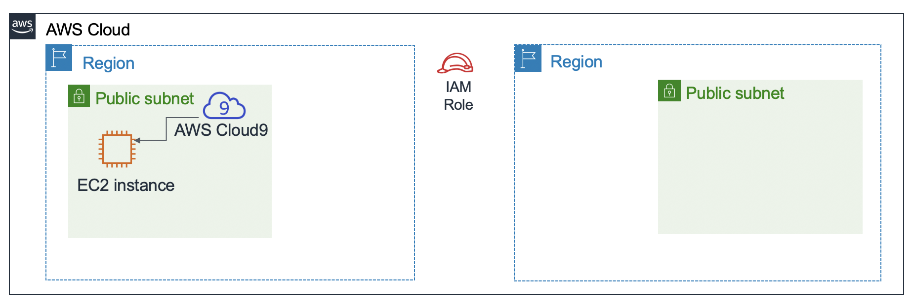

# Module 4 - Challenge Lab: Creating a Dynamic Website for the Café

<!--Note: the step-by-step solutions to the challenge sections of this lab can be found in the instructor guide (source document at https://awsu-coursebuild.s3-us-west-2.amazonaws.com/sourcefiles/CUR-TF-200-ACACAD-20-EN/IG/AcademyCloudArchitecting-IG-Module-04.docx)-->

## Scenario

After the café launched the first version of their website, customers told the café staff how nice the website looks. However, in addition to the praise, customers often asked whether they could place online orders.

Sofía, Nikhil, Frank, and Martha discussed the situation. They agreed that their business strategy and decisions should focus on delighting their customers and providing them with the best possible café experience.


## Lab overview and objectives
In this lab, you will deploy an application on an Amazon Elastic Compute Cloud (Amazon EC2) instance. The application enables the café to accept online orders. After testing that the application works as intended in the first AWS Region (the *development* environment), you will then create an Amazon Machine Image (AMI) from the EC2 instance. You will also deploy a second instance of the same application as the *production* environment in another AWS Region.

After completing this lab, you should be able to:

- Connect to the AWS Cloud9 IDE on an existing EC2 instance

- Analyze the EC2 instance environment and confirm web server accessibility

- Install a web application on an EC2 instance that also uses AWS Systems Manager Parameter Store

- Test the web application

- Create an AMI

- Deploy a second copy of the web application to another AWS Region


When you *start* the lab, some resources are already created for you in the AWS account:



At the *end* of this lab, your architecture should look like the following example:


## Duration
This lab will require approximately **60 minutes** to complete.


## AWS service restrictions
In this lab environment, access to AWS services and service actions might be restricted to the ones that are needed to complete the lab instructions. You might encounter errors if you attempt to access other services or perform actions beyond the ones that are described in this lab.


## Accessing the AWS Management Console

1. At the top of these instructions, choose <span id="ssb_voc_grey">Start Lab</span> to launch your lab.

    A **Start Lab** panel opens, and it displays the lab status.

    **Tip**: If you ever need more time to complete the lab that is displayed on the timer, choose the <span id="ssb_voc_grey">Start Lab</span> button again to restart the timer for the environment. Doing so will not delete resources you have created.


2. Wait until you see the message *Lab status: ready*, then close the **Start Lab** panel by choosing the **X**.


3. At the top of these instructions, choose <span id="ssb_voc_grey">AWS</span>.

    This opens the AWS Management Console in a new browser tab. The system will automatically log you in.

    **Tip**: If a new browser tab does not open, a banner or icon is usually at the top of your browser with the message that your browser is preventing the site from opening pop-up windows. Choose the banner or icon, and then choose **Allow pop-ups**.


4. Arrange the AWS Management Console tab so that it displays alongside these instructions. Ideally, you will have both browser tabs open at the same time so that you can follow the lab steps more easily.


## A business request for the café: Preparing an EC2 instance to host a website (Challenge #1)

The café wants to introduce online ordering for customers, and enable café staff to view submitted orders. Their current website architecture, where the website is hosted on Amazon S3, does not support the new business requirements.

In the first part of this lab, you will take on the role of Sofía. You will configure an Amazon EC2 instance so that it is ready to host a website for the café.


### Task 1: Analyzing the existing EC2 instance

In this task, you will note details about an existing EC2 instance that was created for you in the AWS account.

5. From the **Services** menu, choose **EC2**, then choose **Running instances**.

    Notice the running instance named *aws-cloud9-CafeWebServer-...*. This EC2 instance was created when you started the lab.  

    


#### Answering questions about the instance

Answers will be evaluated when you choose the blue **Submit** button at the end of the lab.

6. Access the questions in this lab.
   - Choose the **Details** menu, and choose **Show**.
   - Choose the **Access the multiple choice questions** link that appears at the bottom of the page.


7. In the page that you loaded, answer the first four questions:

	- **Question 1**: Is the instance in a public subnet?
	- **Question 2**: Does the EC2 instance have an IPv4 public IP address assigned to it?
	- **Question 3**: What inbound TCP port numbers are open for this instance?
	- **Question 4**: Does the EC2 instance have an AWS Identity and Access Management (IAM) role associated with it?

	**Note**: Leave the questions webpage open in your browser tab. You will return to it later in this lab.


### Task 2: Connecting to the IDE on the EC2 instance

AWS Cloud9 is service that can run on an EC2 instance. It provides an integrated development environment (IDE) that includes features such as a code editor, debugger, and terminal.

By using the AWS Cloud9 environment, you don't need to download a key pair and connect to the EC2 instance by using PuTTY or similar Secure Shell (SSH) software. By using AWS Cloud9, you also don't need to use command line text-editing tools (like vi or nano) to edit files on the Linux instance.

8. From the *Services* menu, choose **AWS Cloud9**, then choose **Your environments**.

   Notice the *CafeWebServer* environment. It indicates that it is of enter *EC2*.


9. Choose **Open IDE**.

   You are now connected to the AWS Cloud9 IDE that is running on the EC2 instance that you observed earlier.

   The IDE includes:

   - A *Bash terminal* in the bottom-right panel.
   - A *file browser* in the left panel that shows files in the `/home/ec2-user/environment` directory on the instance.
   - A *file editor* in the upper-right panel. If you double-click a file in the file browser—such as the README.md file—it will display in the editor.

  


### Task 3: Analyzing the LAMP stack environment and confirming that the web server is accessible

Recall that the objective of this challenge lab is configure an EC2 instance to host the new dynamic website for the café. In this task, you will analyze what is already installed.


10. Observe the OS version.

    In the AWS Cloud9 bash terminal, run this command:

    ```bash
    cat /proc/version
    ```

    Notice how the output indicates it is an Amazon Linux instance, roughly analogous to Red Hat 7.


11. Observe the web server, database, and PHP details and server state.

    In the terminal, run these commands:

    ```bash
    sudo httpd -v
    service httpd status
    
    mysql --version
    service mysqld status
    
    php --version
    ```

    The output should show the versions of the web server and the database, and also show that they are not currently running.


12. Start the web server and the database, and also set them to start automatically after any future EC2 instance restart.

    In the terminal, run these commands:

    ```bash
    sudo chkconfig httpd on
    sudo service httpd start
    sudo service httpd status
    
    sudo chkconfig mysqld on
    sudo service mysqld start
    sudo service mysqld status
    ```


13. Configure the EC2 instance so that you can use the AWS Cloud9 editor to edit web server files.

	Notice that the AWS Cloud9 file browser currently does not display the Apache web server default web directory.

    In the terminal, run these two commands:

    ```bash
	ln -s /var/www/ /home/ec2-user/environment
	sudo chown ec2-user:ec2-user /var/www/html
    ```

    The first command you ran created a symlink from the default AWS Cloud9 editor workspace to the `/var/www` directory that contains your web server files.

	The second command changed ownership of the **html** subdirectory so that the *ec2-user* (which you are logged in as) can edit and create new files in it.


14. Creating a simple test webpage.

    - In the *file browser*, expand the **CafeWebServer > www** directory, and highlight the **html** directory.

    - Choose **File** > **New File**.

    - In the text editor tab, paste the following line:

      ```html
      <html>Hello from the café web server!</html>
      ```

    - Choose **File** > **Save**, and save the file in the **html** directory as *index.html*.


15. Make the website accessible from the internet.

    In this step, you will need to verify and update the configurations that make the webpages (which are hosted on the web server) accessible from the internet.

    Here are some tips to help you get started:

<details>
<summary>
<b>Tip #1</b> (click to expand)
</summary>
Discover the IPv4 public IP address of the EC2 instance, and try to load `http://&lt;public-ip>` in a new browser tab. Does the message that you entered into index.html load in the browser?
</details>


<details>
<summary>
<b>Tip #2</b> (click to expand)
</summary>To allow inbound HTTP traffic on TCP port 80 from anywhere, update the security group of the EC2 instance, as needed.
</details>


## New business requirement: Installing a dynamic website application on the EC2 instance (Challenge #2)

In the previous challenge, you configured the EC2 instance. You now know that PHP is installed, and that the application environment has a running relational database. Also, the environment has a running web server that can be accessed from the internet. You now have the basic setup for hosting a dynamic website for the café.

In the second part of this lab, you will take on the role of Sofía, and install the café application on the EC2 instance.


### Task 4: Installing the café application

16. Download and extract the web server application files.

    In the Bash terminal, run these commands:

    ```bash
    cd ~/environment
    wget https://aws-tc-largeobjects.s3-us-west-2.amazonaws.com/ILT-TF-200-ACACAD-20-EN/mod4-challenge/setup.tar.gz
    tar -zxvf setup.tar.gz
    wget https://aws-tc-largeobjects.s3-us-west-2.amazonaws.com/ILT-TF-200-ACACAD-20-EN/mod4-challenge/db.tar.gz
    tar -zxvf db.tar.gz
    wget https://aws-tc-largeobjects.s3-us-west-2.amazonaws.com/ILT-TF-200-ACACAD-20-EN/mod4-challenge/cafe.tar.gz
    tar -zxvf cafe.tar.gz
    ```

    Notice how the file browser now shows the three .tar.gz files that you downloaded.

    You also extracted these archive files, which created the `cafe`, `db`, and `setup` directories in your work environment.


17. Copy the café files over to the web server document root.

    In the Bash terminal, run this command:

    ```bash
    mv cafe /var/www/html/
    ```


18. Observe how the application is designed to work.

    - Open the `html/cafe/index.php` source code in the AWS Cloud9 editor by double-clicking it.
    - Notice that this file has HTML code in it, but it also contains sections that are enclosed in *<?php ... ?>* elements. These elements make calls to other systems and resources.
    - For example, on **line 18**, you see that the PHP code references a file named *getAppParameters.php*.
    - Open the **getAppParameters.php** file in the code editor.
    - Notice on **line 3** of this file that the *AWSSDK* is invoked.
    - Also, on **lines 10–33**, the web application creates a client that connects to the *ssm* service, which is AWS Systems Manager. The application then retrieves seven parameters from Systems Manager. Those parameters have not been created in AWS Systems Manager yet, but you will do that next.


19. In the AWS Systems Manager Parameter Store, configure the application parameters.

    In the Bash terminal, run these commands:

    ```bash
    cd setup
    ./set-app-parameters.sh
    ```

    The shell script that you just ran issued AWS Command Line Interface (AWS CLI) commands. These commands added the parameters that the application will use to the Parameter Store.


20. In the AWS Management Console, from the **Services** menu, choose **Systems Manager**.


21. From the panel on the left, choose **Parameter Store**.

    Notice how there are now seven parameters stored here.

    The café application's PHP code references these values (for example, so that it can retrieve the connection information for the MySQL database).

    Choose the `/cafe/dbPassword` parameter, and copy the *Value* to your clipboard. You will use this value in a moment.


22. Configure the MySQL database to support the café application.

    Back in the AWS Cloud9 bash terminal, run the following commands:

    ```bash
    cd ../db/
    ./set-root-password.sh
    ./create-db.sh
    ```


23. Observe the database tables that were created.

    In the Bash terminal, run this command to connect the terminal-based MySQL client to the database:

    ```bash
    mysql -u root -p
    ```
    When you are prompted for the database password, paste the *dbPassword* parameter value that you copied.

    You should now see a  `mysql>` prompt, which indicates that you are now connected to the MySQL database that runs on this EC2 instance.


  


To observe the contents of the database (specifically, the tables that support the café web application), enter the following commands:

  ```sql
show databases;
use cafe_db;
show tables;
select * from product;
exit;
  ```


24. Update the *timezone* configuration in PHP.

    In the Bash terminal, run the following commands:

    ```bash
    sudo sed -i "2i date.timezone = \"America/New_York\" " /etc/php.ini
    sudo service httpd restart
    ```

    The first command that you ran configured the time zone in the PHP software.

    The second command that you ran restarted the web server so that the web server notices the configuration update.


25. Test whether the café website is working and can be accessed from the internet.

    In a new browser tab, try to load the application at `http://<public-ip>/cafe` where <*public-ip*> is the IPv4 public IP address of the EC2 instance.

    You will see that *only the title banner* of the website loads. The rest of the webpage is not loading correctly.


26. Resolve an issue with the website.

    In this step, you will need to figure out how to make the café website function correctly.

    Here's a list of what *does* work:

    - The test page at *http://&lt;public-ip>/* loads, so you know that the web server works, and is accessible from the internet
    - You also know that the MySQL database is running, and contains tables and data to support the application

What could be the issue?

<details>
<summary>
<b>Tip #1</b> (click to expand)
</summary>
There is nothing wrong with the PHP code as written. The issue is related to permissions.
</details>

<details>
<summary>
<b>Tip #2</b> (click to expand)
</summary>
Does the web application rely on any other services or resources in addition to the web server and the database? For example, does it require access to another AWS service?
</details>

<details>
<summary>
<b>Tip #3</b> (click to expand)
</summary>
Go to the IAM service and search for the IAM role that is named <B>CafeRole</B>. Observe the permissions that this role grants. Would it be helpful to have these rights granted to the EC2 instance? How could you grant these permissions to the café web application?
</details>

<details>
<summary>
<b>Tip #4</b> (click to expand)
</summary>
 Select the EC2 instance in the Amazon EC2 console, and review the options on the <B>Actions</B> menu. Would any of the actions help solve the issue?
</details>


When you think you have fixed the issue, load the `http://<public-ip>/cafe` page again. Does it load completely so that you can see the café menu items? If so, congratulations!

**Note**: If you still can't solve the issue, you might find it helpful to run the grading script as documented in the **Submitting your work** section at the end of these lab instructions. The Submission Report that is generated can provide additional tips for parts of the lab that you didn't complete successfully. You can submit your work as many times as you like—only the score that you achieve on the last submission will be retained.


### Task 5: Testing the web application

27. Test by placing an order.

    - In the browser tab where you have the `http://<public-ip>/cafe` page open, choose **Menu**.

    - Submit an order for at least one of the menu items displayed.

      - Note: you may need to scroll down to find the **Submit Order** button.

    - Return to the menu page and place another order, then go to the **Order History** page to see the order details for all the orders that you placed.


## New business requirement: Creating development and production websites in different AWS Regions (Challenge #3)


Everyone at the café is impressed with the new dynamic website that Sofía created! Customers are delighted that they can now place online orders and schedule dessert items for pickup. Customer satisfaction has increased because of the reduced customer wait times.  

However, another business requirement emerges, along with the praise. Martha and Frank would like to have *two* café websites:
- One website that can be used as a *development environment* to mock up new features and web designs before they are released to customers

- A separate website that will host the *production environment* that customers use

Sofía discussed the new requirement with Mateo when he came into the café one morning for his coffee. He suggested that, ideally, the two environments would exist in *different AWS Regions*. Such a design would have the added benefit of providing more robust disaster recovery (DR) in the unlikely scenario when an AWS Region becomes temporarily unavailable.

Sofía is now very busy! As she accomplishes more impressive work, her skills become more in-demand.


### Task 6: Creating an AMI and launching another EC2 instance

Because the café website already runs well on an existing EC2 instance, Sofía decides to duplicate it by creating an AMI from it. She will then launch a new instance from the new AMI.

You will continue to take on the role of Sofía for this task. Before you create an AMI out of this instance, you should create a new key pair, which might be important to have later in this lab.


28. Set a static internal hostname and create a new key pair on the EC2 instance.

    In the bash terminal, run the following commands:

    ```bash
    sudo hostname cafeserver
    ssh-keygen -t rsa -f ~/.ssh/id_rsa
    ```

    For the two times that you are prompted for a passphrase, press the ENTER key.

    To make the new key available to the SSH utilities, in the Bash terminal, run the following command:
    ```bash
    cat ~/.ssh/id_rsa.pub >> ~/.ssh/authorized_keys
    ```


29. In the AWS Management Console, browse to the **EC2** service area and select the instance.


30. Choose **Actions > Images and templates > Create Image**.

    **Tip**: Leave the **Create Image** dialog open in the browser tab while you answer some questions about AMIs.


#### Answering questions about AMIs

Answers will be recorded when you choose the blue **Submit** button at the end of the lab.


31. Return to the browser tab that has the questions for this lab. You accessed this tab earlier.

    If you need to find the page again:

    - Choose the **Details** menu, and choose **Show**.

    - Choose the **Access the multiple choice questions** link that appears at the bottom of the page.


32. In the page, submit answers to the following questions:

    - **Question 5**: When you create an AMI from an instance, will the instance be rebooted?

    - **Question 6**: In what ways can you modify the root volume properties when you create an AMI from an instance?

    - **Question 7**: Can you add more volumes to an AMI that you create from an instance that only has one volume?


33. Back in the AWS Management Console, in the **Create Image** screen, create the new AMI:

    - **Image name**: `CafeServer`

    - Choose **Create Image**


34. From the navigation menu,  choose **AMIs** and wait until the image status becomes *Available*. The process typically takes about 2 minutes. You may need to expand **Images** to find **AMIs**.

    

35. Create an AMI in another AWS Region

    In this step, your objective is to create a new EC2 instance from the AMI that you just captured. However, you must create the new instance in the Oregon (us-west-2) AWS Region.

<details>
<summary>
<b>Tip #1</b> (click to expand)
</summary>
Copy the AMI ID of the image that you just created. Then, try to find it in the us-west-2 Region.
</details>

<details>
<summary>
<b>Tip #2</b> (click to expand)
</summary>
Do AMIs exist at the account level?
</details>

<details>
<summary>
<b>Tip #3</b> (click to expand)
</summary>
Select the AMI you that you created in the AWS Region where you created it. Next, choose the <b>Actions</b> menu. Do any actions seem like they could help you make the AMI available in the US West (Oregon) Region? Go ahead and choose the appropriate action. After you initiate it, the action might take up to 5 minutes to complete. Choose the refresh icon occasionally to know more quickly when it has completed.
</details>


36. Create the new café instance from your AMI. The new instance that you create must match the following criteria.

    - **Region**: `Oregon`

    - **Instance Size**: `t2.small`

    - **Network**: `Lab VPC Region 2`, `Public Subnet`

    - **IAM Role**: `CafeRole`

    - Tag:
      - **Key**: `Name`
      - **Value**: `ProdCafeServer`

    - Security Group:
      - Create a new one named **cafeSG**, with TCP port **22** open to anywhere
      - Set TCP port **80** so that it's open to anywhere as well

    - **Proceed without a key pair** (the key pair that you created earlier in this lab should work to connect to it, if necessary)


37. Wait for the new instance to have a *Public DNS* value assigned to it, even if the status of the instance is still not *Available*.


38. Copy the **Public DNS** value. You will use it soon.


39. To create the needed *AWS Systems Manager parameters* in the new AWS Region, complete these steps.

    - Return to the AWS Cloud9 IDE in the **N. Virginia (us-east-1)** Region.

    - Open the CafeWebServer/setup/**set-app-parameters.sh** file in the text editor.

    - Edit **line 12** of the file to match this setting:

      ```bash
      region="us-west-2"
      ```

    - Edit **line 18** to match this setting (where <*public-dns-of-ProdCafeServer-instance*> is the actual DNS of the ProdCafeServer instance):

      ```bash
      publicDNS="<public-dns-of-ProdCafeServer-instance>"
      ```

    **Note**: The line should still contain the quotation marks, but it should *not* contain the angle brackets (< >).


    This example shows what line 12 should look like and how line 18 should be formatted. However, the value of your public DNS will be different.


  - **File > Save** the change.

  - To run this script, go to the top of the IDE and choose the **Run** button.

In the Bash terminal below the text editor, you should see output that's formatted in JavaScript Object Notation (JSON). This output indicates that the parameters script ran successfully.

<details>
<summary>If the script encountered an issue, click here to view troubleshooting tips.</summary>
If the output of the command indicates that the credentials are expired, try running these commands in the Bash terminal (and then run the set-app-parameters.sh again):
<br><code>wget https://aws-tc-largeobjects.s3-us-west-2.amazonaws.com/ILT-TF-200-ACACAD-20-EN/mod4-challenge/cred-update.sh</code><br>
<code>chmod +x cred-update.sh</code><br>
<code>./cred-update.sh</code>
</details>

**Note**: By changing the AWS Region details and running this script again, you created the same parameters that you created earlier in the us-east-1 Region of the AWS Systems Manager Parameter Store. However, this time, you created these parameters in the Oregon Region.


### Task 7: Verifying the new café instance  


40. Return to the EC2 Console in the **Oregon** Region, and verify that the new **ProdCafeServer** instance is running.


41. Copy the IPv4 public IP address, and load it in a web browser.

    The *Hello from the cafe web server!* message should display.


42. Load the `http://<public-ip>/cafe/` URL in a browser tab.

    The entire café website should display.


43. Load the **Menu** page.

    The full *Menu* page should load, and the order-placing functionality should work.


44. Place an order to verify that the website is working as intended.


45. Troubleshooting tips (skip this one step if you didn't encounter any issues with loading the *Menu* page).

    The grading script can provide additional tips for parts of the lab that you didn't complete successfully. You can submit your work as many times as you like—only the score that you achieve on the last submission will be retained.

    Also, if you want to connect to the new EC2 instance in Oregon (us-west-2) to do some troubleshooting, run this command from the AWS Cloud9 IDE in us-east-1:

    ```bash
    ssh -i ~/.ssh/id_rsa ec2-user@<public-ip-of-ProdCafeServer>
    ```
    Note that <*public-ip-of-ProdCafeServer*> is the actual public IP address of the ProdCafeServer instance.


## Update from the café


Sofía is now a hero at the cafe! She created a dynamic website, *and* she also created a duplicate version of the same website that runs in a second AWS Region.

Sofía decided to designate the first EC2 instance that she created—the one in the us-east-1 Region—as the *development* instance. The second instance she created—the one in Oregon (the us-west-2 Region)—will be the *production* instance.

This way, Sofía and any other application developers can test application enhancements on the *development* site without affecting the *production* site. Then, when the developers decide that the enhancements look good and they have fully tested them, they can migrate the code to the production site.

Sofía explained to her parents, Frank and Martha, what she had done. Though they didn't fully understand all the technical terms that Sofía used, they were pleased to know that the website can now take online orders. They were also glad to hear that they can now test new enhancements to the website without immediately exposing those changes to customers.


## Submitting your work

46. At the top of these instructions, <span id="ssb_blue">Submit</span> to record your progress and when prompted, choose **<span id="ssb_blue">Yes</span>**.


47. If the results don't display after a couple of minutes, return to the top of these instructions and choose <span id="ssb_voc_grey">Grades</span>

     **Tip**: You can submit your work multiple times. After you change your work, choose **Submit** again. Your last submission is what will be recorded for this lab.


48. To find detailed feedback on your work, choose <span id="ssb_voc_grey">Details</span> followed by <i class="fas fa-caret-right"></i> **View Submission Report**.


## Lab complete

<i class="icon-flag-checkered"></i> Congratulations! You have completed the lab.


49. To confirm that you want to end the lab, at the top of this page, choose **<span id="ssb_voc_grey">End Lab</span>**, and then choose **<span id="ssb_blue">Yes</span>**.  

    A panel should appear with this message: *DELETE has been initiated... You may close this message box now.*


50. To close the panel, choose the **X** in the top-right corner.


*©2020 Amazon Web Services, Inc. and its affiliates. All rights reserved. This work may not be reproduced or redistributed, in whole or in part, without prior written permission from Amazon Web Services, Inc. Commercial copying, lending, or selling is prohibited.*