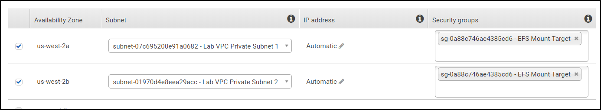
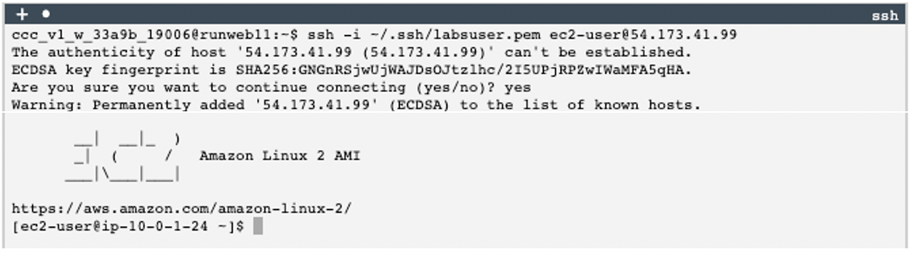
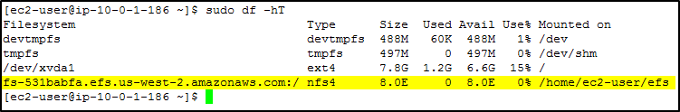
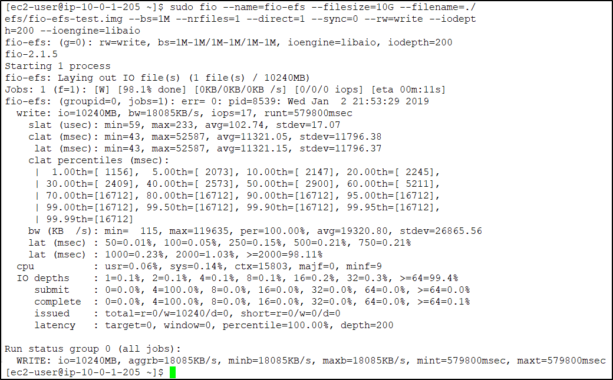
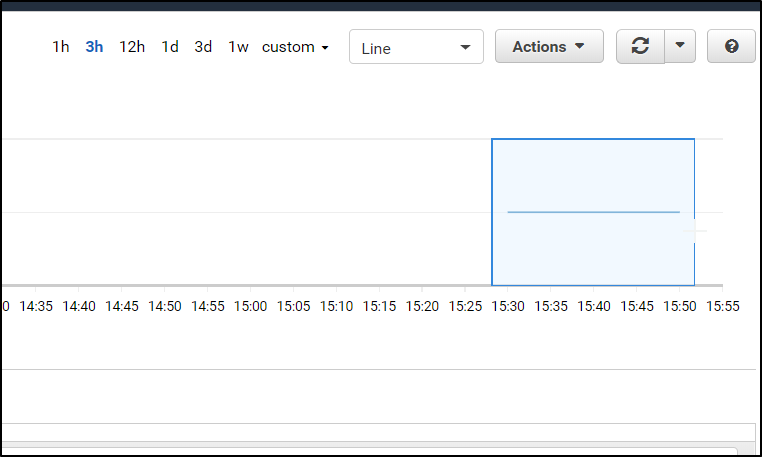
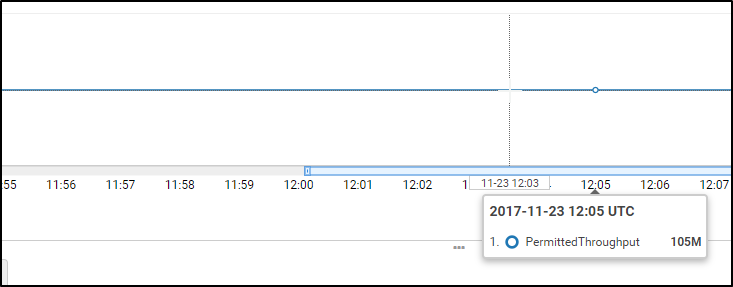
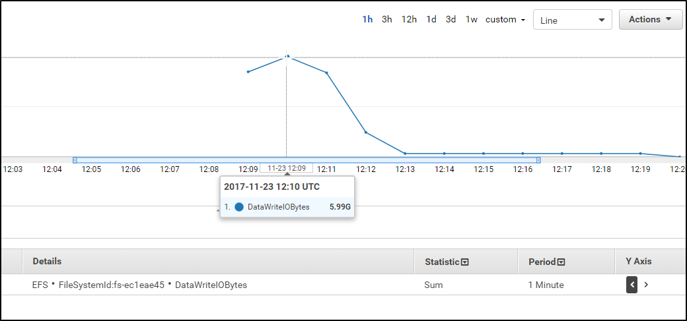

<header>

<link rel="stylesheet" href="https://use.fontawesome.com/releases/v5.5.0/css/all.css" integrity="sha384-B4dIYHKNBt8Bc12p+WXckhzcICo0wtJAoU8YZTY5qE0Id1GSseTk6S+L3BlXeVIU" crossorigin="anonymous">

<!-- Latest compiled and minified CSS -->
<link rel="stylesheet" href="https://maxcdn.bootstrapcdn.com/bootstrap/3.3.7/css/bootstrap.min.css" integrity="sha384-BVYiiSIFeK1dGmJRAkycuHAHRg32OmUcww7on3RYdg4Va+PmSTsz/K68vbdEjh4u" crossorigin="anonymous">

<!-- Optional theme -->
<link rel="stylesheet" href="https://maxcdn.bootstrapcdn.com/bootstrap/3.3.7/css/bootstrap-theme.min.css" integrity="sha384-rHyoN1iRsVXV4nD0JutlnGaslCJuC7uwjduW9SVrLvRYooPp2bWYgmgJQIXwl/Sp" crossorigin="anonymous">

<!-- Latest compiled and minified JavaScript -->
<script src="https://maxcdn.bootstrapcdn.com/bootstrap/3.3.7/js/bootstrap.min.js" integrity="sha384-Tc5IQib027qvyjSMfHjOMaLkfuWVxZxUPnCJA7l2mCWNIpG9mGCD8wGNIcPD7Txa" crossorigin="anonymous"></script>

<!--custom-->
<link rel="stylesheet" href="../../aws-vocareum.css" type="text/css">

</header>

# Module 4 - Guided Lab: Introduction to Amazon EFS
<!-- This lab comes from SPL-151 -->

This lab introduces you to Amazon Elastic File System (Amazon EFS) by using the AWS Management Console.

In this lab, you will:

- Log in to the AWS Management Console
- Create an Amazon EFS file system
- Log in to an Amazon Elastic Compute Cloud (Amazon EC2) instance that runs Amazon Linux
- Mount your file system to your EC2 instance
- Examine and monitor the performance of your file system

**Duration**

This lab requires approximately **20 minutes** to complete.

## Accessing the AWS Management Console

1. At the top of these instructions, choose <span id="ssb_voc_grey">Start Lab</span> to launch your lab.

    A **Start Lab** panel opens, and it displays the lab status.

    **Tip**: If you need more time to complete the lab, choose the <span id="ssb_voc_grey">Start Lab</span> button again to restart the timer for the environment.

2. Wait until you see the message *Lab status: ready*, then close the **Start Lab** panel by choosing the **X**.
    ​

3. At the top of these instructions, choose <span id="ssb_voc_grey">AWS</span>

    This opens the AWS Management Console in a new browser tab. The system will automatically log you in.

    **Tip**: If a new browser tab does not open, a banner or icon is usually at the top of your browser with the message that your browser is preventing the site from opening pop-up windows. Choose the banner or icon, and then choose **Allow pop-ups**.
    ​

4. Arrange the AWS Management Console tab so that it displays alongside these instructions. Ideally, you will have both browser tabs open at the same time so that you can follow the lab steps more easily.

    <i class="fas fa-exclamation-triangle"></i>Do not change the Region unless you are instructed to do so.


## Task 1: Creating a security group to access your EFS file system

The security group that you associate with a mount target *must allow inbound access for TCP on port 2049 for Network File System (NFS)*. This is the security group that you will now create, configure, and attach to your EFS mount targets.


5. In the **AWS Management Console**, on the <span id="ssb_services">Services</span> menu, choose **EC2**.

6. In the navigation pane on the left, choose **Security Groups**.

7. Copy the **Security group ID** of the *EFSClient* security group to your text editor.

   The Group ID should look similar to *sg-03727965651b6659b*.

8. Choose <span id="ssb_orange">Create security group</span> then configure:

   <a id='securitygroup'></a>

    * **Security group name:** `EFS Mount Target`
    * **Description:** `Inbound NFS access from EFS clients`
    * **VPC:** *Lab VPC*

9. Under the **Inbound rules** section, choose <span id="ssb_white">Add rule</span> then configure:

    * **Type:** *NFS*
    * **Source:**
      * *Custom*
      * In the *Custom* box, paste the security group's **Security group ID** that you copied to your text editor
    * Choose <span id="ssb_orange">Create security group</span>.


## Task 2: Creating an EFS file system

EFS file systems can be mounted to multiple EC2 instances that run in different Availability Zones in the same Region. These instances use *mount targets* that are created in each *Availability Zone* to mount the file system by using standard NFSv4.1 semantics. You can mount the file system on instances in only one virtual private cloud (VPC) at a time. Both the file system and the VPC must be in the same Region.


10. On the <span id="ssb_services">Services</span> menu, choose **EFS**.

11. Choose <span id="ssb_blue">Create file system</span>

12. For **VPC**, select *Lab VPC*.

13. Detach the default security group from each *Availability Zone* mount target by choosing the <i class="fas fa-times"></i> check box on each default security group.

14. Attach the **EFS Mount Target** security group to each *Availability Zone* mount target by:

  * Selecting each **Security groups** check box.
  * Choosing **EFS Mount Target**.

    A mount target is created for each subnet.

    Your mount targets should look like the following example. The diagram shows two mount targets in the **Lab VPC** that use the **EFS Mount Target** security group. In this lab, you should be using the Lab VPC.

    

15. Choose <span id="ssb_blue">Next Step</span>

    Next, you will add an optional tag to your EFS file system. Tags are case-sensitive, key-value pairs that describe your file system.

16. On **Step 2**, in the **Add tags** section, configure:

    * **Key:** `Name`
    * **Value:** `My First EFS File System`


17. In the **Choose performance mode** section, keep the default settings.

18. Scroll to the bottom of the screen and choose <span id="ssb_blue">Next Step</span>

19. On **Step 3**, choose <span id="ssb_blue">Next Step</span>

20. On **Step 4:**

    * Review your configuration.
    * Choose <span id="ssb_blue">Create File System</span>


    <i class="far fa-thumbs-up"></i> Congratulations! You have created a new EFS file system in your Lab VPC and mount targets in each Lab VPC subnet. In a few seconds, the **File system state** of the file system will change to *Available*, followed by the mount targets 2–3 minutes later.

    Proceed to the next step after the **Mount target state** for each mount target changes to *Available*. Choose the screen refresh button after 2–3 minutes to check its progress.


## Task 3: Connecting to your EC2 instance via SSH

In this task, you will connect to your EC2 instance by using Secure Shell (SSH).

21. Above these instructions that you are currently reading, choose the <span id="ssb_voc_grey">Details</span> dropdown menu, and then choose <span id="ssb_voc_grey">Show</span>

22. The **EC2PublicIP** address is displayed. copy it to your clipboard or to a text file.

23. Exit the **Details** panel by choosing the **X**.

24. In the terminal window that displays to the right of these instructions, run the following command (replace *<public-ip\>*, including the brackets, with the IP address that you copied a moment ago):

    ```bash
    ssh -i ~/.ssh/labsuser.pem ec2-user@<public-ip>
    ```

25. You should be prompted to allow the first connection to this remote SSH server, enter `yes`.

    Because you are using a key pair for authentication, you will not be prompted for a password.

    You should see that your terminal in the browser prompt now shows that you are connected as the ec2-user to the EC2 instance.

    


    *Note*: The terminal in the browser that you are provided when you start this lab is connected to an Ubuntu Linux server that exists *outside* of your AWS account. It has a copy of the key pair (labsuser.pem) that can be used to connect to the EC2 instance in your AWS account. The SSH command you ran connected your terminal from the Ubuntu server to the EC2 instance.


## Task 4: Creating a new directory and mounting the EFS file system

<i class="fas fa-info-circle" aria-hidden="true"></i> Amazon EFS supports the NFSv4.1 and NFSv4.0 protocols when it mounts your file systems on EC2 instances. Though NFSv4.0 is supported, we recommend that you use NFSv4.1. When you mount your EFS file system on your EC2 instance, you must also use an NFS client that supports your chosen NFSv4 protocol. The EC2 instance that was launched as a part of this lab includes an NFSv4.1 client, which is already installed on it.


26. Back in the **AWS Management Console**, on the <span id="ssb_services">Services</span> menu, click **EFS**.

27. Select your EFS file system. In the expanded details, scroll down to the **File system access** section and select the **Amazon EC2 mount instructions (from local VPC)** link.

28. In your SSH session, follow the instructions in the **To set up your EC2 instance** section. Copy and paste (or manually type) the command to install the required utilities.

    The command should look similar to this example:

    ```
    sudo yum install -y amazon-efs-utils
    ```

    *Tip:* to paste into the terminal in the browser, place your cursor just to the right of the command prompt and right-click to see the paste option.

29. Scroll down to the **Mounting your file system** section.

30. In your SSH session, make a new directory by entering `sudo mkdir efs`

31. Copy the entire command in the **Using the NFS client** section.

    The mount command should look similar to this example:

    `sudo mount -t nfs4 -o nfsvers=4.1,rsize=1048576,wsize=1048576,hard,timeo=600,retrans=2,noresvport fs-bce57914.efs.us-west-2.amazonaws.com:/ efs`

    <i class="fas fa-comment" aria-hidden="true"></i> The provided `sudo mount...` command uses the default Linux mount options.

32. In your Linux SSH session, mount your Amazon EFS file system by:

    * Pasting the command
    * Pressing ENTER


33. Get a full summary of the available and used disk space usage by entering:

    `sudo df -hT`

    This following screenshot is an example of the output from the following *disk filesystem* command: `df -hT`

    Notice the *Type* and *Size* of your mounted EFS file system.


    


## Task 5: Examining the performance behavior of your new EFS file system


### Examining the performance by using Flexible IO

<i class="fas fa-info-circle"></i> Flexible IO (fio) is a synthetic I/O benchmarking utility for Linux. It is used to benchmark and test Linux I/O subsystems. During boot, *fio* was automatically installed on your EC2 instance.

34. Examine the write performance characteristics of your file system by entering:

    ```
    sudo fio --name=fio-efs --filesize=10G --filename=./efs/fio-efs-test.img --bs=1M --nrfiles=1 --direct=1 --sync=0 --rw=write --iodepth=200 --ioengine=libaio
    ```

    <i class="fas fa-comment"></i> The `fio` command will take 5–10 minutes to complete. The output should look like the example in the following screenshot. Make sure that you examine the output of your `fio` command, specifically the summary status information for this WRITE test.

    

### Monitoring performance by using Amazon CloudWatch

35. In the **AWS Management Console**, on the <span id="ssb_services">Services</span> menu, choose **CloudWatch**.

36. In the navigation pane on the left, choose **Metrics**.

37. In the **All metrics** tab, choose **EFS**.

38. Choose **File System Metrics**.

39. Select the row that has the **PermittedThroughput** Metric Name.

    <i class="fas fa-comment"></i> You might need to wait 2–3 minutes and refresh the screen several times before all available metrics, including **PermittedThroughput**, calculate and populate.

40. On the graph, choose and drag around the data line. If you do not see the line graph, adjust the time range of the graph to display the period during which you ran the `fio` command.

    


41. Pause your pointer on the data line in the graph. The value should be *105M*.

    


    The throughput of Amazon EFS scales as the file system grows. File-based workloads are typically spiky. They drive high levels of throughput for short periods of time, and low levels of throughput the rest of the time. Because of this behavior, Amazon EFS is designed to burst to high throughput levels for periods of time. All file systems, regardless of size, can burst to 100 MiB/s of throughput. For more information about performance characteristics of your EFS file system, see the official <a href="http://docs.aws.amazon.com/efs/latest/ug/performance.html" target="_blank">Amazon Elastic File System documentation</a>.


42. In the **All metrics** tab, *uncheck* the box for **PermittedThroughput**.

43. Select the check box for **DataWriteIOBytes**.

    <i class="fas fa-comment"></i> If you do not see *DataWriteIOBytes* in the list of metrics, use the **File System Metrics** search to find it.

44. Choose the **Graphed metrics** tab.

45. On the **Statistics** column, select **Sum**.

46. On the **Period** column, select **1 Minute**.

47. Pause your pointer on the peak of the line graph. Take this number (in bytes) and divide it by the duration in seconds (60 seconds). The result gives you the write throughput (B/s) of your file system during your test.

    


    The throughput that is available to a file system scales as a file system grows. All file systems deliver a consistent baseline performance of 50 MiB/s per TiB of storage. Also, all file systems (regardless of size) can burst to 100 MiB/s. File systems that are larger than 1T B can burst to 100 MiB/s per TiB of storage. As you add data to your file system, the maximum throughput that is available to the file system scales linearly and automatically with your storage.

    File system throughput is shared across all EC2 instances that are connected to a file system. For more information about performance characteristics of your EFS file system, see the official <a href="http://docs.aws.amazon.com/efs/latest/ug/performance.html" target="_blank">Amazon Elastic File System documentation</a>.

    <i class="far fa-thumbs-up" style="color:blue"></i> Congratulations! You created an EFS file system, mounted it to an EC2 instance, and ran an I/O benchmark test to examine its performance characteristics.


## Submit Your Work for a Grade

It's time to check your work!

48. *Important:* In the terminal in the browser, disconnect the EC2 instance SSH session by typing `exit` at the prompt. Verify that you see a "Connection to <ip address> closed" message.

49. At the top of these instructions, choose <span id="ssb_voc_grey">Build</span> to enable grading for this lab.

    Verify that the command "cd;/bin/bash -c ../resource/scripts/build.sh" was run.

    Wait at least 15 seconds before continuing to the next step.

50. Next, choose <span id="ssb_blue">Submit</span> to launch the grading script.

51. Choose **Yes**.

52. If your grades are not visible after a couple of minutes, you can view your score by choosing <span id="ssb_voc_grey">Grades</span> at the top of these instructions.

    **Tip**: You can submit your work multiple times. After making changes to your work, you only need to choose **Submit** again. Your last submission will be your final grade for this lab.

    <i class="fas fa-exclamation-triangle"></i> **Do not rerun the Build process.**

53. To find recommended solutions for incomplete tasks, choose <span id="ssb_voc_grey">Details</span> followed by **View Submission Report**.


## Lab complete

<i class="icon-flag-checkered"></i> Congratulations! You have completed the lab.

54. To confirm that you want to end the lab, at the top of this page, choose <span id="ssb_voc_grey">End Lab</span> and then choose <span id="ssb_blue">Yes</span>

    A panel should appear with this message: *DELETE has been initiated... You may close this message box now.*

55. To close the panel, choose the **X** in the top-right corner.


    Errors or corrections? Email us at [aws-course-feedback@amazon.com](mailto:aws-course-feedback@amazon.com)

    Other questions? Contact us at https://aws.amazon.com/contact-us/aws-training


    *©2020 Amazon Web Services, Inc. and its affiliates. All rights reserved. This work may not be reproduced or redistributed, in whole or in part, without prior written permission from Amazon Web Services, Inc. Commercial copying, lending, or selling is prohibited.*
