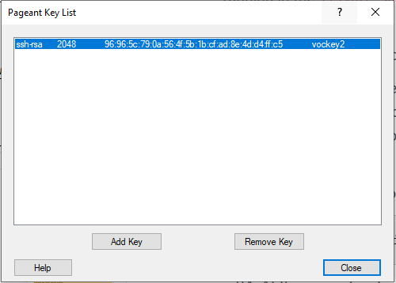

# Module 6 - Challenge Lab: Creating a VPC Networking Environment for the Café

<!--Note: the step-by-step solutions to the challenge sections of this lab can be found in the instructor guide (source document at https://awsu-coursebuild.s3-us-west-2.amazonaws.com/sourcefiles/CUR-TF-200-ACACAD-20-EN/IG/AcademyCloudArchitecting-IG-Module-06.docx)-->

## Scenario

Sofía and Nikhil are now confident in their ability to create a two-tier architecture because of their experience migrating the café's data. They successfully moved from a MariaDB database on an Amazon Elastic Compute Cloud (Amazon EC2) instance to an Amazon Relational Database Service (Amazon RDS) database instance. In addition, they also moved their database resources from a public subnet to a private subnet.


When Mateo—a café regular and an AWS systems administrator and engineer—visits the café, Sofía and Nikhil tell him about the database migration. Mateo tells them that they can enhance security by running the café's application server in another private subnet that's separate from the database instance. They could then go through a bastion host (or jump box) to gain administrative access to the application server. The application server must also be able to download needed patches.

Knowing that <a href="https://aws.amazon.com/blogs/enterprise-strategy/create-a-culture-of-experimentation-enabled-by-the-cloud/" target="_blank">the cloud makes experimentation easier</a>, Sofía and Nikhil are eager to set up a non-production VPC environment. They can use it implement the new architecture and test different security layers, without accidentally disrupting the café's production environment.

<br/>
## Lab overview and objectives

In this lab, you use Amazon Virtual Private Cloud (Amazon VPC) to create a networking environment on AWS and implement security layers to protect your resources.

After completing this lab, you should be able to:

- Create a virtual private cloud (VPC) environment that enables you to securely connect to private resources
- Enable your private resources to connect to the internet
- Create an additional layer of security in your VPC to control traffic to and from private resources

When you start the lab, you will only have a VPC created for you in the AWS account.

At the end of this lab, your architecture should look like the following example:


(In the diagram, the communication arrows were omitted for simplicity.)

**Note**: in this challenge lab, step-by-step instructions are not provided for most of the tasks. You must figure out how to complete the tasks on your own.

<br/>
## Duration

This lab will require approximately **90 minutes** to complete.

<br/>
## AWS service restrictions

In this lab environment, access to AWS services and service actions might be restricted to the ones that are needed to complete the lab instructions. You might encounter errors if you attempt to access other services or perform actions beyond the ones that are described in this lab.

<br/>

## Accessing the AWS Management Console

1. At the top of these instructions, choose <span id="ssb_voc_grey">Start Lab</span> to launch your lab.

   A **Start Lab** panel opens, and it displays the lab status.

   **Tip**: If you need more time to complete the lab, choose the Start Lab button again to restart the timer for the environment.

2. Wait until you see the message *Lab status: ready*, then close the **Start Lab** panel by choosing the **X**.

3. At the top of these instructions, choose <span id="ssb_voc_grey">AWS</span>

   This opens the AWS Management Console in a new browser tab. The system will automatically log you in.

   **Tip**: If a new browser tab does not open, a banner or icon is usually at the top of your browser with a message that your browser is preventing the site from opening pop-up windows. Choose the banner or icon and then choose **Allow pop ups**.

4. Arrange the AWS Management Console tab so that it displays along side these instructions. Ideally, you will be able to see both browser tabs at the same time so that you can follow the lab steps more easily.  

<br/>
## A business request for the café: Creating a VPC network that allows café staff to remotely and securely administer the web application server (Challenge #1)


In this challenge, you will take on the role of one of the café's system administrators. You will create and configure a VPC network so that you can securely connect from a bastion host in a public subnet to an EC2 instance in a private subnet. You will also create a NAT gateway to enable the EC2 instance in your private subnet to access the internet.  

<br/>
### Task 1: Creating a public subnet

Your first task in this lab is to create a public subnet in the *Lab VPC*. After you create a public subnet, you will create an internet gateway to allow communication from the subnet to the internet. You will update the routing table that's attached to the subnet to route internet-bound network traffic through the internet gateway.  

5. Open the **Amazon VPC console**.

6. Note that a VPC called `Lab VPC` was created for you.

7. Create a public subnet that meets the following criteria:
   - **Name tag**: `Public Subnet`
   - **VPC**: *Lab VPC*
   - **Availability Zone**: Choose Availability Zone **a** of your Region (for example, if your Region is *us-east-1*, then select **us-east-1a**)
   - **IPv4 CIDR block**: `10.0.0.0/24`

8. Create a new internet gateway and attach it to the `Lab VPC`.

9. Edit the route table that was created in your VPC. Add the route `0.0.0.0/0`. For the target, select the internet gateway that you created in the previous step

    **Hint**: To successfully complete this task, you must create a few resources. If you get stuck, refer to the <a href="https://docs.aws.amazon.com/vpc/latest/userguide/VPC_Internet_Gateway.html" target="_blank">AWS Documentation</a>.

<br/>
### Task 2: Creating a bastion host

In this task, you will create a bastion host in the *Public Subnet*. In later tasks, you will create an EC2 instance in a private subnet and connect to it from this bastion host.

10. From the **Amazon EC2 console**, create an EC2 instance in the `Public Subnet` of the *Lab VPC* that meets the following criteria:
    - **Amazon Machine Image (AMI)**: *Amazon Linux 2 AMI (HVM)*
    - **Instance type**: *t2.micro*
    - **Auto-assign Public IP**: This setting should be disabled
    - **Name**: `Bastion Host`
    - Security group called `Bastion Host SG` that only allows the following traffic:
      - **Type**: *SSH*
      - **Port**: `22`
      - **Source**: Your IP address
    - Uses the **vockey** key pair


<br/>

> **Note:** In practice, hardening a bastion host involves more work than only restricting Secure Shell (SSH) traffic from your IP address. A bastion host is typically placed in a network that's closed off from other networks. It's often protected with multi-factor authentication (MFA) and monitored with auditing tools. Most enterprises require an auditable access trail to the bastion host.

<br/>
### Task 3: Allocating an Elastic IP address for the bastion host

In this task, you will assign an Elastic IP address to the bastion host.  

The bastion host that you just created can't be reached from the internet. It doesn't have a public IPv4 address or an Elastic IP address that's associated with its private IPv4 address. Elastic IP addresses are associated with bastion instances and are allowed from on-premises firewalls. If an instance is terminated and a new instance is launched in its place, the existing Elastic IP address is re-associated with the new instance. With this behavior, the same trusted Elastic IP address is used at all times.

11. Allocate an Elastic IP address, and make it reachable from the internet over IPv4 by associating it with your bastion host.

<br/>
### Task 4: Testing the connection to the bastion host

In this task, you will use the SSH key (.pem file or .ppk file) to test the SSH connection to your bastion host. This key was created for you.

12. In the top-right area of these instructions, select **Details**.

13. Next to **AWS**, choose **Show**.

14. Download the SSH key. Note the file will be named **labuser.\***.
    - **Microsoft Windows PuTTY users**: *Download PPK*
    - **macOS or Linux users**: *Download PEM*

15. To close the window, choose **X**.

16. Connect to your bastion host by using SSH.

17. After you have tested your connection to the bastion host, you can close the terminal or PuTTY.

    **Hint**: If you get stuck, refer to the <a href="https://docs.aws.amazon.com/AWSEC2/latest/UserGuide/AccessingInstancesLinux.html" target="_blank">AWS Documentation</a>. This page provides detailed instructions about how to use SSH to connect to an EC2 instance.

<br/>

> **Note for Microsoft Windows users**: If you don't have PuTTY installed, you must <a href="https://the.earth.li/~sgtatham/putty/latest/w64/putty.exe" target="_blank">download and install PuTTY</a>. We recommend that you configure PuTTY so that your connection doesn't expire. To keep the PuTTY session open longer, set **Seconds between keepalives** to `30`.

<br/>
### Task 5: Creating a private subnet

In this task, you will create a private subnet in the *Lab VPC*.

18. In the console, create a private subnet that meets the following criteria:
    - **Name tag**: `Private Subnet`
    - **Availability Zone**: Same as *Public Subnet*
    - **IPv4 CIDR block**: `10.0.1.0/24`

<br/>
### Task 6: Creating a NAT gateway

In this task, you will create a NAT gateway, which enables resources in the *Private Subnet* to connect to the internet.


19.  Create a NAT gateway that meets the following criteria:

     - **Name**: `Lab NAT Gateway`
     - **Subnet**: *Public Subnet*

**Tip**: Your NAT gateway needs an Elastic IP address.

20.  Create a new route table that meets the following criteria:
     - **Name tag**: `Private Subnet Route Table`
     - **Destination**: `0.0.0.0/0`
     - **Target**: *NAT Gateway*
21.  Attach this route table to the *Private Subnet*, which you created earlier.

    **Hint**: If you get stuck, refer to the <a href="https://docs.aws.amazon.com/vpc/latest/userguide/vpc-nat-gateway.html#nat-gateway-creating" target="_blank">AWS Documentation</a>.

<br/>
### Task 7: Creating an EC2 instance in the private subnet

In this task, you will create an EC2 instance in the *Private Subnet*, and you will configure it to allow SSH traffic from the bastion host. You will also create a new key pair to access this instance.

22. Create a new key pair named `vockey2`, and download the appropriate .ppk (Microsoft Windows) or .pem (macOS or Linux).

23. Create an EC2 instance in the *Private Subnet* of the *Lab VPC* that meets the following criteria.
    - **AMI**: *Amazon Linux 2 AMI (HVM)*
    - **Instance type**: *t2.micro*
    - **Name**: `Private Instance`
    - Only allows the following traffic:
      - **Type**: *SSH*
      - **Port**: `22`
      - **Source**: Bastion host security group (**Hint**: Refer to the <a href="https://docs.aws.amazon.com/AWSEC2/latest/UserGuide/ec2-security-groups.html" target="_blank">AWS Documentation</a>
    - Uses the **vockey2** key pair that you created earlier


<br/>
### Task 8: Configuring your SSH client for SSH passthrough

Because the private instance you just created uses a different key pair than the bastion host, you must configure your SSH client to use SSH passthrough. This action allows you to use a key pair that's stored on your computer to access the private instance without uploading the key pair to the bastion host. This is a good security practice.  

To set up your client, follow either the Microsoft Windows, or the macOS or Linux steps.


#### Microsoft Windows users only

Windows users should complete the following steps.

24. Download and install *Pageant*, which is available from the PuTTY <a href="http://www.chiark.greenend.org.uk/~sgtatham/putty/download.html" target="_blank">download page</a>.

25. After you install Pageant, open it. Pageant runs as a Windows service.

26. To import the PuTTY-formatted key into Pageant, follow these steps.
    - In the Windows system tray, double-click the **Pageant** icon. 
    - Choose **Add Key**.
    - Select the .ppk file that you downloaded when you created the *vockey2* key pair.  

    Your screen should look similar to the following example.

    

27. Add the first *vockey* that you downloaded earlier. The filename was **labuser.\***.

    You should now have two keys listed. You can close the Pageant window.

28. In PuTTY, under **Connection > SSH > Auth**, select **Allow agent forwarding** and leave the **Private key file for authentication** box empty. After you have completed this step, continue on to Task 9, step 32. Proceed to connect to the bastion host using PuTTY as you normally would, but don't open a .ppk file.


#### macOS or Linux users only

For macOS users, *ssh-agent* is already installed as part of the OS. To add your keys, complete the following steps.

29. Add your private keys to the keychain application by using the `ssh-add` command, with the `-K` option and the `.pem` file for the key. The command should look like the following example.

    ```bash
    ssh-add -K vockey2.pem
    ```

30. Make sure that you add both the *vockey.pem* and *vockey2.pem* keys that you downloaded.

    By adding the key to the agent, you can use SSH to connect to an instance without using the `–i` <keyfile> option when you connect.

31. To verify that the keys are available to ssh-agent, use the `ssh-add` command with the `-L` option, like the following example.

    ```bash
    ssh-add –L
    ```
The agent should display the keys that it's stored.

After the key is added to your keychain, you can connect to the bastion host instance with SSH by using the `–A` option. This option enables SSH agent forwarding. It also allows the local SSH agent to respond to a public key challenge when you use SSH to connect from the bastion host to a target instance in your VPC.

For example, to connect to an instance in a private subnet, you would enter the following command (this command enables SSH agent forwarding by using the bastion host instance):

```bash
ssh –A ec2-user@<bastion-IP-address-or-DNS-entry>
```
After you’re connected to the bastion host instance, you can use SSH to connect to a specific instance by entering a command like this example.

  ```bash
  ssh user@<instance-IP-address-or-DNS-entry>
  ```

> **Note**:  The ssh-agent doesn't know which key it should use for a given SSH connection. Therefore, ssh-agent will sequentially try all the keys that are loaded in the agent. Because instances terminate the connection after five failed connection attempts, make sure that the agent has five or fewer keys. Because each administrator should have only a single key, this is usually not a problem for most deployments. For details about how to manage the keys in ssh-agent, use the `man ssh-agent` command.

<br/>
### Task 9: Testing the SSH connection from the bastion host

In this task, you will test the SSH connection from your bastion host to the EC2 instance that is running in the *Private Subnet*.

32. Connect to the bastion host instance by using SSH.

    **Tip**: Use the connection method that was described in the SSH passthrough section.

33. Connect to the private instance by using SSH and the IP address for the private instance.

    ```bash
    ssh ec2-user@<private-ip-address-of-instance-in-private-subnet>
    ```

34. Now that you are connected to the EC2 instance in the *Private Subnet*, test its connection to the internet.

      ```bash
      ping 8.8.8.8
      ```

    **Tip**: Press CTRL+C to exit the command
<br/>

You have now established communication between the *Bastion Host* in the *Public Subnet* and the EC2 instance in the *Private Subnet*, like in the following diagram:
<br/>


<br/>
<br/>
**Architecture best practice**

In this first challenge, you implemented the architectural best practice of *enable people to perform actions at a distance.*

<details>
	<summary>Expand <b>here</b> to learn more about it.</summary>
	According to the <a href ="https://docs.aws.amazon.com/wellarchitected/latest/framework/welcome.html" target="_blank">Well-Architected Framework</a>, compute resources require multiple layers of defense to help protect them from external and internal threats. In practice, you should remove the ability for interactive access to reduce the risk of human error and the potential for manual configuration or management. The Well-Architected Framework recommends that you use a change management workflow to deploy EC2 instances by using infrastructure as code. Then, you should use tools, such as Amazon EC2 Systems Manager, to manage EC2 instances instead of allowing direct access or a bastion host. For more information about replacing a bastion host with Amazon EC2 Systems Manager, see this <a href="https://aws.amazon.com/blogs/mt/replacing-a-bastion-host-with-amazon-ec2-systems-manager/" target="_blank">AWS Security Blog post</a>
</details>

<br/>
## New business requirement: Enhancing the security layer for private resources (Challenge #2)

Sofía and Nikhil are proud of the changes they made to the cafe's application architecture. They are pleased by the additional security they built, and they are also glad to have a test environment that they can use before they deploy updates to the production instance. They tell Mateo about their new application architecture, and he's impressed! To further improve their application security, Mateo advises them to build an additional layer of security by using custom network access control lists (network ACLs).

In this challenge, you will continue to take on the role of one of the café's system administrators. Now that you established secure access from the bastion host to the EC2 instance in the private subnet, you must enhance the security layer of the private subnet. To accomplish this task, you will create and configure a custom network ACL.

<br/>
### Task 10: Creating a network ACL

In this task, you will create a custom network ACL to control traffic to and from the *Private Subnet*.

You can use network ACLs to control traffic between subnets. It's a good practice to use network ACLs to implement rules that are similar to your security group rules. The network ACLs provide an additional layer of protection.

For this challenge, you will create an EC2 instance in the *Public Subnet*. You will create a security group that allows Internet Control Message Protocol (ICMP) traffic from the local network. Next, you will create and configure your custom network ACL to deny ICMP traffic between the *Private Subnet* and this test instance. ICMP is used by the *ping* utility.


35. Go to the **Amazon VPC console**, and inspect the default network ACL of *Lab VPC*.  

    **Note 1**: The subnets that you created are automatically associated with the default network ACL.  
    **Note 2**: The inbound and outbound rules of the default network ACL *allow* all traffic.


36. Create a custom network ACL called `Lab Network ACL` for the *Lab VPC*.  

    **Note**: The default inbound and outbound rules of the custom network ACL *deny* all traffic.


37. Configure your custom network ACL to *allow ALL traffic that goes into and out of* the *Private Subnet*.

    **Hint**: If you get stuck, refer to the <a href="https://docs.aws.amazon.com/vpc/latest/userguide/vpc-network-acls.html#CreateACL" target="_blank">AWS Documentation</a>.

<br/>
### Task 11: Testing your custom network ACL

38. Create an EC2 instance in the *Public Subnet* of the *Lab VPC*. It should meet the following criteria.
    - AMI: *Amazon Linux 2 AMI (HVM)*
    - Instance type: *t2.micro*
    - Name: `Test Instance`
    - Allows *All ICMP – IPv4* inbound traffic to the instance through the security group


39. Note the private IP address of the *Test Instance*.

40. Test that you can reach the private IP address of the *Test Instance* from the *Private Instance*. From the *Private Instance* terminal window, run the following ping command:

    ```bash
    ping <private-ip-address-of-test-instance>
    ```

41. Leave the *ping* utility running.

42. Modify your custom network ACL to *deny All ICMP – IPv4 traffic to* the `<private-ip-address-of-test-instance>/32`

    - Make sure to add `/32` to the end of the private IP address.

    - Make sure that this rule is evaluated ***first***.

43. In the *Private Instance* terminal window, the ping command should stop responding. The traffic to the *Test Instance* has been blocked.

<br/>

You have now denied traffic from the *Private Subnet* to the *Test Instance*, as shown in the following diagram:

<br/>


<br/>
<br/>
**Architecture best practice**

In this second challenge, you protected your network resources by implementing the architectural best practice of *controlling traffic at all layers*.

<details>
	<summary>Expand <b>here</b> to learn more about it.</summary>
	According to the <a href="https://docs.aws.amazon.com/wellarchitected/latest/framework/welcome.html" target="_blank">Well-Architected Framework</a>, any workload that has some form of network connectivity, whether it's the internet or a private network, requires multiple layers of defense to help protect it from external and internal network-based threats. When you control traffic at all layers, you apply multiple layers of security controls (known as a <i>defense in depth</i> approach) for both inbound and outbound traffic. For example, you do this in Amazon VPC by using security groups, network ACLs, and subnets.
</details>

<br/>
## Answering questions about the lab

Answers will be recorded when you choose the blue **Submit** button at the end of the lab.

44. Access the questions in this lab.
   - Choose the <span id="ssb_voc_grey">Details <i class="fas fa-angle-down"></i></span>
 menu, and choose <span id="ssb_voc_grey">Show</span>.
   - Choose the **Access the multiple choice questions** link that appears at the bottom of the page.

45. In the page that you loaded, answer the following questions:

	- **Question 1**: What is the purpose of the internet gateway in the public subnet?
	- **Question 2**: What allows the instance in the private subnet to connect to the internet so that it can download updates?
	- **Question 3**: Can the instance in the private subnet be accessed directly from the internet?
	- **Question 4**: Why do you use two different key pairs to access the private instance and the bastion host?
	- **Question 5**: Can the bastion host use ping and get a reply from the instance in the private subnet?
	- **Question 6**: Which security group rules allow the private EC2 instance to receive the return traffic when it pings the test instance?

<br/>

## Submitting your work

46. At the top of these instructions, choose <span id="ssb_blue">Submit</span> to record your progress and when prompted, choose **<span id="ssb_blue">Yes</span>**

47. If the results don't display after a couple of minutes, return to the top of these instructions and choose <span id="ssb_voc_grey">Grades</span>

     **Tip**: You can submit your work multiple times. After you change your work, choose **Submit** again. Your last submission is what will be recorded for this lab.

48. To find detailed feedback on your work, choose <span id="ssb_voc_grey">Details</span> followed by <i class="fas fa-caret-right"></i> **View Submission Report**.

<br/>
## Lab complete

<i class="fas fa-flag-checkered"></i> Congratulations! You have completed the lab.


49. To confirm that you want to end the lab, at the top of this page, choose **<span id="ssb_voc_grey">End Lab</span>**, and then choose **<span id="ssb_blue">Yes</span>**

    A panel should appear with this message: *DELETE has been initiated... You may close this message box now.*


50. To close the panel, choose the **X** in the top-right corner.


<br/>
*©2021 Amazon Web Services, Inc. and its affiliates. All rights reserved. This work may not be reproduced or redistributed, in whole or in part, without prior written permission from Amazon Web Services, Inc. Commercial copying, lending, or selling is prohibited.*
