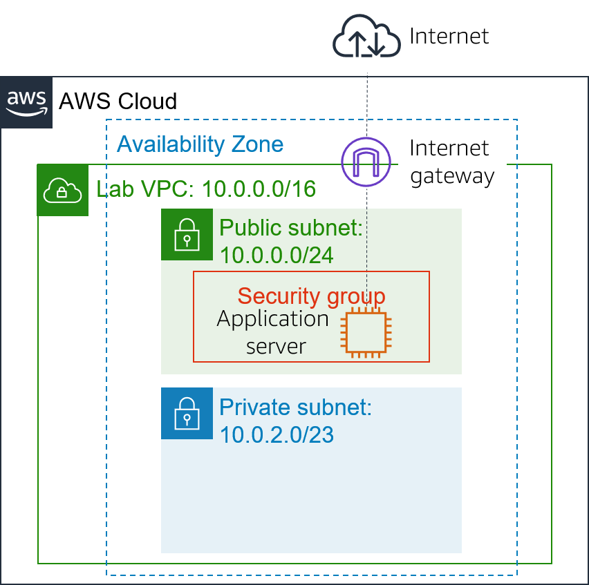
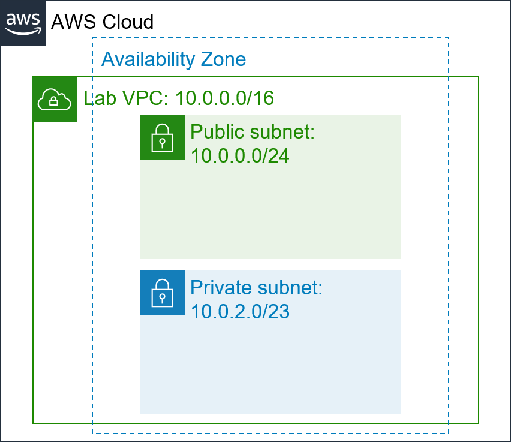

# Module 6 - Guided Lab: Creating a Virtual Private Cloud

[//]: # "SKU: ILT-TF-200-ACACAD-2    Source Course: ILT-TF-100-ARCHIT-6 branch dev_65"

## Lab overview and objectives

Traditional networking is difficult. It involves equipment, cabling, complex configurations, and specialist skills. Amazon Virtual Private Cloud (Amazon VPC) hides the complexity, and simplifies the deployment of secure private networks.

This lab shows you how to build your own virtual private cloud (VPC), deploy resources, and create private peering connections between VPCs.

After completing this lab, you should be able to:

- Deploy a VPC
- Create an internet gateway and attach it to the VPC
- Create a public subnet
- Create private subnet
- Create an application server to test the VPC


At the **end** of this lab, your architecture will look like the following example:




<br/>
##Duration

This lab will require approximately **30 minutes** to complete.

<br/>

## AWS service restrictions

In this lab environment, access to AWS services and service actions might be restricted to the ones that are needed to complete the lab instructions. You might encounter errors if you attempt to access other services or perform actions beyond the ones that are described in this lab.

<br/>

## Accessing the AWS Management Console

1. At the top of these instructions, choose <span id="ssb_voc_grey">Start Lab</span> to launch your lab.

   A **Start Lab** panel opens, and it displays the lab status.

   <i class="fas fa-info-circle"></i> **Tip**: If you need more time to complete the lab, restart the timer for the environment by choosing the <span id="ssb_voc_grey">Start Lab</span> button again.

2. Wait until the **Start Lab** panel displays the message *Lab status: ready*, then close the panel by choosing the **X**.

3. At the top of these instructions, choose <span id="ssb_voc_grey">AWS</span>.

   This action opens the AWS Management Console in a new browser tab. The system automatically logs you in.

   <i class="fas fa-exclamation-triangle"></i> **Tip**: If a new browser tab does not open, a banner or icon is usually at the top of your browser with the message that your browser is preventing the site from opening pop-up windows. Choose the banner or icon, and then choose **Allow pop-ups**.

4. Arrange the **AWS Management Console** tab so that it displays alongside these instructions. Ideally, you will have both browser tabs open at the same time so that you can follow the lab steps more easily.

   <i class="fas fa-exclamation-triangle"></i> **Do not change the Region unless specifically instructed to do so**.

<br/>

## Task 1: Creating a VPC

You will begin by using Amazon VPC to create a new **virtual private cloud, or VPC**.

A VPC is a virtual network that is dedicated to your Amazon Web Services (AWS) account. It is logically isolated from other virtual networks in the AWS Cloud. You can launch AWS resources, such as Amazon Elastic Compute Cloud (Amazon EC2) instances, into the VPC. You can configure the VPC by modifying its IP address range, and create subnets. You can also configure route tables, network gateways, and security settings.

5. In the **AWS Management Console**, on the <span id="ssb_services">Services<i class="fas fa-angle-down"></i></span> menu, choose **VPC**.

   The VPC console provides a wizard that can automatically create several VPC architectures. However, in this lab, you will create the VPC components manually.

6. In the left navigation pane, choose **Your VPCs**.

   A default VPC is provided so that you can launch resources as soon as you start using AWS. There is also a **Shared VPC** that you will use later in the lab. However, you will now create your own _Lab VPC_.

   The VPC will have a Classless Inter-Domain Routing (CIDR) range of **10.0.0.0/16**, which includes all IP address that start with **10.0.x.x**. It contains over 65,000 addresses. You will later divide the addresses into separate _subnets_.

7. Choose <span id="ssb_blue">Create VPC</span> and configure these settings:

    - **Name tag:** `Lab VPC`
    - **IPv4 CIDR block:** `10.0.0.0/16`
    - Choose <span id="ssb_blue">Create</span> and then choose <span id="ssb_blue">Close</span>

	<i class="fas fa-comment"></i> If these options do not appear, cancel your configuration. In the left navigation pane, make sure you that chose **Your VPCs**. Then, choose **Create VPC** again.

8. Select <i class="far fa-check-square"></i>**Lab VPC**, and make sure that it is the only VPC that you selected.

9. In the lower half of the page, choose the **Tags** tab.

    Tags are useful for identifying resources. For example, you can use a tag to identify cost centers or different environments (such as development, test, or production).

10. Choose <span id="ssb_grey">Actions<i class="fas fa-angle-down"></i></span> and select **Edit DNS hostnames**.

    This option assigns a _friendly_ Domain Name System (DNS) name to EC2 instances in the VPC, such as:

    _ec2-52-42-133-255.us-west-2.compute.amazonaws.com_

11. Select <i class="far fa-check-square"></i>**enable**, choose <span id="ssb_blue">Save</span> and then choose <span id="ssb_blue">Close</span>

    Any EC2 instances that are launched into the VPC will now automatically receive a DNS hostname. You can also add a more meaningful DNS name (such as _app.example.com_) later by using Amazon Route 53.


## Task 2: Creating subnets

A subnet is a subrange of IP addresses in the VPC. AWS resources can be launched into a specified subnet. Use a _public subnet_ for resources that must be connected to the internet, and use a _private subnet_ for resources that must remain isolated from the internet.

In this task, you will create a public subnet and a private subnet:



<br/>
### Creating a public subnet

The public subnet will be used for internet-facing resources.

12. In the left navigation pane, choose **Subnets**.

13. Choose <span id="ssb_blue">Create subnet</span> and configure these settings:

    - **Name tag:** `Public Subnet`
    - **VPC:** _Lab VPC_
    - **Availability Zone:** Select the _first_ Availability Zone in the list (Do _not_ choose **No Preference**)
    - **IPv4 CIDR block:** `10.0.0.0/24`
    - Choose <span id="ssb_blue">Create</span> and then choose <span id="ssb_blue">Close</span>

    <i class="fas fa-comment"></i> The VPC has a CIDR block of *10.0.0.0/16*, which includes all *10.0.x.x* IP addresses. The subnet you just created has a CIDR block of *10.0.0.0/24*, which includes all *10.0.0.x* IP addresses. They might look similar, but the subnet is smaller than the VPC because of the _/24_ in the CIDR range.

    You will now configure the subnet to automatically assign a public IP address for all instances that are launched in it.

14. Select <i class="far fa-check-square"></i>**Public Subnet**.

15. Choose <span id="ssb_grey">Actions<i class="fas fa-angle-down"></i></span> and select **Modify auto-assign IP settings**, then:

    - Select <i class="far fa-check-square"></i>**Auto-assign IPv4**
    - Choose <span id="ssb_blue">Save</span>

    <i class="fas fa-comment"></i>Though this subnet is named _Public Subnet_, it is not yet public. A public subnet must have an internet gateway, which you attach in the next task.

<br/>

### Creating a private subnet

The private subnet will be used for resources that must remain isolated from the internet.

16. Use what you just learned to create another subnet with these settings:

    - **Name tag:** `Private Subnet`
    - **VPC:** _Lab VPC_
    - **Availability Zone:** Select the _first_ Availability Zone in the list (Do _not_ choose **No Preference**)
    - **IPv4 CIDR block:** `10.0.2.0/23`

    The CIDR block of *10.0.2.0/23* includes all IP addresses that start with *10.0.2.x* and *10.0.3.x*. This is twice as large as the public subnet because most resources should be kept private, unless they specifically must be accessible from the internet.

    Your VPC now has two subnets. However, the public subnet is totally isolated and cannot communicate with resources outside the VPC. You will next configure the public subnet to connect to the internet via an internet gateway.

<br/>

## Task 3: Creating an internet gateway

An *internet gateway* is a horizontally scaled, redundant, and highly available VPC component. It allows communication between the instances in a VPC and the internet. It imposes no availability risks or bandwidth constraints on network traffic.

An internet gateway serves two purposes:

- To provide a target in route tables that connects to the internet
- To perform network address translation (NAT) for instances that were assigned public IPv4 addresses

In this task, you will create an internet gateway so that internet traffic can access the public subnet.

17. In the left navigation pane, choose **Internet Gateways**.

18. Choose <span id="ssb_blue">Create internet gateway</span> and configure these settings:

    - **Name tag:** `Lab IGW`
    - Choose <span id="ssb_blue">Create</span> and then choose <span id="ssb_blue">Close</span>

    You can now attach the internet gateway to your _Lab VPC_.

19. Select <i class="far fa-check-square"></i> **Lab IGW**, and make sure that it is the only gateway that you selected.

20. Choose <span id="ssb_grey">Actions<i class="fas fa-angle-down"></i></span> then **Attach to VPC**, and configure these settings:

    - **VPC:** From the list, select _Lab VPC_ 
    - Choose <span id="ssb_blue">Attach</span>

    This action will attach the internet gateway to your _Lab VPC_. Though you created an internet gateway and attached it to your VPC, you must also configure the public subnet _route table_ so it uses the internet gateway.

<br/>
## Task 4: Configuring route tables

A *route table* contains a set of rules, called *routes*, that are used to determine where network traffic is directed. Each subnet in a VPC must be associated with a route table because the table controls the routing for the subnet. A subnet can only be associated with one route table at a time, but you can associate multiple subnets with the same route table.

To use an internet gateway, a subnet's route table must contain a route that directs internet-bound traffic to the internet gateway. If a subnet is associated with a route table that has a route to an internet gateway, it is known as a _public subnet_.

In this task, you will:

* Create a _public route table_ for internet-bound traffic
* Add a _route_ to the route table to direct internet-bound traffic to the internet gateway
* Associate the public subnet with the new route table

21. In the left navigation pane, choose **Route Tables**.

    Several route tables are displayed, but there is only one route table associated with *Lab VPC*. This route table routes traffic locally, so it is called a _private route table_.

22. In the **VPC ID** column, select <i class="far fa-check-square"></i> the route table that shows **Lab VPC** (you can expand the column to see the names).

23. In the **Name** column, choose <i class="fas fa-pencil-alt"></i> then enter the name  `Private Route Table` and choose <i class="fas fa-check-circle"></i>.

24. In the lower half of the page, choose the **Routes** tab.

   There is only one route. It shows that all traffic that is destined for _10.0.0.0/16_ (which is the range of the _Lab VPC_) will be routed _locally_. This route allows all subnets in a VPC to communicate with each other.

   You will now create a new public route table to send public traffic to the internet gateway.

25. Choose <span id="ssb_blue">Create route table</span> and configure these settings:

    - **Name tag:** `Public Route Table`
    - **VPC:** _Lab VPC_
    - Choose <span id="ssb_blue">Create</span> and then choose <span id="ssb_blue">Close</span>

26. Select <i class="far fa-check-square"></i> **Public Route Table**, and make sure that it is the only route table that you selected.

27. In the **Routes** tab, choose <span id="ssb_grey">Edit routes</span>

    You will now add a route to direct internet-bound traffic (_0.0.0.0/0_) to the internet gateway.

28. Choose <span id="ssb_grey">Add route</span> then configure these settings:

    * **Destination:** `0.0.0.0/0`
    * **Target:** Select _Internet Gateway_ and then, from the list, select _Lab IGW_
    * Choose <span id="ssb_blue">Save routes</span> and then choose <span id="ssb_blue">Close</span>

    The last step is to _associate_ this new route table with the public subnet.

29. Choose the **Subnet Associations** tab.

30. Choose <span id="ssb_grey">Edit subnet associations</span>

31. Select <i class="far fa-check-square"></i> the row with **Public Subnet**.

32. Choose <span id="ssb_blue">Save</span>

     The public subnet is now _public_ because it has a route table entry that sends traffic to the internet via the internet gateway.

     To summarize, you can create a public subnet by following these steps:

    - Create an _internet gateway_

    - Create a _route table_

    - Add a _route_ to the route table that directs _0.0.0.0/0_ traffic to the internet gateway

    - Associate the route table with a _subnet_, which thus becomes a _public subnet_

<br/>

## Task 5: Creating a security group for the application server

A *security group* acts as a virtual firewall for instances to control inbound and outbound traffic. Security groups operate at the level of the _elastic network interface for the instance_. Security groups do not operate at the _subnet_ level. Thus, each instance can have its own firewall that controls traffic. If you do not specify a particular security group at launch time, the instance is automatically assigned to the _default security group_ for the VPC.

In this task, you will create a security group that allows users to access your application server via HTTP.

33. In the left navigation pane, choose **Security Groups**.

34. Choose <span id="ssb_blue">Create security group</span> and configure these settings:

    - **Security group name:** `App-SG`
    - **Description:** `Allow HTTP traffic`
    - **VPC:** _Lab VPC_
    - Choose <span id="ssb_blue">Create</span> and then choose <span id="ssb_blue">Close</span>

35. Select <i class="far fa-check-square" aria-hidden="true"></i>**App-SG**.

36. Choose the **Inbound Rules** tab.

    The settings for **Inbound Rules** determine what traffic is permitted to reach the instance. You will configure it to permit HTTP (port 80) traffic that comes from anywhere on the internet (_0.0.0.0/0_).

37. Choose <span id="ssb_grey">Edit rules</span>

38. Choose <span id="ssb_grey">Add Rule</span> and then configure these settings:

    - **Type:**  _HTTP_
    - **Source:** _Anywhere_
    - **Description:** `Allow web access`
    - Choose <span id="ssb_blue">Save rules</span> and then choose <span id="ssb_blue">Close</span>

    You use this _App-SG_ in the next task.

<br/>
## Task 6: Launching an application server in the public subnet

To test that your VPC is correctly configured, you will now launch an EC2 instance into the public subnet. You will also confirm that you can access the EC2 instance from the internet.

39. On the <span id="ssb_services">Services<i class="fas fa-angle-down"></i></span> menu, choose **EC2**.

40. Choose <span id="ssb_orange">Launch Instance</span> and select **Launch Instance** from the drop down list. Configure these options:

    - Step 1 (Choose AMI):

    	- **AMI:** _Amazon Linux 2_

    - Step 2 (Choose Instance Type):

      - **Instance Type:** _t2.micro_

    - Step 3 (Configure Instance Details):
      - **Network:** _Lab VPC_
      - **Subnet:** _Public Subnet_
      - **IAM role:** _Inventory-App-Role_
      - **User data** (Under <i class="fas fa-caret-right"></i> **Advanced Details**):

      ```bash
      #!/bin/bash
      # Install Apache Web Server and PHP
      yum install -y httpd mysql
      amazon-linux-extras install -y php7.2
      # Download Lab files
      wget https://aws-tc-largeobjects.s3-us-west-2.amazonaws.com/ILT-TF-200-ACACAD-20-EN/mod6-guided/scripts/inventory-app.zip
      unzip inventory-app.zip -d /var/www/html/
      # Download and install the AWS SDK for PHP
      wget https://github.com/aws/aws-sdk-php/releases/download/3.62.3/aws.zip
      unzip aws -d /var/www/html
      # Turn on web server
      chkconfig httpd on
      service httpd start
      ```

    - Step 4 (Add Storage):

      - Use default settings (no changes)

    - Step 5 (Add Tags):
      - Choose <span id="ssb_grey">Add Tag</span>
      - **Key:** `Name`
      - **Value:** `App Server`

    - Step 6 (Configure Security Group):

      - **Select an existing security group:** _App-SG_

      <i class="fas fa-comment"></i> You will receive this warning: _You will not be able to connect to the instance_. This warning is acceptable because you will not be connecting to the instance. All configuration is done via the user data script. 
      
      - Click **Continue**.
      
    - Step 7 (Review):

      - <span id="ssb_blue">Launch</span>

41. In the **Select an existing key pair or create a new key pair** window:

   * Select **Proceed without a key pair**.
   * Select <i class="far fa-check-square"></i> **I acknowledge that...**.
   * Choose <span id="ssb_blue">Launch Instances</span>

   A status page notifies you that your instances are launching.

42. Choose <span id="ssb_blue">View Instances</span>

43. Wait for the application server to fully launch. It should display the following status:

   - **Instance State:** <span style="color:green"><i class="fas fa-circle"></i></span> running

   <i class="fas fa-comment"></i> You can choose to refresh <i class="fas fa-sync" aria-hidden="true"></i> occasionally to update the display.

44. Select <i class="far fa-check-square"></i> **App Server**.

45. Copy the **IPv4 Public IP** address from the **Description** tab.

46. Open a new web browser tab with that IP address.

   If you configured the VPC correctly, the Inventory application and this message should appear: _Please configure settings to connect to database_. You have not configured any database settings yet, but the appearance of the Inventory application demonstrates that the public subnet was correctly configured.

   <span style="color:red"><i class="fas fa-exclamation-triangle"></i></span> If the Inventory application does not appear, wait 60 seconds and refresh <i class="fas fa-sync"></i> the page to try again. It can take a couple of minutes for the EC2 instance to boot and run the script that installs software.


<br/>
## Submitting your work

47. At the top of these instructions, choose <span id="ssb_blue">Submit</span> to record your progress and when prompted, choose **Yes**.

48. If the results don't display after a couple of minutes, return to the top of these instructions and choose <span id="ssb_voc_grey">Grades</span>

    **Tip**: You can submit your work multiple times. After you change your work, choose **Submit** again. Your last submission is what will be recorded for this lab.

49. To find detailed feedback on your work, choose <span id="ssb_voc_grey">Details</span> followed by <i class="fas fa-caret-right"></i> **View Submission Report**.

<br/>

## Lab complete <i class="fas fa-graduation-cap"></i>

<i class="fas fa-flag-checkered"></i> Congratulations! You have completed the lab.

50. Choose <span id="ssb_voc_grey">End Lab</span> at the top of this page, and then select <span id="ssb_blue">Yes</span> to confirm that you want to end the lab.

    A panel indicates that *DELETE has been initiated... You may close this message box now.*

51. Select the **X** in the top right corner to close the panel.


*©2020 Amazon Web Services, Inc. and its affiliates. All rights reserved. This work may not be reproduced or redistributed, in whole or in part, without prior written permission from Amazon Web Services, Inc. Commercial copying, lending, or selling is prohibited.*