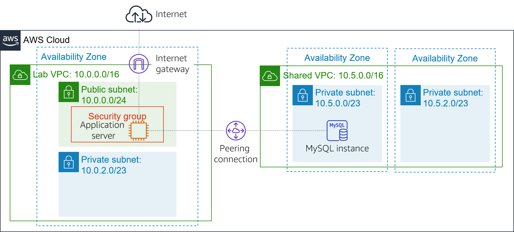
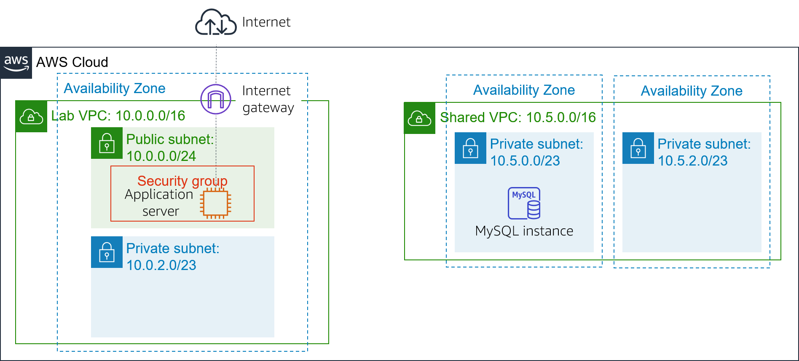
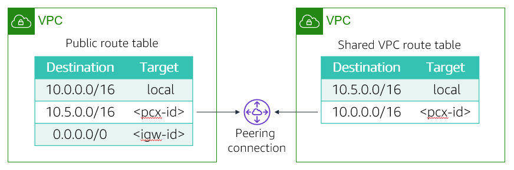

# Module 7 - Guided Lab: Creating a VPC Peering Connection
[//]: # "SKU: ILT-TF-200-ACACAD-2    Source Course: ILT-TF-100-ARCHIT-6 branch dev_65"

## Lab overview and objectives

You might want to connect your virtual private clouds (VPCs) when you must transfer data between them. This lab shows you how to create a private VPC peering connection between two VPCs.

After completing this lab, you should be able to:

- Create a VPC peering connection  
- Configure route tables to use the VPC peering connection

At the **end** of this lab, your architecture will look like the following example:

 
##Duration
This lab will require approximately **20 minutes** to complete.

 

## AWS service restrictions

In this lab environment, access to AWS services and service actions might be restricted to the ones that are needed to complete the lab instructions. You might encounter errors if you attempt to access other services or perform actions beyond the ones that are described in this lab.

 

## Accessing the AWS Management Console

1. At the top of these instructions, choose Start Lab to launch your lab.

   A **Start Lab** panel opens, and it displays the lab status.

   <i class="fas fa-info-circle"></i> **Tip**: If you need more time to complete the lab, restart the timer for the environment by choosing the Start Lab button again.

2. Wait until the **Start Lab** panel displays the message *Lab status: ready*, then close the panel by choosing the **X**.

3. At the top of these instructions, choose AWS.

   This action opens the AWS Management Console in a new browser tab. The system automatically logs you in.

   <i class="fas fa-exclamation-triangle"></i> **Tip**: If a new browser tab does not open, a banner or icon is usually at the top of your browser with the message that your browser is preventing the site from opening pop-up windows. Choose the banner or icon, and then choose **Allow pop-ups**.

4. Arrange the **AWS Management Console** tab so that it displays alongside these instructions. Ideally, you will have both browser tabs open at the same time so that you can follow the lab steps more easily.

   <i class="fas fa-exclamation-triangle"></i> **Do not change the Region unless specifically instructed to do so**.

 

## Task 1: Creating a VPC peering connection

<i class="fas fa-comment"></i>Your task is to create a VPC peering connection between two VPCs.

A *VPC peering connection* is a one-to-one networking connection between two VPCs that enables you to route traffic between them privately. Instances in either VPC can communicate with each other like they are in the same network. You can create a VPC peering connection between your own VPCs, in a VPC in another AWS account, or with a VPC in a different AWS Region.

Two VPCs are provided as part of this lab: *Lab VPC* and *Shared VPC*. *Lab VPC* has an Inventory application that runs on an Amazon Elastic Compute Cloud (Amazon EC2) instance in a public subnet. *Shared VPC* has a database instance that runs in a private subnet.

5. In the **AWS Management Console**, on the Services<i class="fas fa-angle-down"></i> menu, choose **VPC**. 

6. In the left navigation pane, choose **Peering Connections**. 

7. Choose Create Peering Connection and configure:

   - **Peering connection name tag:** `Lab-Peer`

   - **VPC (Requester):** *Lab VPC*

   - **VPC (Accepter):** *Shared VPC*

   - Choose Create Peering Connection then choose OK

   When a VPC peering connection is created, the target VPC must accept the connection request. The target VPC must accept the request because it might be owned by a different account. Alternatively, the user that creates the peering connection might not have permission to accept the connection request for the target VPC. However, in this lab, you will accept the connection yourself.

8. Select <i class="far fa-check-square"></i> **Lab-Peer**.

9. Choose Actions<i class="fas fa-angle-down"></i> then select **Accept Request**, and choose Yes, Accept to accept the request.

10. In the pop-up box, choose Close.

 

## Task 2: Configuring route tables

You will now update the route tables in both VPCs to send traffic from *Lab VPC* to the peering connection for *Shared VPC*.

11. In the left navigation pane, choose **Route Tables**.  

12. Select <i class="far fa-check-square"></i> **Lab Public Route Table** (for *Lab VPC*).

    You will configure the *Public Route Table* associated with *Lab VPC*.  If the destination IP address falls in the range of *Shared VPC*, the *Public Route Table* will send traffic to the peering connection.

13. In the **Routes** tab, choose Edit routes then configure these settings:

    - Choose Add route
    - **Destination:** `10.5.0.0/16` (The setting is the Classless Inter-Domain Route, or CIDR, block range of *Shared VPC*.)
    * **Target:** Select **Peering Connection**, and then from the list, select *Lab-Peer*.
    - Choose Save routes then choose Close.

    You will now configure the reverse flow for traffic that comes from *Shared VPC* and goes to *Lab VPC*.

14. Select <i class="far fa-check-square"></i> **Shared-VPC Route Table**. If the check boxes for any other route tables are selected, clear them.

    This route table is for *Shared VPC*. You will now configure it to send traffic to the peering connection if the destination IP address falls in the range of *Lab VPC*.

15. In the **Routes** tab, choose Edit routes then configure these settings:

    - Choose Add route
    - **Destination:** `10.0.0.0/16` (This setting is the CIDR block range of *Lab VPC*.)
    * **Target:** Select *Peering Connection*, and then from the list, select *Lab-Peer*.
    - ChooseSave routes then choose Close.

    The route tables are now configured to send traffic via the peering connection when the traffic is destined for the other VPC.

 

## Task 3: Testing the VPC peering connection

Now that you configured VPC peering, you will test the VPC peering connection. You will perform the test by configuring the Inventory application to access the database across the peering connection.

16. On the Services<i class="fas fa-angle-down"></i> menu, choose **EC2**.

17. In the left navigation pane, choose **Instances**.

18. Copy the **IPv4 Public IP** address that is shown in the **Description** tab. 

19. Open a new web browser tab with that IP address.

    You should see the Inventory application and the following message: *"Please configure settings to connect to database"*

20. Choose <i class="fas fa-cog" aria-hidden="true"></i> **Settings** and configure:

    - **Endpoint:** Paste the database endpoint. To find this endpoint, select *Details*. Next to *AWS*, choose *Show*. Then, copy the *Endpoint*.
    - **Database:** `inventory`
    - **Username:** `admin`
    - **Password:** `lab-password`
    - Choose Save

    The application should now show data from the database.

    This step confirms that the VPC peering connection was established because *Shared VPC* does not have an internet gateway. The only way to access the database is through the VPC peering connection.

 

## Submitting your work

21. At the top of these instructions, choose Submit to record your progress and when prompted, choose **Yes**.

22. If the results don't display after a couple of minutes, return to the top of these instructions and choose Grades

    **Tip**: You can submit your work multiple times. After you change your work, choose **Submit** again. Your last submission is what will be recorded for this lab.

23. To find detailed feedback on your work, choose Details followed by <i class="fas fa-caret-right"></i> **View Submission Report**.

 

## Lab complete <i class="fas fa-graduation-cap"></i>

<i class="fas fa-flag-checkered"></i> Congratulations! You have completed the lab.

24. Choose End Lab at the top of this page, and then select Yes to confirm that you want to end the lab.

    A panel indicates that *DELETE has been initiated... You may close this message box now.*

25. Select the **X** in the top right corner to close the panel.

*©2020 Amazon Web Services, Inc. and its affiliates. All rights reserved. This work may not be reproduced or redistributed, in whole or in part, without prior written permission from Amazon Web Services, Inc. Commercial copying, lending, or selling is prohibited.*
