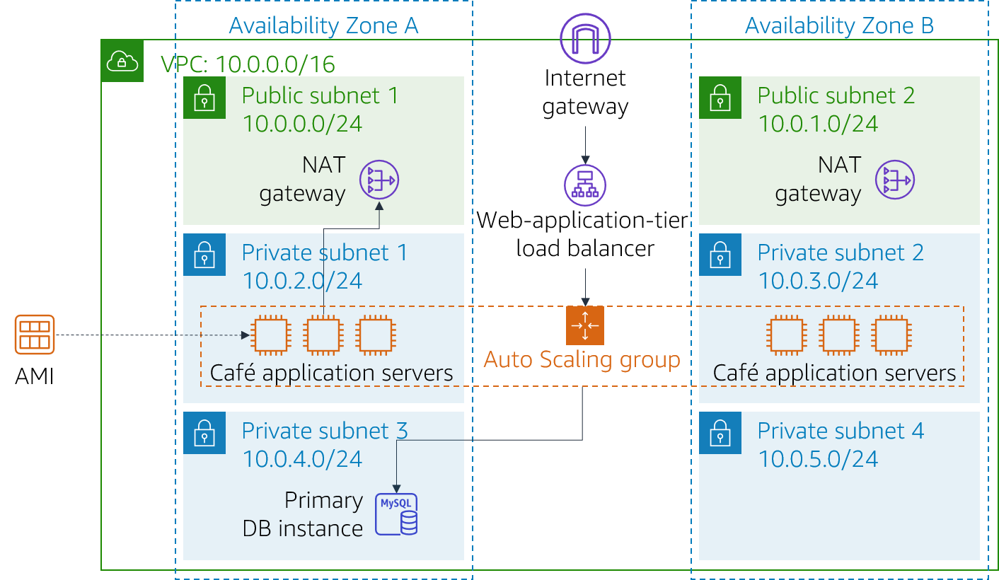

# Module 9 - Challenge Lab: Creating a Scalable and Highly Available Environment for the Café

<!--Note: the step-by-step solutions to the challenge sections of this lab can be found in the instructor guide (source document at https://awsu-coursebuild.s3-us-west-2.amazonaws.com/sourcefiles/CUR-TF-200-ACACAD-20-EN/IG/AcademyCloudArchitecting-IG-Module-09.docx)-->

## Scenario

The café will soon be featured in a famous TV food show. When it airs, Sofía and Nikhil anticipate that the café’s web server will experience a temporary spike in the number of users—perhaps even up to tens of thousands of users. Currently, the café’s web server is deployed in one Availability Zone, and they are worried that it won’t be able to handle the expected increase in traffic. They want to ensure that their customers have a great experience when they visit the website, and that they don’t experience any issues, such as lags or delays in placing orders.

To ensure this experience, the website must be responsive, able to scale both up and down to meet fluctuating customer demand, and be highly available. Instead of overloading a single server, the architecture must distribute customer order requests across multiple application servers so it can handle the increase in demand.

In this lab, you will take on the role of Sofía to implement a scalable and highly available architecture for the café's web application.

<br/>
## Lab overview and objectives

In this lab, you use Elastic Load Balancing and Amazon EC2 Auto Scaling to create a scalable and highly available environment on AWS.

After completing this lab, you should be able to:

- Inspect a VPC
- Update a network to work across multiple Availability Zones
- Create an Application Load Balancer
- Create a launch template
- Create an Auto Scaling group
- Test load balancing and automatic scaling

<br/>

When you start the lab, your architecture will look like the following example:

<br/>


<br/>

At the end of this lab, your architecture should look like the following example:

<br/>



<br/>

Note: In this challenge lab, step-by-step instructions are not provided for most of the tasks. You must figure out how to complete the tasks on your own.

<br/>
## Duration

This lab will require approximately **90 minutes** to complete.

<br/>
## AWS service restrictions

In this lab environment, access to AWS services and service actions might be restricted to the ones that are needed to complete the lab instructions. You might encounter errors if you attempt to access other services or perform actions beyond the ones that are described in this lab.

<br/>
## Accessing the AWS Management Console

1. At the top of these instructions, choose <span id="ssb_voc_grey">Start Lab</span> to launch your lab.

   A **Start Lab** panel opens, and it displays the lab status.

   > **Tip**: If you need more time to complete the lab, choose the Start Lab button again to restart the timer for the environment.

2. Wait until you see the message *Lab status: ready*, then close the **Start Lab** panel by choosing the **X**.

   > **Note**: This lab will take approximately 15 minutes to start.

3. At the top of these instructions, choose <span id="ssb_voc_grey">AWS</span>.

   This opens the AWS Management Console in a new browser tab. The system will automatically log you in.

   > **Tip**: If a new browser tab does not open, a banner or icon is usually at the top of your browser with a message that your browser is preventing the site from opening pop-up windows. Choose the banner or icon and then choose **Allow pop ups**.

4. Arrange the AWS Management Console tab so that it displays along side these instructions. Ideally, you will be able to see both browser tabs at the same time so that you can follow the lab steps more easily.

<br/>
## A business request for the café: Implementing a scalable and highly available environment (Challenge)

Sofía understands that she must complete some tasks to implement high availability and scalability for the café’s web application. However, before changing the café’s application architecture, Sofía must evaluate its current state.

In the next several tasks, you will work as *Sofía* to create and configure the resources that you need to implement a scalable and highly available application.

### Task 1: Inspecting your environment

In this task, you will evaluate the current state of your lab environment.

5. Explore the lab environment, including how the network is set up.

> **Tip**: You might want to start in the **Amazon VPC console**.

To help you explore, continue to the next section and answer the questions about this lab.

<br/>

#### Answering questions about the lab

Answers will be recorded when you choose the blue **Submit** button at the end of the lab.

6. Access the questions in this lab.
   - Choose the <span id="ssb_voc_grey">Details <i class="fas fa-angle-down"></i></span>
     menu, and choose <span id="ssb_voc_grey">Show</span>.
   - Choose the **Access the multiple choice questions** link that appears at the bottom of the page.

7. In the page that you loaded, answer the questions:

   - **Question 1**: Which ports are open in the *CafeSG* security group?
   - **Question 2**: Can you connect from the internet to instances in *Public Subnet 1*?
   - **Question 3**: Should an instance in *Private Subnet 1* be able to reach the internet?
   - **Question 4**: Should an instance in *Private Subnet 2* be able to reach the internet?
   - **Question 5**: Can you connect to the *CafeWebAppServer* instance from the internet?
   - **Question 6**: What is the name of the Amazon Machine Image (AMI)?

<br/>

### Task 2: Creating a NAT gateway for the second Availability Zone

To achieve high availability, the architecture must span at least two Availability Zones. However, before you launch Amazon Elastic Compute Cloud (Amazon EC2) instances for your web application servers in the second Availability Zone, you must create a NAT gateway for them. A NAT gateway will allow instances that do not have a public IP address to access the internet.

8. Create a NAT gateway in the *Public Subnet* in the second Availability Zone.
9. Configure the network to send internet-bound traffic from instances in *Private Subnet 2* to the NAT gateway you just created.

<br/>
### Task 3: Creating a bastion host instance in a public subnet

In this task, you will create a bastion host in a public subnet. In later tasks, you will create an EC2 instance in a private subnet and connect to it from this bastion host.

10. From the **Amazon EC2 console**, create an EC2 instance in one of the public subnets of the *Lab VPC*. It must meet the following criteria:
    - **Amazon Machine Image (AMI)**: *Amazon Linux 2 AMI (HVM)*
    - **Instance type**: *t2.micro*
    - **Auto-assign Public IP**: This setting should be enabled
    - **Name**: `Bastion Host`
    - Only allows the following traffic:
      - **Type**: *SSH*
      - **Port**: `22`
      - **Source**: Your IP address
    - Uses the **vockey** key pair

<br/>
### Task 4: Creating a launch template

During the lab setup, an Amazon Machine Image (AMI) was created from the *CafeWebAppServer* instance. In this task, you will create a launch template by using this AMI.  

11. Create a launch template by using the AMI that was created during lab setup. It must meet the following criteria.
    - **AMI**: `Cafe WebServer Image`   
    **Tip**: To locate the AMI, go to the the **AMI** dropdown menu and enter: `Cafe`  
    - **Instance type**: *t2.micro*  
    **Tip**: To locate the instance type, go to the **Instance Type** dropdown menu and enter: `t2`   
    - **Key pair (login)**: Uses a *new key pair*
    **Tip**: Create a new key pair and select it. Make sure that you download the key pair to your local computer.
    - **Security groups**: `CafeSG`  
    **Tip**: To locate the security group, go to the **Security groups** dropdown menu and enter: `CafeSG`   
    - **Resource tags**:
        - **Key**: `Name`
        - **Value**: `webserver`
        - **Resource types**: *Instances*
    - **IAM Instance Profile**: `CafeRole`  
    **Tip**: Look in **Advanced Details** for this setting.

<br/>
### Task 5: Creating an Auto Scaling group

Now that the launch template is defined, you will create an Auto Scaling group for the instances. In this task, do *not* create a load balancer when you create the Auto Scaling group. (You will create a load balancer in the next task.)

12. Create a new Auto Scaling Group that meets the following criteria:
    - **Launch template**: Uses the launch template that you created in the previous task
    - **VPC**: Uses the VPC that was configured for this lab
    - **Subnets**: Uses `Private Subnet 1` and `Private Subnet 2`
    - Skips *all* the advanced options
    - Has a **Group size** configured as:
        - **Desired capacity**: `2`
        - **Minimum capacity**: `2`
        - **Maximum capacity**: `6`
    - Enables the **Target tracking scaling policy** configured as:
        - **Metric type**: *Average CPU utilization*
        - **Target Value**: `25`
        - **Instances need**: `60`

13. To verify that you created the Auto Scaling group correctly, go to the **Amazon EC2 console**. You should have two instances, both with the name that you configured as *resource tags* in the previous task.

<br/>
### Task 6: Creating a load balancer

Now that you web application server instances are deployed in private subnets, you need a way for the outside world to connect to them. In this task, you will create a load balancer to distribute traffic across your private instances.

14. Create an HTTP Application Load Balancer that meets the following criteria:
    - **VPC**: Uses the VPC configured for this lab
    - **Subnets**: Uses the two *public subnets*
    - Skips the HTTPS security configuration settings
    - **Security group**: Creates a *new security group* that allows HTTP traffic from anywhere
    - **Target group**: Creates a *new target group*
    - Skips registering targets

**Note**: *Wait* until the load balancer is active.

15. Modify the Auto Scaling group that you created in the previous task by adding this new load balancer.

    > **Hint**: Add the *target group* you created in the Load Balancer configuration.

<br/>

Sofía has now created and configured the resources that the web application needs to be highly available and scalable. However, Sofía knows that she still has more work to do. To complete the process of updating the application architecture, Sofía must test the café’s web application to make sure that it performs as expected.

In the next tasks, you will continue working in the role of Sofía and test whether the café web application automatically scales under load.

<br/>
### Task 7: Testing the web application

In this task, you will test the café web application.

16. To test the café web application, visit the Domain Name System (DNS) name of your load balancer and append `/cafe` to the URL.

The café application should load.

If it does not, go back through the lab tasks and check your work. Pay attention to the following resources:

- *Network configuration*: Did you add the NAT gateway correctly?
- *Route tables*: Did you update the route tables with the NAT gateway?
- *Launch template*: Does the instance specify an IAM role?
- *Load balancer*: Is the load balancer in the public subnets?
- *Instances*: Are the instances deployed from the Auto Scaling group that is in the correct subnets?
- *Security groups*: Do the security groups allow HTTP traffic from the internet?

<br/>
### Task 8: Testing automatic scaling under load

In this task, you will test whether the café application *scales out* automatically.

17. By using *Secure Shell (SSH) passthrough through the bastion host instance*, use SSH to connect to one of the running web server instances.

> Tip: You will need to modify the *CafeSG* security group to allow SSH traffic over port 22 from the bastion host.

18. From the web server instance, use the following commands to start a stress test. This test increases the load on the web server CPU:

    ```bash
    sudo yum install https://dl.fedoraproject.org/pub/epel/epel-release-latest-7.noarch.rpm
    sudo yum install stress -y
    stress --cpu 1 --timeout 600
    ```

19. Verify that the Auto Scaling group deploys new instances.
    - Continue to observe the Amazon EC2 console.
    - During the test, you should observe that more web server instances are deployed.

<br/>
## Update from the café

After Sofía finishes testing the café web application's performance, she tells her parents about the changes—when traffic increases, the café application now successfully scales out. Frank and Martha are impressed that Sofía implemented a highly available and scalable architecture for the application.

Meanwhile, the entire café team is excited! They are busy preparing for the increased volume of orders that they anticipate from being featured on the TV show. As they work on their preparations, they know that they can rely on automatic scaling to help them take orders and delight new customers.

<br/>
## Submitting your work

20. At the top of these instructions, choose <span id="ssb_blue">Submit</span> to record your progress and when prompted, choose **<span id="ssb_blue">Yes</span>**

21. If the results don't display after a couple of minutes, return to the top of these instructions and choose <span id="ssb_voc_grey">Grades</span>

     **Tip**: You can submit your work multiple times. After you change your work, choose **Submit** again. Your last submission is what will be recorded for this lab.

22. To find detailed feedback on your work, choose <span id="ssb_voc_grey">Details</span> followed by <i class="fas fa-caret-right"></i> **View Submission Report**.

<br/>

## Lab complete

<i class="fas fa-flag-checkered"></i> Congratulations! You have completed the lab.

23. To confirm that you want to end the lab, at the top of this page, choose **<span id="ssb_voc_grey">End Lab</span>**, and then choose **<span id="ssb_blue">Yes</span>**

    A panel should appear with this message: *DELETE has been initiated... You may close this message box now.*

24. To close the panel, choose the **X** in the top-right corner.


*©2020 Amazon Web Services, Inc. and its affiliates. All rights reserved. This work may not be reproduced or redistributed, in whole or in part, without prior written permission from Amazon Web Services, Inc. Commercial copying, lending, or selling is prohibited.*
