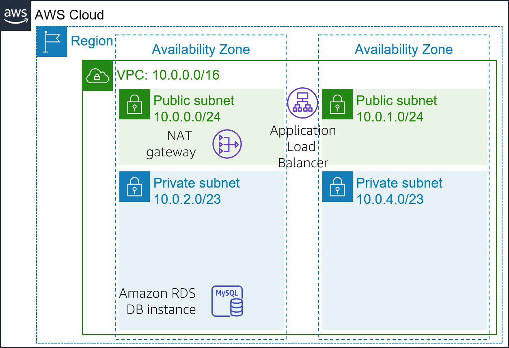
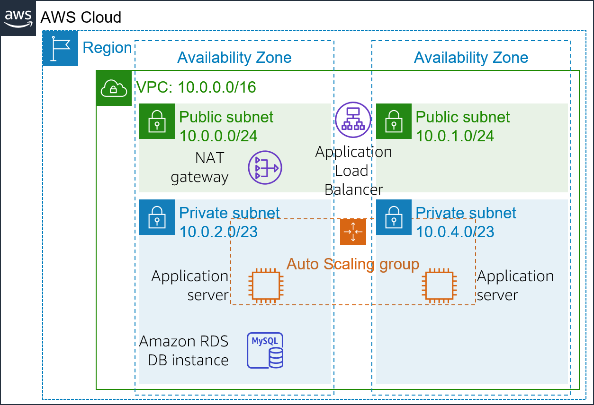
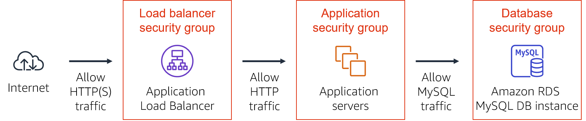
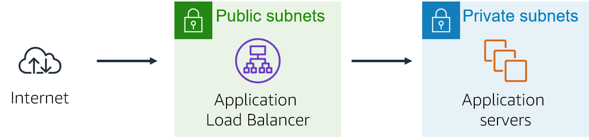

# Module 9 – Guided Lab: Creating a Highly Available Environment

[//]: # "SKU: ILT-TF-200-ACACAD-2    Source Course: ILT-TF-100-ARCHIT-6 branch dev_65"

## Lab overview and objectives

Critical business systems should be deployed as *highly available applications*—that is, applications remain operational even when some components fail. To achieve high availability in Amazon Web Services (AWS), we recommend that you *run services across multiple Availability Zones*.

Many AWS services are inherently highly available, such as load balancers. Many AWS services can also be configured for high availability, such as deploying Amazon Elastic Compute Cloud (Amazon EC2) instances in multiple Availability Zones.

In this lab, you will start with an application that runs on a single EC2 instance. You will then make the application highly available.

After completing this lab, you should be able to:

- Inspect a provided virtual private cloud (VPC)
- Create an Application Load Balancer
- Create an Auto Scaling group
- Test the application for _high availability_


At the **end** of this lab, your architecture will look like the following example:


<br/>

## Duration

The lab requires approximately **40 minutes** to complete.


<br/>

## AWS service restrictions

In this lab environment, access to AWS services and service actions might be restricted to the ones that are needed to complete the lab instructions. You might encounter errors if you attempt to access other services or perform actions beyond the ones that are described in this lab.

<br/>

## Accessing the AWS Management Console

1. At the top of these instructions, choose <span id="ssb_voc_grey">Start Lab</span> to launch your lab.

   A **Start Lab** panel opens, and it displays the lab status.

   <i class="fas fa-info-circle"></i> **Tip**: If you need more time to complete the lab, restart the timer for the environment by choosing the <span id="ssb_voc_grey">Start Lab</span> button again.


2. Wait until the **Start Lab** panel displays the message *Lab status: ready*, then close the panel by choosing the **X**.


3. At the top of these instructions, choose <span id="ssb_voc_grey">AWS</span>.

   This action opens the AWS Management Console in a new browser tab. The system automatically logs you in.

   <i class="fas fa-exclamation-triangle"></i> **Tip**: If a new browser tab does not open, a banner or icon is usually at the top of your browser with the message that your browser is preventing the site from opening pop-up windows. Choose the banner or icon, and then choose **Allow pop-ups**.


4. Arrange the **AWS Management Console** tab so that it displays alongside these instructions. Ideally, you will have both browser tabs open at the same time so that you can follow the lab steps more easily.

   <i class="fas fa-exclamation-triangle"></i> **Do not change the Region unless specifically instructed to do so**.

<br/>

## Task 1: Inspecting your VPC

This lab begins with an environment that is already deployed via AWS CloudFormation. It includes:

- A VPC
- Public and private subnets in two Availability Zones
- An internet gateway (not shown) that is associated with the public subnets
- A Network Address Translation (NAT) gateway in one of the public subnets
- An Amazon Relational Database Service (Amazon RDS) instance in one of the private subnets


In this task, you will review the configuration of the VPC that was created for this lab.


5. On the **AWS Management Console**, on the <span id="ssb_services">Services<i class="fas fa-angle-down"></i></span> menu, choose **VPC**.


6. In the left navigation pane, under **Filter by VPC**, choose the <i class="fas fa-search"></i> **Select a VPC** box and select **Lab VPC**.

   This setting will limit the console to only show resources that are associated with the _Lab VPC_.


7. In the left navigation pane, choose **Your VPCs**.

   Here, you can access information about the **Lab VPC** that was created for you.

   The **IPv4 CIDR** column has a value of *10.0.0.0/16*, which means that this VPC includes all IP addresses that start with *10.0.x.x*.


8. In the left navigation pane, choose **Subnets**.

   Here, you can access information about **Public Subnet 1:**

    - The **VPC** column shows that this subnet exists inside of *Lab VPC*.

    - The **IPv4 CIDR** column has a value of *10.0.0.0/24*, which means that this subnet includes the 256 IP addresses between _10.0.0.0_ and _10.0.0.255_. Five of these addresses are reserved and unusable.

    - The **Availability Zone** column lists the Availability Zone where this subnet resides.


9. To reveal more details at the bottom of the page, select <i class="far fa-check-square"></i> **Public Subnet 1**.

   **Tip:** To adjust the size of the lower window pane, you can drag the divider.


10. In the lower half of the page, choose the **Route table** tab.

    This tab includes details about the routing for this subnet:

    - The first entry specifies that traffic destined within the Classless Inter-Domain Routing (CIDR) range for the VPC (*10.0.0.0/16*) will be routed within the VPC (*local*).

    - The second entry specifies that any traffic destined for the internet (*0.0.0.0/0*) is routed to the internet gateway (*igw-*). This setting makes the subnet a *public subnet*.


11. Choose the **Network ACL** tab.

    This tab has information about the network access control list (network ACL) that is associated with the subnet. The rules currently permit *all traffic* to flow in and out of the subnet, but the rules can be further restricted by using security groups.


12. In the left navigation pane, choose **Internet Gateways**.

    Notice that an internet gateway is already associated with **Lab VPC**.


13. In the left navigation pane, choose **Security Groups**.


14. Select <i class="far fa-check-square"></i> **Inventory-DB**.

    This security group controls incoming traffic to the database.


15. In the lower half of the page, choose the **Inbound rules** tab.

    These rules permit inbound MySQL or Aurora traffic (port 3306) from anywhere in the VPC (_10.0.0.0/16_). You will later modify this setting so it only accepts traffic from the application servers.


16. Choose the **Outbound rules** tab.

    By default, security groups allow all outbound traffic. However, this setting can be modified as needed.


<br/>

## Task 2: Creating an Application Load Balancer

To build a highly available application, it is a best practice to launch resources in *multiple Availability Zones*. Availability Zones are physically separate data centers (or groups of data centers) in the same Region. If you run your applications across multiple Availability Zones, you can provide greater *availability* if a data center experiences a failure.

Because the application runs on multiple application servers, you will need a way to distribute traffic amongst those servers. You can accomplish this goal by using a *load balancer*. This load balancer will also perform health checks on instances and only send requests to healthy instances.




17. On the <span id="ssb_services">Services<i class="fas fa-angle-down"></i></span> menu, choose **EC2**.


18. In the left navigation pane, choose **Load Balancers** (you might need to scroll down to find it).


19. Choose <span id="ssb_blue">Create Load Balancer</span>

    Several types of load balancers are displayed. Read the descriptions of each type to understand their capabilities.


20. Under **Application Load Balancer**, choose **Create**.


21. For **Load balancer name**, enter: `Inventory-LB`


22. Scroll down to the **Network mapping** section, then for **VPC**, select **Lab VPC**.

    **Important:** Be sure to choose **Lab VPC**. It is likely not the default selection.

    You will now specify which _subnets_ the load balancer should use. It will be a public load balancer, so you will select both public subnets.


23. Under **Mappings**, choose the **first** Availability Zone, then choose the **Public Subnet** that displays.


24. Choose the **second** Availability Zone, then choose the **Public Subnet** that displays.

    You should now have selected two subnets: **Public Subnet 1** and **Public Subnet 2**. (If not, go back and try the configuration again.)


25. In the **Security groups** section, select **Create new security group**, then configure:

    - **Security group name:** `Inventory-LB`

    - **Description:** `Enable web access to load balancer`

    - **VPC**: Remove the default VPC by choosing the X to the right of it. Then select  **Lab VPC**.


26. Under **Inbound rules**, choose **Add rule** and configure as described:

    - **Type:** _HTTP_

    - **Source:** _Anywhere-IPv4_


27. Still under **Inbound rules**, choose **Add rule** again and configure:

    - **Type:** _HTTPS_

    - **Source:** _Anywhere-IPv4_


28. Choose **Create security group**.


29. Assign the security group to the load balancer:

    - Return to the browser tab where you are still configuring the load balancer.
    - Scroll down to the **Security groups** area and choose the <i class="fas fa-sync"></i> refresh icon.
    - For **Security groups**, select the **Inventory-LB** security group.
    - Next, below the **Security groups** dropdown menu, select the **X** next to the *default* security group so that the Inventory-LB is now the only security group chosen.


30. In the **Listeners and routing** section, choose **Create target group**.

    **Analysis**: _Target groups_ define where to *send* traffic that comes into the load balancer. The Application Load Balancer can send traffic to multiple target groups based upon the URL of the incoming request, such as having requests from mobile apps going to a different set of servers. Your web application will use only one target group.


31. A new browser tab will open. Configure the target group as described here:

    - **Choose a target type:** *Instances*

    - **Target group name:** `Inventory-App`

    - **VPC:** Ensure that *Lab VPC* is chosen.

    - Scroll down and expand <i class="fas fa-caret-right"></i> **Advanced health check settings**.

      **Note**: The Application Load Balancer automatically performs _health checks_ on all instances to ensure that they are responding to requests. The default settings are recommended, but you will make them slightly faster for use in this lab.

    - **Healthy threshold:** `2`

    - **Interval:** `10` (seconds)

      This means that the health check will be performed every 10 seconds, and if the instance responds correctly twice in a row, it will be considered healthy.

    - Choose **Next**. The *Register targets* screen appears.

      **Note:** _Targets_ are the individual instances that will respond to requests from the load balancer.

      You do not have any web application instances yet, so you can skip this step.

    - Review the settings and choose **Create target group**.


32. Return to the browser tab where you already started defining the load balancer.


33. In the **Listeners and routing** section, choose the <i class="fas fa-sync"></i> refresh icon.


34. For the **Listener HTTP:80** row, set the **Default action** to forward to **Inventory-app**.


35. Scroll to the bottom of the page, and choose **Create load balancer**.

    - The load balancer is successfully created.

    - Choose **View load balancer**.


<br/>

## Task 3: Creating an Auto Scaling group

*Amazon EC2 Auto Scaling* is a service designed to _launch_ or _terminate_ Amazon EC2 instances automatically based on user-defined policies, schedules, and health checks. It also *automatically distributes instances across multiple Availability Zones* to make applications *highly available*.

In this task, you will create an Auto Scaling group that deploys EC2 instances across your *private subnets*, which is a security best practice for application deployment. Instances in a private subnet cannot be accessed from the internet. Instead, users send requests to the load balancer, which forwards the requests to EC2 instances in the private subnets.




<br/>

### Create an AMI for Auto Scaling

You will create an Amazon Machine Image (AMI) from the existing _Web Server 1_. This will save the contents of the boot disk so that new instances can be launched with identical content.


36. In the **AWS Management Console**, on the <span id="ssb_services">Services <i class="fas fa-angle-down"></i></span> menu, choose **EC2**.


37. In the left navigation pane, choose **Instances**.

    First, you will confirm that the instance created for you in this lab is running.


38. Wait until the **Status check** for **Web Server 1** displays *2/2 checks passed*. Choose refresh <i class="fas fa-sync"></i> to update.

    You will now create an AMI based upon this instance.


39. Select <i class="far fa-check-square"></i> **Web Server 1**.


40. In the <span id="ssb_grey">Actions <i class="fas fa-angle-down"></i></span> menu, choose **Image and templates** &gt; **Create image**, then configure:

    - **Image name:** `Web Server AMI`

    - **Image description:** `Lab AMI for Web Server`


41. Choose <span id="ssb_orange">Create image</span>

    A banner at the top of the screen displays the **AMI ID** for your new AMI.

    You will use this AMI when launching the Auto Scaling group later in the lab.

<br/>

### Create a launch configuration and an Auto Scaling group

You will first create a *launch configuration*, which defines the type of instances that Amazon EC2 Auto Scaling should launch. The interface looks similar to when you launch an EC2 instance. However, instead of launching an instance, it _stores_ the configuration for later use.


42. In the left navigation pane, choose **Launch Configurations**.


43. Choose <span id="ssb_orange">Create launch configuration</span>


44. Configure these settings:

    - **Launch configuration name:** `Inventory-LC`

    - **Amazon machine image (AMI):** *Web Server AMI*

    - **Instance type:**

      - Select <span id="ssb_white">Choose instance type</span>
      - Select *t3.micro*
      - Select <span id="ssb_orange">Choose</span>

      **Note:** If you have launched the lab in the us-east-1 Region, select the **t2.micro** instance type. To find the Region, look in the upper-right corner of the Amazon EC2 console.

      **Note:** If you receive the error message *Something went wrong. Please refresh and try again*, you may ignore it and continue with the exercise.

    - **Additional configuration:**

      - **IAM instance profile**: _Inventory-App-Role_

    - **Monitoring:** Select <i class="far fa-check-square"></i> *Enable EC2 instance detailed monitoring within CloudWatch*

      This allows Auto Scaling to react quickly to changing utilization.


45. Expand <i class="fas fa-caret-right"></i> **Advanced details**. Under **User data**, copy and paste this script:

```bash
#!/bin/bash
# Install Apache Web Server and PHP
yum install -y httpd mysql
amazon-linux-extras install -y php7.2
# Download Lab files
wget https://aws-tc-largeobjects.s3-us-west-2.amazonaws.com/ILT-TF-200-ACACAD-20-EN/mod9-guided/scripts/inventory-app.zip
unzip inventory-app.zip -d /var/www/html/
# Download and install the AWS SDK for PHP
wget https://github.com/aws/aws-sdk-php/releases/download/3.62.3/aws.zip
unzip aws -d /var/www/html
# Turn on web server
chkconfig httpd on
service httpd start
```

46. Under **Security groups**, for **Select an existing security group**, choose _Inventory-App_.

  <i class="fas fa-comment"></i> You will receive a warning that _You will not able to connect to the instance_. You can ignore this warning because you will not need connect to the instance. All configuration is done via the user data script.


47. Under **Key pair (login)**:

    - **Key pair options:** *Proceed without a key pair*

    - Select <i class="far fa-check-square"></i> *I acknowledge that...*


48. Choose <span id="ssb_orange">Create launch configuration</span>

    The _launch configuration_ defined *what to launch*, but the _Auto Scaling group_ defines *where to launch* the resources.


49. In the **Launch configurations** table, select <i class="far fa-check-square"></i> *Inventory-LC*.


50. From the <span id="ssb_white">Actions<i class="fas fa-caret-down"></i></span> menu, choose *Create Auto Scaling group*.


51. For **Auto Scaling group name**, enter: `Inventory-ASG` (*ASG* stands for _Auto Scaling group_)


52. Choose <span id="ssb_orange">Next</span>


53. On the **Network** page, configure as described below:

    - **VPC:** _Lab VPC_

    - **Subnet:** Select _Private Subnet 1_ **and** _Private Subnet 2_

      This will launch EC2 instances in private subnets across both Availability Zones.


54. Choose <span id="ssb_orange">Next</span>


55. Under **Load balancing**, configure:

    -  Select <i class="far fa-check-square"></i> **Attach to an existing load balancing**
    - **Existing load balancer target groups:** Select *Inventory-App*

      These settings tell the Auto Scaling group to register new EC2 instances as part of the _Inventory-App_ target group that you created earlier. The load balancer will send traffic to instances that are in this target group.


56. Under **Health checks**, configure:

    - **Health check type:** Select <i class="far fa-check-square"></i> **ELB**

    - **Health check grace period:** `90`


57. Under **Additional settings**, select <i class="far fa-check-square"></i> **Enable group metrics collection within CloudWatch**.


58. Choose <span id="ssb_orange">Next</span>


59. Under **Group size**, configure:

    - **Desired capacity:** 2

    - **Minimum capacity:** 2

    - **Maximum capacity:** 2


60. Under **Scaling policies**, choose *None*.

    For this lab, you will *maintain two instances at all times* to ensure _high availability_. If the application is expected to receive varying loads of traffic, you can also create _scaling policies_ that define when to launch or terminate instances. However, you do not need to create scaling policies for the Inventory application in this lab.


61. Choose <span id="ssb_orange">Next</span>


62. On the **Add notifications** page, choose <span id="ssb_orange">Next</span>. You do not need to configure any of these settings.


63. On the **Add tags** page, choose <span id="ssb_white">Add tag</span> and configure:
      - **Key:** `Name`
      - **Value:** `Inventory-App`
      - Select <span id="ssb_orange">Next</span>

    These settings will _tag_ the Auto Scaling group with a *Name*, which will also appear on the EC2 instances that are launched by the Auto Scaling group. You can use tags to identify which Amazon EC2 instances are associated with which application. You could also add tags such as *Cost Center* to assign application costs in the billing files.


64. On the **Review page**, choose <span id="ssb_orange">Create Auto Scaling group</span>

    The _Inventory-ASG_ will appear in the console:

      

      The review shows that:

      - The group currently has *no instances*, but the **Status** column indicates *Updating capacity*.
      - The **Desired** quantity is *2 instances*. Amazon EC2 Auto Scaling will attempt to launch two instances to reach the desired quantity.
      - The **Min** and **Max** are also set to *2 instances*. Amazon EC2 Auto Scaling will try to always provide two instances, even if failure occurs.

        Your application will soon run across two Availability Zones. Amazon EC2 Auto Scaling will maintain that configuration even if an instance or Availability Zone fails.

        After a minute, choose the <i class="fas fa-sync"></i> refresh icon to update the display. It should show that *2 instances* are running.

<br/>

## Task 4: Updating security groups

The application you deployed is a *three-tier architecture*. You will now configure the security groups to enforce these tiers:



<br/>

### Load balancer security group

You already configured the _load balancer security group_ when you created the load balancer. It accepts all incoming _HTTP_ and _HTTPS_ traffic.

The load balancer has been configured to forward incoming requests to a _target group_. When Auto Scaling launches new instances, it will automatically add those instances to the target group.

<br/>

### Application security group

The _application security group_ was provided as part of the lab setup. You will now configure it to only accept incoming traffic from the load balancer.


67. In the left navigation pane, choose **Security Groups**.


68. Select <i class="far fa-check-square"></i> **Inventory-App**.


69. In the lower half of the page, choose the **Inbound rules** tab.

The security group is currently empty. You will now add a rule to accept incoming _HTTP_ traffic from the load balancer. You do not need to configure _HTTPS_ traffic because the load balancer was configured to forward HTTPS requests via HTTP. This practice offloads security to the load balancer, reducing the amount of work that is required by the individual application servers.


70. Choose <span id="ssb_grey">Edit inbound rules</span>.


71. On the **Edit inbound rules** page, choose <span id="ssb_grey">Add rule</span> and configure these settings:

- **Type:** _HTTP_
- **Source:**
  - Choose the search box to the right of **Custom**
  - Delete the current contents
  - Enter `sg`
  - From the list that appears, select **Inventory-LB**
- **Description:** `Traffic from load balancer`
- Choose <span id="ssb_orange">Save rules</span>

The application servers can now receive traffic from the load balancer. This includes _health checks_ that the load balancer performs automatically.

<br/>

### Database security group

You will now configure the _database security group_ to only accept incoming traffic from the application servers.


72. In the **Security groups** list, choose <i class="far fa-check-square"></i> **Inventory-DB** (and make sure that no other security groups are selected).

    The existing rule permits traffic on port 3306 (used by MySQL) from any IP address within the VPC. This is a good rule, but security can be restricted further.


73. In the **Inbound rules** tab, choose <span id="ssb_grey">Edit inbound rules</span> and configure these settings:

    - **Delete** the existing rule.

    - Choose **Add rule**.

    - For **Type**, choose **MYSQL/Aurora**

    - Choose the search box to the right of **Custom**

    - Enter `sg`

    - From the list that appears, select **Inventory-App**

    - **Description:** `Traffic from application servers`

    - Choose <span id="ssb_orange">Save rules</span>
    
    
    You have now configured _three-tier security_. Each element in the tier only accepts traffic from the tier above.
    
    In addition, the use of private subnets means that you have two security barriers between the internet and your application resources. This architecture follows the best practice of applying multiple layers of security.

<br/>

## Task 5: Testing the application

Your application is now ready for testing.

In this task, you will confirm that your web application is running. You will also test that it is highly available.


74. In the left navigation pane, choose **Target Groups**.

    The *Inventory-App* group of instances will be displayed.

74. Select <i class="far fa-check-square"></i> **Inventory-app**.


75. In the lower half of the page, choose the **Targets** tab.

    This tab should show two *registered targets*. The **Status** column shows the results of the load balancer health check that is performed against the instances.


76. In the **Registered targets** area, occasionally choose the <i class="fas fa-sync"></i> refresh icon until the **Status** for both instances appears as *healthy*.

    If the status does not eventually change to *healthy*, ask your educator for help with diagnosing the configuration.

    You will test the application by connecting to the load balancer, which will then send your request to one of the EC2 instances. You will first need to retrieve the Domain Name System (DNS) name of the load balancer.


77. In the left navigation pane, choose **Load Balancers**.


78. In the **Description** tab in the lower half of the window, copy the **DNS name** to your clipboard.

    It should be similar to: *inventory-LB-xxxx.elb.amazonaws.com*


79. Open a new web browser tab, paste the DNS name from your clipboard and press ENTER.

    The load balancer forwarded your request to one of the EC2 instances. The instance ID and Availability Zone are shown at the bottom of the webpage.


80. Reload <i class="fas fa-sync"></i> the page in your web browser. You should notice that the instance ID and Availability Zone sometimes change between the two instances.

    When this web application displays, the flow of information is:

   

   - You sent the request to the *load balancer*, which resides in the *public subnets* that are connected to the internet.

   - The load balancer chose one of the *EC2 instances* that reside in the *private subnets* and forwarded the request to it.

   - The EC2 instance then returned the webpage to the load balancer, which returned it to your web browser.

<br/>

## Task 6: Testing high availability

Your application was configured to be highly available. You can prove the application's high availability by terminating one of the EC2 instances.


81. Return to the **Amazon EC2 console** tab in your web browser (but do not close the web application tab—you will return to it soon).


82. In the left navigation pane, choose **Instances**.

    You will now terminate one of the web application instances to simulate a failure.


83. Select <i class="far fa-check-square"></i> one of the **Inventory-App** instances (it does not matter which one you select).


84. Choose **Instance State > Terminate instance**.


85. Choose **Terminate**.

    In a short time, the load balancer health checks will notice that the instance is not responding. The load balancer will automatically route all requests to the remaining instance.


86. Return to the web application tab in your web browser and reload <i class="fas fa-sync"></i> the page several times.

    You should notice that the *Availability Zone* that is shown at the bottom of the page stays the same. Though an instance failed, your application remains available.

    After a few minutes, Amazon EC2 Auto Scaling will also notice the instance failure. It was configured to keep two instances running, so Amazon EC2 Auto Scaling will *automatically launch a replacement instance*.


87. Return to the **Amazon EC2 console** tab where you have the instances list displayed. In the top-right area, choose the <i class="fas fa-sync"></i> refresh icon every 30 seconds or so until a new EC2 instance appears.

    After a few minutes, the health check for the new instance should become healthy. The load balancer will resume sending traffic between the two Availability Zones. You can reload your web application tab to see this happen.

    This task demonstrates that your application is now _highly available_.

<br/>

## Optional task 1: Making the database highly available

<i class="fas fa-comment"></i> _This task is **optional**. You can work on this task if you have remaining lab time._

The application architecture is now highly available. However, the Amazon RDS database operates from only one database instance.

In this optional task, you will make the database highly available by configuring it to run across multiple Availability Zones (that is, in a *Multi-AZ deployment*).


88. On the <span id="ssb_services">Services<i class="fas fa-angle-down"></i></span> menu, choose **RDS**.


89. In the left navigation pane, choose **Databases**.


90. Choose the link for the name of the **inventory-db** instance.

    Feel free to explore the information about the database.


91. Choose <span id="ssb_rds_white">Modify</span>


92. Scroll down to the **Availability & durability** section. For **Multi-AZ deployment**, select <i class="far fa-dot-circle"></i> **Create a standby instance**.

    *Analysis*: You only need to reconfigure this one setting to convert the database to run across multiple data centers (Availability Zones).

    This option does not mean that the database is _distributed_ across multiple instances. Instead, one instance is the _primary_ instance, which handles all requests. Another instance will be launched as the _standby_ instance, which takes over if the primary instance fails. Your application continues to use the same DNS name for the database. However, the connections will automatically redirect to the currently active database server.

    You can scale an EC2 instance by changing attributes, and you can also scale an RDS database this way. You will now scale up the database.


93. Scroll back up and for **DB instance class**, select **db.t3.small**.

    This action doubles the size of the instance.


94. For **Allocated storage**, enter: `10`

    This action doubles the amount of space that is allocated to the database.

    Feel free to explore the other options on the page, but do not change any other settings.


95. At the bottom of the page, choose <span id="ssb_orange">Continue</span>

    Database performance will be impacted by these changes. Therefore, these changes can be scheduled during a defined maintenance window, or they can be run immediately.


96. Under **Scheduling of Modifications**, select <i class="far fa-dot-circle"></i> **Apply immediately**.


97. Choose <span id="ssb_orange">Modify DB instance</span>

    The database enters a _modifying_ state while it applies the changes. You do not need to wait for it to complete.

<br/>

## Optional task 2: Configuring a highly available NAT gateway

<i class="fas fa-comment"></i> _This task is **optional**. You can work on this task if you have remaining lab time._

The application servers run in a private subnet. If the servers must access the internet (for example, to download data), the requests must be redirected through a _Network Address Translation (NAT) gateway_. (The NAT gateway must be located in a public subnet).

The current architecture has only one NAT gateway in _Public Subnet 1_. Thus, if Availability Zone 1 fails, the application servers will not be able to communicate with the internet.

In this optional task, you will make the NAT gateway highly available by launching another NAT gateway in the other Availability Zone. The resulting architecture will be highly available:


98. On the <span id="ssb_services">Services<i class="fas fa-angle-down"></i></span> menu, choose **VPC**.


99. In the left navigation pane, choose **NAT Gateways**.

    The existing NAT gateway displays. You will now create a NAT gateway for the other Availability Zone.


100. Choose <span id="ssb_orange">Create NAT gateway</span> and configure these settings:

     - **Subnet:** *Public Subnet 2*

     - Choose <span id="ssb_grey">Allocate Elastic IP</span>

     - Choose <span id="ssb_orange">Create NAT gateway</span>

       You will now create a new route table for _Private Subnet 2_. This route table will redirect traffic to the new NAT gateway.


101. In the left navigation pane, choose **Route Tables**.

     

102. Choose <span id="ssb_blue">Create route table</span> and configure these settings:

     - **Name:** `Private Route Table 2`

     - **VPC:** _Lab VPC_

     - Choose **Create route table**.


103. Observe the settings in the **Routes** tab.

     Currently, one route directs all traffic _locally_. You will now add a route to send internet-bound traffic through the new NAT gateway.


104. Choose <span id="ssb_grey">Edit routes</span> and then configure these settings:

     - Choose <span id="ssb_grey">Add route</span>

     - **Destination:** `0.0.0.0/0`

     - **Target:** Select _NAT Gateway_, then select the _nat-_ entry that is *not* the entry for _NATGateway1_ (which is under the **Details** button above these instructions)

     - Choose **Save changes**

       <i class="fas fa-comment"></i> The NAT gateway that is listed under the **Details** button (which is above these instructions) is for _Public Subnet 1_. You are configuring this route table to use the _other_ NAT gateway.


105. Choose the **Subnet Associations** tab.


106. Choose <span id="ssb_grey">Edit subnet associations</span>


107. Select <i class="far fa-check-square"></i> **Private Subnet 2**.


108. Choose <span id="ssb_orange">Save associations</span>

     This action now sends internet-bound traffic from Private Subnet 2 to the NAT gateway that is in the same Availability Zone.

     Your NAT gateways are now highly available. A failure in one Availability Zone will not impact traffic in the other Availability Zone.

<br/>

## Submitting your work

109. At the top of these instructions, choose <span id="ssb_blue">Submit</span> to record your progress and when prompted, choose **Yes**.


110. If the results don't display after a couple of minutes, return to the top of these instructions and choose <span id="ssb_voc_grey">Grades</span>

     **Tip**: You can submit your work multiple times. After you change your work, choose **Submit** again. Your last submission is what will be recorded for this lab.


111. To find detailed feedback on your work, choose <span id="ssb_voc_grey">Details</span> followed by <i class="fas fa-caret-right"></i> **View Submission Report**.

<br/>

## Lab complete <i class="fas fa-graduation-cap"></i>

<i class="fas fa-flag-checkered"></i> Congratulations! You have completed the lab.


112. Choose <span id="ssb_voc_grey">End Lab</span> at the top of this page, and then select <span id="ssb_blue">Yes</span> to confirm that you want to end the lab.

     A panel indicates that *DELETE has been initiated... You may close this message box now.*


113. Select the **X** in the top right corner to close the panel.


*©2021 Amazon Web Services, Inc. and its affiliates. All rights reserved. This work may not be reproduced or redistributed, in whole or in part, without prior written permission from Amazon Web Services, Inc. Commercial copying, lending, or selling is prohibited.*
