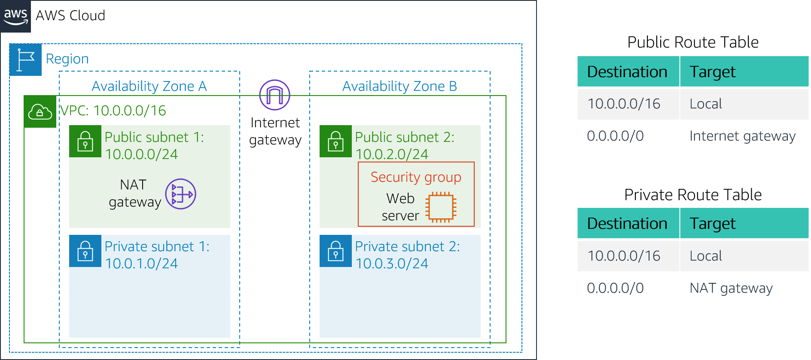
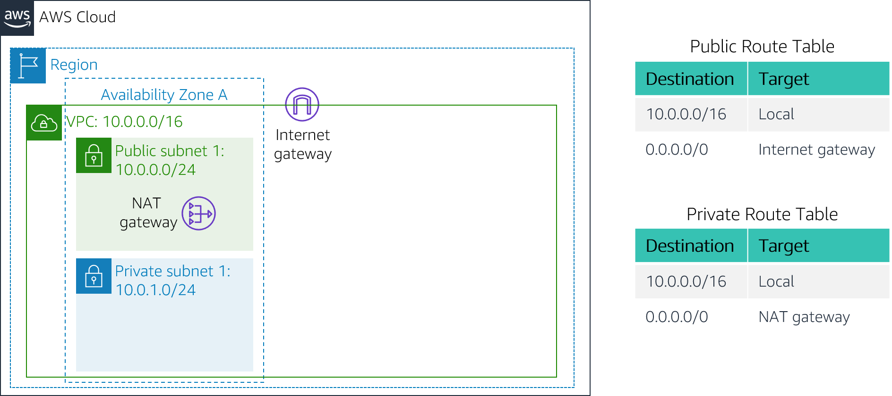

# Lab 2: Build your VPC and Launch a Web Server

<!-- Lab origin: Technical Essentials Lab 1. -->

## Lab overview and objectives

In this lab, you will use Amazon Virtual Private Cloud (VPC) to create your own VPC and add additional components to produce a customized network. You will also create security groups for your EC2 instance. You will then configure and customize an EC2 instance to run a web server and launch it into the VPC.

**Amazon Virtual Private Cloud (Amazon VPC)** enables you to launch Amazon Web Services (AWS) resources into a virtual network that you defined. This virtual network closely resembles a traditional network that you would operate in your own data center, with the benefits of using the scalable infrastructure of AWS. You can create a VPC that spans multiple Availability Zones.

After completing this lab, you should be able to do the following:

- Create a VPC.

- Create subnets.

- Configure a security group.

- Launch an EC2 instance into a VPC.

  

## **Duration**

This lab takes approximately **30 minutes** to complete.


## AWS service restrictions

In this lab environment, access to AWS services and service actions might be restricted to the ones that are needed to complete the lab instructions. You might encounter errors if you attempt to access other services or perform actions beyond the ones that are described in this lab.


## **Scenario**

In this lab you build the following infrastructure:



&nbsp;&nbsp;
## Accessing the AWS Management Console

1. At the top of these instructions, choose <span id="ssb_voc_grey">Start Lab</span> to launch your lab.

    A Start Lab panel opens displaying the lab status.

    

2. Wait until you see the message "**Lab status: ready**", then choose the **X** to close the Start Lab panel

     

3. At the top of these instructions, choose <span id="ssb_voc_grey">AWS</span>

    This will open the AWS Management Console in a new browser tab. The system will automatically log you in.

    **Tip**: If a new browser tab does not open, there will typically be a banner or icon at the top of your browser indicating that your browser is preventing the site from opening pop-up windows. Choose on the banner or icon and choose "Allow pop ups."

    

4. Arrange the AWS Management Console tab so that it displays along side these instructions. Ideally, you will be able to see both browser tabs at the same time, to make it easier to follow the lab steps.

    

## Task 1: Create Your VPC

In this task, you will use the VPC Wizard to create a VPC an Internet Gateway and two subnets in a single Availability Zone. An **Internet gateway (IGW)** is a VPC component that allows communication between instances in your VPC and the Internet.

After creating a VPC, you can add **subnets**. Each subnet resides entirely within one Availability Zone and cannot span zones. If a subnet's traffic is routed to an Internet Gateway, the subnet is known as a *public subnet*. If a subnet does not have a route to the Internet gateway, the subnet is known as a *private subnet*.

The wizard will also create a _NAT Gateway_, which is used to provide internet connectivity to EC2 instances in the private subnets.


5. In the search box to the right of <i class="fas fa-th"></i> **Services**, search for and choose **VPC** to open the VPC console.

     

6. Choose <span id="ssb_orange">Launch VPC Wizard</span>

     

7. In the left navigation pane, choose **VPC with Public and Private Subnets** (the second option).

     

8. Choose <span id="ssb_blue">Select</span> then configure:

   - **VPC name:** `Lab VPC`

   - **Availability Zone:** Select the *first* Availability Zone

   - **Public subnet name:** `Public Subnet 1`

   - **Availability Zone:** Select the *first* Availability Zone (the same as used above)

   - **Private subnet name:** `Private Subnet 1`

   - **Elastic IP Allocation ID:** Choose in the box and select the displayed IP address

     

9. Choose <span id="ssb_blue">Create VPC</span>

    The wizard will create your VPC.

    

10. Once it is complete, choose <span id="ssb_blue">OK</span>

    The wizard has provisioned a VPC with a public subnet and a private subnet in the same Availability Zone, together with route tables for each subnet:

    

    &nbsp;

    The Public Subnet has a CIDR of **10.0.0.0/24**, which means that it contains all IP addresses starting with **10.0.0.x**.

    The Private Subnet has a CIDR of **10.0.1.0/24**, which means that it contains all IP addresses starting with **10.0.1.x**.


## Task 2: Create Additional Subnets

In this task, you will create two additional subnets in a second Availability Zone. This is useful for creating resources in multiple Availability Zones to provide _High Availability_.


11. In the left navigation pane, choose **Subnets**.

    First, you will create a second Public Subnet.

    

12. Choose <span id="ssb_orange">Create subnet</span> then configure:

    - **VPC ID:**  **Lab VPC** (select from the menu).
    - **Subnet name:** `Public Subnet 2`
    - **Availability Zone:** Select the *second* Availability Zone
    - **IPv4 CIDR block:** `10.0.2.0/24`

    The subnet will have all IP addresses starting with **10.0.2.x**.

    

13. Choose <span id="ssb_orange">Create subnet</span>

    The second *public* subnet was created. You will now create a second *private* subnet.

    

14. Choose <span id="ssb_orange">Create subnet</span> then configure:

    - **VPC ID:** `Lab VPC`
    - **Subnet name:** `Private Subnet 2`
    - **Availability Zone:** Select the *second* Availability Zone
    - **CIDR block:** `10.0.3.0/24`

    The subnet will have all IP addresses starting with **10.0.3.x**.

    

15. Choose <span id="ssb_orange">Create subnet</span>

    The second *private* subnet was created. 

    You will now configure the Private Subnets to route internet-bound traffic to the NAT Gateway so that resources in the Private Subnet are able to connect to the Internet, while still keeping the resources private. This is done by configuring a _Route Table_.

    A *route table* contains a set of rules, called *routes*, that are used to determine where network traffic is directed. Each subnet in a VPC must be associated with a route table; the route table controls routing for the subnet.

    

16. In the left navigation pane, choose **Route Tables**.

    

17. Select <i class="far fa-check-square"></i> the route table with **Main = Yes** and **VPC = Lab VPC**. (Expand the _VPC ID_ column if necessary to view the VPC name.)

    

18. In the **Name** column for this route table, choose the pencil <i class="fas fa-pencil-alt"></i> then type `Private Route Table` and choose <span id="ssb_orange">Save</span>

    

19. In the lower pane, choose the **Routes** tab.

    Note that **Destination 0.0.0.0/0** is set to **Target nat-xxxxxxxx**. This means that traffic destined for the internet (0.0.0.0/0) will be sent to the NAT Gateway. The NAT Gateway will then forward the traffic to the internet.

    This route table is therefore being used to route traffic from Private Subnets. 

    

20. In the lower pane, choose the **Subnet Associations** tab.

    You will now associate this route table to the Private Subnets.

    

21. Choose <span id="ssb_white">Edit subnet associations</span>


22. Select <i class="far fa-check-square"></i> both **Private Subnet 1** and **Private Subnet 2**.

    <i class="fas fa-comment"></i> You can expand the _Subnet ID_ column to view the Subnet names.

    

23. Choose <span id="ssb_orange">Save associations</span>

    You will now configure the Route Table that is used by the Public Subnets.

    

24. Select <i class="far fa-check-square"></i> the route table with **Main = No** and **VPC = Lab VPC** (and deselect any other subnets).

    

25. In the **Name** column for this route table, choose the pencil <i class="fas fa-pencil-alt"></i> then type `Public Route Table`, and choose <span id="ssb_orange">Save</span>

    

26. In the lower pane, choose the **Routes** tab.

    Note that **Destination 0.0.0.0/0** is set to **Target igw-xxxxxxxx**, which is the Internet Gateway. This means that internet-bound traffic will be sent straight to the internet via the Internet Gateway.

    You will now associate this route table to the Public Subnets.

    

27. Choose the **Subnet associations** tab.

    

28. Choose <span id="ssb_white">Edit subnet associations</span>

    

29. Select <i class="far fa-check-square"></i> both **Public Subnet 1** and **Public Subnet 2**.

    

30. Choose <span id="ssb_orange">Save associations</span>

    Your VPC now has public and private subnets configured in two Availability Zones:

    


## Task 3: Create a VPC Security Group

In this task, you will create a VPC security group, which acts as a virtual firewall. When you launch an instance, you associate one or more security groups with the instance. You can add rules to each security group that allow traffic to or from its associated instances.


31. In the left navigation pane, choose **Security Groups**.

    

32. Choose <span id="ssb_orange">Create security group</span> and then configure:

    - **Security group name:** `Web Security Group`

    - **Description:** `Enable HTTP access`

    - **VPC:** _Lab VPC_

      

33. In the **Inbound rules** pane, choose <span id="ssb_white">Add rule</span>

    

34. Configure the following settings:

    - **Type:** _HTTP_

    - **Source:** _Anywhere-IPv4_

    - **Description:** `Permit web requests`

      

35. Scroll to the bottom of the page and choose <span id="ssb_orange">Create security group</span>

    You will use this security group in the next task when launching an Amazon EC2 instance.


## Task 4: Launch a Web Server Instance

In this task, you will launch an Amazon EC2 instance into the new VPC. You will configure the instance to act as a web server.


36. In the search box to the right of <i class="fas fa-th"></i> **Services**, search for and choose **EC2** to open the EC2 console.

    

37. Choose <span id="ssb_orange">Launch instances</span>

    

38. Name the instance:

    - Give it the name `Web Server 1`

      When you name your instance, AWS creates a tag and associates it with the instance. A tag is a key value pair. The key for this pair is ***\*Name\****, and the value is the name you enter for your EC2 instance.
      
      

39. Choose an AMI from which to create the instance:

    - In the list of available *Quick Start* AMIs, keep the default **Amazon Linux** AMI selected. 

    - Also keep the default **Amazon Linux 2 AMI (HVM)** selected.

      The type of _Amazon Machine Image (AMI)_ you choose determines the Operating System that will run on the EC2 instance that you launch.
      
      

40. Choose an Instance type:

    - In the *Instance type* panel, keep the default **t2.micro** selected.

      The _Instance Type_ defines the hardware resources assigned to the instance.
      
      

41. Select the key pair to associate with the instance:

    - From the **Key pair name** menu, select **vockey**.

      The vockey key pair you selected will allow you to connect to this instance via SSH after it has launched. Although you will not need to do that in this lab, it is still required to identify an existing key pair, or create a new one, when you launch an instance.
      
      

42. Configure the Network settings:

    - Next to Network settings, choose **Edit**, then configure: 

      - **Network:** _Lab VPC_ 

      - **Subnet:** _Public Subnet 2_ (_not_ Private!)

      - **Auto-assign public IP:** _Enable_

        This will ensure that the instance runs in Public Subnet 2 of the VPC that you created earlier in this lab.

    - Next, you will configure the instance to use the _Web Security Group_ that you created earlier.

      - Under Firewall (security groups), choose <i class="far fa-dot-circle"></i> **Select an existing security group**.

      - For **Common security groups**, select <i class="far fa-check-square"></i> **Web Security Group**.

        This security group will permit HTTP access to the instance.
        
        

43. In the *Configure storage* section, keep the default settings.

    **Note**: The default settings specify that the *root volume* of the instance, which will host the Amazon Linux 2 guest operating system that you specified earlier, will run on a general purpose SSD (*gp2*) hard drive that is 8 GiB in size. You could alternatively add more storage volumes, however that is not needed in this lab.

    

44. Configure a script to run on the instance when it launches: 

    - Expand the **Advanced details** panel.
    - Scroll to the bottom of the page and then copy and paste the code shown below into the **User data** box:
      
      ```bash
      #!/bin/bash
      # Install Apache Web Server and PHP
      yum install -y httpd mysql php
      # Download Lab files
      wget %% S3_HTTP_PATH_PREFIX %%/lab-app.zip
      unzip lab-app.zip -d /var/www/html/
      # Turn on web server
      chkconfig httpd on
      service httpd start
      ```
      
      This script will run with root user permissions on the guest OS of the instance. It will run automatically when the instance launches for the first time. The script installs a web server, a database, and PHP libraries, and then it downloads and installs a PHP web application on the web server.
      
      

45. At the bottom of the **Summary** panel on the right side of the screen choose <span id="ssb_orange">Launch instance</span>

    You will see a Success message.

    

46. Choose <span id="ssb_orange">View all instances</span>

    

47. Wait until **Web Server 1** shows *2/2 checks passed* in the **Status check** column.

    <i class="fas fa-comment"></i> This may take a few minutes. Choose the refresh <i class="fas fa-sync"></i> icon at the top of the page every 30 seconds or so to more quickly become aware of the latest status of the instance.

    You will now connect to the web server running on the EC2 instance.

    

48. Select <i class="far fa-check-square"></i> **Web Server 1**.

    

49. Copy the **Public IPv4 DNS** value shown in the **Details** tab at the bottom of the page.

    

50. Open a new web browser tab, paste the **Public DNS** value and press Enter.

    You should see a web page displaying the AWS logo and instance meta-data values.

    The complete architecture you deployed is:

    


## Lab Complete

<i class="icon-flag-checkered"></i> Congratulations! You have completed the lab.


51. Choose <span id="ssb_voc_grey">End Lab</span> at the top of this page and then choose <span id="ssb_blue">Yes</span> to confirm that you want to end the lab.  

    A panel will appear, indicating that "DELETE has been initiated... You may close this message box now."

    

52. Choose the **X** in the top right corner to close the panel.

    

© 2022, Amazon Web Services, Inc. and its affiliates. All rights reserved. This work may not be reproduced or redistributed, in whole or in part, without prior written permission from Amazon Web Services, Inc. Commercial copying, lending, or selling is prohibited.
