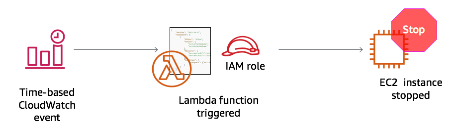
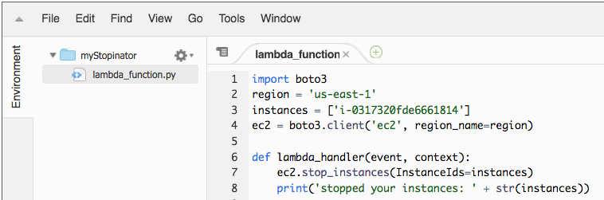

# Activity: AWS Lambda

<!-- Note to translators: This lab is unique to this course. -->

&nbsp;
&nbsp;
## Overview



&nbsp;
&nbsp;
&nbsp;
In this hands-on activity, you will create an AWS Lambda function. You will also create an Amazon CloudWatch event to trigger the function every minute. The function uses an AWS Identity and Access Management (IAM) role. This IAM role allows the function to stop an Amazon Elastic Compute Cloud (Amazon EC2) instance that is running in the Amazon Web Services (AWS) account.

&nbsp;
&nbsp;
### Duration

This activity takes approximately **30 minutes** to complete.

&nbsp;
&nbsp;
## Accessing the AWS Management Console

1. At the top of these instructions, choose <span id="ssb_voc_grey">Start Lab</span> to launch your lab.

    A **Start Lab** panel opens, and it displays the lab status.

2. Wait until you see the *Lab status: in creation* message. To close the **Start Lab** panel, choose the **X**.

3. At the top of these instructions, choose <span id="ssb_voc_grey">AWS</span>

    The AWS Management Console opens in a new browser tab. The system automatically logs you in.

    **Tip**: If a new browser tab does not open, a banner or icon will typically be at the top of your browser, indicating that your browser is preventing the website from opening pop-up windows. Choose the banner or icon and choose **Allow pop ups**.

4. Arrange the **AWS Management Console** tab so that it displays alongside these instructions. Ideally, you will be able to see both browser tabs at the same time, which makes it easier to follow the activity steps.

&nbsp;
&nbsp;
## Task 1: Create a Lambda function

5. In the **AWS Management Console**, from the **Services** menu, choose **Lambda**.

    **Note**: If you see a warning message that says *tags failed to load*, you can ignore it.

6. Choose <span id="ssb_lambda_orange">Create function</span>.

7. In the **Create function** screen, configure these settings:

    - Choose **Author from scratch**

    - Function name: `myStopinator`

    - Runtime: **Python 3.8**

    - Choose <i class="fas fa-caret-right"></i>**Choose or create an execution role**

    - Execution role: **Use an existing role**

    - Existing role: From the dropdown list, choose **myStopinatorRole**

8. Choose <span id="ssb_lambda_orange">Create function</span>.

&nbsp;
&nbsp;
## Task 2: Configure the trigger
In this task, you will configure a scheduled event to trigger the Lambda function by setting a CloudWatch event as the event source (or trigger). The Lambda function can be configured to operate much like a cron job on a Linux server, or a scheduled task on a Microsoft Windows server. However, you do not need to have a server running to host it.

9. Choose <span id="ssb_lambda_white">+ Add trigger</span>.

10. Choose the **Select a trigger** dropdown menu, and choose **EventBridge (CloudWatch Events)**.

11. For the rule, choose **Create a new rule** and configure these settings:

    - Rule name: `everyMinute`
    - Rule type: **Schedule expression**
    - Schedule expression: `rate(1 minute)`

    **Note**: A more realistic, schedule-based stopinator Lambda function would probably be triggered by using a cron expression instead of a rate expression. However, for the purposes of this activity, using a rate expression ensures that the Lambda function will be triggered soon enough that you can see the results.

12. Choose <span id="ssb_lambda_orange">Add</span>.

&nbsp;
&nbsp;

## Task 3: Configure the Lambda function

In this task, you will paste a few lines of code to update two values in the function code. You do not need to write code to complete this task.

13. Below the **Function overview** pane, choose **Code**, and then choose *lambda_function.py* to display and edit the Lambda function code. 

14. In the **Code source** pane, delete the existing code. Copy the following code, and paste it in the box:

```
import boto3
region = '<REPLACE_WITH_REGION>'
instances = ['<REPLACE_WITH_INSTANCE_ID>']
ec2 = boto3.client('ec2', region_name=region)

def lambda_handler(event, context):
    ec2.stop_instances(InstanceIds=instances)
    print('stopped your instances: ' + str(instances))
```
**Note:** After pasting the code into the **Code source** box, review line 5. If a period (.) was added, delete it.

15. Replace the `<REPLACE_WITH_REGION>` placeholder with the actual Region that you are using. To do this:

    Choose on the region on the top right corner and use the region code. For example, the region code for US East (N. Virginia) is *us-east-1*.

    **Important**: Keep the single quotation marks (' ') around the Region in your code. For example, for the N. Virginia, it would be `'us-east-1'`

16. **Challenge section**: Verify that an EC2 instance named *instance1* is running in your account, and copy the *instance1* **instance ID**.
			
				HTML
				
					
				
				
						
				
			
		
      You are encouraged to figure out how to do this task without specific step-by-step guidance. However, if you need detailed guidance, choose here.
      
         Open another browser tab and go to https://console.aws.amazon.com/ec2
         Click Instances.
        Note that an EC2 instance named instance1 exists, and that it is in a running state.
         From the Description tab of instance1, copy the instance ID (it will start with i-)
        Note: Leave this browser tab open. You will return to it in a moment.
      

</details>

17. Return to the **AWS Lambda console** browser tab, and replace `<REPLACE_WITH_INSTANCE_ID>` with the actual instance ID that you just copied.

    **Important**: Keep the single quotation marks (' ') around the instance ID in your code.

    Your code should now look similar to the following example. However, you might have a different value for the Region, and you will have a different value for the instance ID:

    

18. In the top-right corner of the **Code source** box, choose <span id="ssb_lambda_white">Deploy</span>.

    Your Lambda function is now fully configured. It should attempt to stop your instance every minute.

19. Choose **Monitor** (the tab near the top of the page).

    Note that one of the charts shows you how many times your function has been invoked. There is also a chart that shows the error count and the success rate as a percentage.

## Task 4: Verify that the Lambda function worked

20. Return to the **Amazon EC2 console** browser tab and see if your instance was stopped.

    **Tip**: You can choose the <i class="fas fa-sync-alt"></i> refresh icon or refresh the browser page to see the change in state more quickly.

21. Try starting the instance again. What do you think will happen?

    <details>
          <summary>Click <b>here</b> to reveal the answer.</summary>
          The instance will be stopped again within 1 minute.
    </details>

&nbsp;
&nbsp;

## Activity complete

<i class="icon-flag-checkered"></i> Congratulations! You have completed the activity.

22. Choose <span id="ssb_voc_grey">End Lab</span> at the top of this page, and then to confirm that you want to end the activity, choose <span id="ssb_blue">Yes</span>.  

    A panel appears, with a message that indicates: *DELETE has been initiated... You may close this message box now.*

23. To close the panel, go to the top-right corner and choose the **X**.

For feedback, suggestions, or corrections, email us at: *aws-course-feedback@amazon.com*

&nbsp;
&nbsp;
